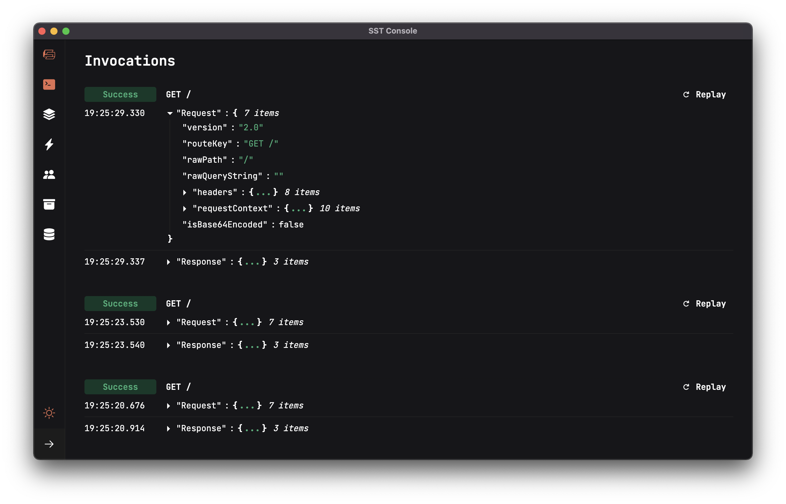

<p align="center">
  <a href="https://sst.dev/">
    
  </a>
</p>

<p align="center">
  <a href="https://sst.dev/discord"></a>
  <a href="https://www.npmjs.com/package/sst"></a>
  <!--<a href="https://github.com/serverless-stack/sst/actions/workflows/ci.yml"></a>-->
</p>

---

SST makes it easy to build full-stack serverless applications on AWS.

- [**High-level components**](https://docs.sst.dev/what-is-sst#infrastructure) to simplify building APIs, databases, and frontends on AWS.
  - Avoid having to configure ten different AWS resources just to create a simple API.
- [**Set breakpoints in VS Code**](https://docs.sst.dev/what-is-sst#local-dev) and debug Lambda functions locally in real-time.
  - You won't need to create mock request objects or deploy every time you make a change.
- [**Admin dashboard**](https://docs.sst.dev/what-is-sst#local-dev) to view logs, run queries, browse uploads, apply migrations, and more.
  - Way better than clicking through a dozen different services in the AWS console.
- [**Full-stack starters**](https://docs.sst.dev/what-is-sst#starters) with all the best practices, designed like monoliths.
  - Don't spend days organizing your functions or getting secrets, testing, etc., to work.

Learn more: [What is SST](https://docs.sst.dev/what-is-sst) | [Live Lambda][live] | [SST Console][console_doc] | [FAQ](https://docs.sst.dev/faq)

## Try it out

```bash
# Create a new SST app
npx create-sst@latest my-sst-app
cd my-sst-app
npm i

# Start Live Lambda Dev
npx sst start

# Open the SST Console
open console.sst.dev

# Deploy to prod
npx sst deploy --stage prod
```

## Get started

- [Quick start](https://docs.sst.dev/quick-start): Take a quick tour of SST and deploy your first full-stack app. _Takes minutes_.

- [Tutorial](https://docs.sst.dev/learn/): A tutorial on how to add a new feature to your SST app. _Takes an hour_.

- [Guide](https://sst.dev/guide.html): Learn to build a full-stack serverless app from scratch with SST. _Takes a day_.

## Why SST

Here's how SST makes it easy to build full-stack serverless apps.

### AWS without all the complexity

SST provides simple abstractions called [Constructs][resources] for common use cases like APIs, databases, static sites, etc. So you don't have to configure each of the underlying AWS services by hand.

For example, the following is an API with a custom domain that has permissions to upload files to S3.

```ts
const api = new Api(this, "Api", {
  customDomain: "api.domain.com",
  routes: {
    "GET /notes": "src/list.main",
  },
});

api.attachPermissions(["s3"]);
```

Internally, SST uses [AWS CDK](https://aws.amazon.com/cdk/) to compile this code, configure nearly a dozen AWS services, and create the necessary security policies.

And don't worry, SST has an easy way to [extend constructs, and even has an escape hatch](https://docs.sst.dev/design-principles#progressive-disclosure) for when you need something custom.

### Local development with live reload

The [`sst start`][live] command starts a local development environment that lets you set breakpoints and test your functions locally. You don't need to mock any resources or wait for the changes to redeploy.

[](https://www.youtube.com/watch?v=hnTSTm5n11g&feature=youtu.be)

- Supports real Lambda environment variables and Lambda IAM permissions.
- Supports all Lambda triggers, so there's no need to mock API Gateway, SQS, SNS, etc.
- Is 50-100x faster than the alternatives and changes are reloaded in a few ms.

The instant feedback means that working on a serverless application is no different from working on a traditional application.

### Admin dashboard

The [SST Console][console_doc] is a web based dashboard to manage your SST apps. So you don't have to click through a dozen different services in the AWS console.

[][console_doc]

Here's just a couple of things you can do with the Console:

- Invoke functions and replay them
- Query your databases and run migrations
- Upload and delete files from your buckets

The SST Console automatically connects to your local environment when you run `sst start`.

### Organized like monoliths

The [full-stack starters](https://docs.sst.dev/packages/create-sst) that come with SST are organized like singular monolith apps in a monorepo. They are designed to manage growing serverless projects.

```
my-sst-app
├─ sst.json
├─ services
│  ├─ core
│  ├─ functions
│  │  └─ graphql
│  └─ migrations
├─ graphql
├─ stacks
└─ web
```

The backend, frontend, and infrastructure code are kept together as packages in the monorepo. Types, environment variables, secrets, and config are also shared across the application.

### And more

You can also use [Seed](https://seed.run) to `git push` to deploy your SST apps. It natively supports concurrent asynchronous deployments for your SST apps. And SST deployments on Seed are free!

Seed is built by the team behind SST.

---

**Join our community** [Discord][discord] | [YouTube](https://www.youtube.com/c/sst-dev) | [Twitter](https://twitter.com/SST_dev) | [Contribute](CONTRIBUTING.md)

[discord]: https://sst.dev/discord
[console_doc]: https://docs.sst.dev/console
[resources]: https://docs.sst.dev/constructs
[live]: https://docs.sst.dev/live-lambda-development
