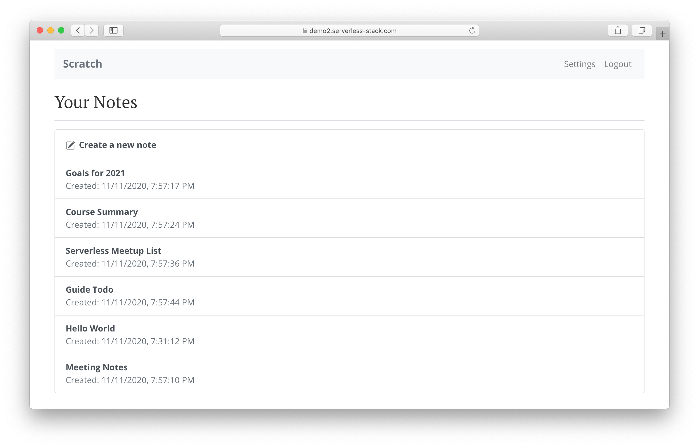

# SST Demo Notes App [](https://console.seed.run/serverless-stack/demo-notes-app)

The [Serverless Stack Guide](https://serverless-stack.com/#guide) is a comprehensive open source tutorial for building and deploying full-stack apps using serverless and React on AWS.

We create a [note taking app](https://demo.serverless-stack.com) from scratch. Using React.js, AWS Lambda, API Gateway, DynamoDB, and Cognito.



This repo is a full-stack serverless app built with [SST](https://github.com/serverless-stack/serverless-stack).

- The `stacks/` directory defines our AWS infrastructure using AWS CDK.
- The `src/` directory contains the Lambda functions that power the CRUD API.
- The `frontend/` directory contains the React app.

It's a single-page React app powered by a serverless CRUD API. We also cover how add user authentication, handle file uploads, and process credit card payments with Stripe.

### Usage

Clone this repo.

```bash
$ git clone https://github.com/serverless-stack/demo-notes-app
```

Install dependencies.

``` bash
$ npm install
```

This project refers to a `.env.local` file with a secret that we are not checking in to the repo. Make sure to create one before deploying - https://serverless-stack.com/chapters/handling-secrets-in-sst.html.

#### Developing Locally

Start the [Live Lambda Dev Environment](https://docs.serverless-stack.com/live-lambda-development).

``` bash
$ npx sst start
```

Install dependencies for the frontend React app.

``` bash
$ cd frontend
$ npm install
```

Start the React local dev environment from the `frontend/` dir.

``` bash
$ npm start
```

#### Running Tests

From the project root.

``` bash
$ npx sst test
```

#### Deploying to Prod

Run this in the project root to deploy it to prod.

``` bash
$ npx sst deploy
```

---

Join the SST community over on [Slack](https://launchpass.com/serverless-stack) and follow us on [Twitter](https://twitter.com/ServerlessStack).
