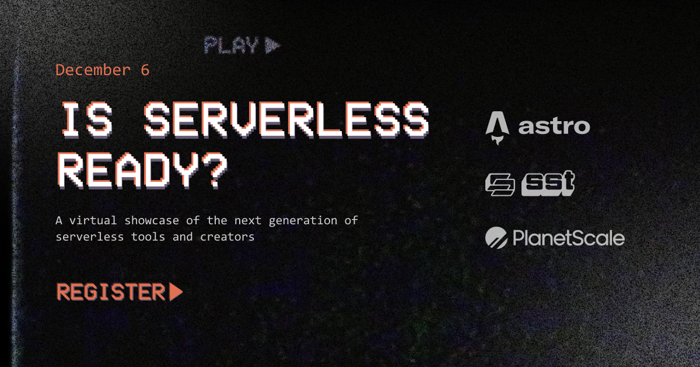

Today we are launching a new livestream series called — _"Is serverless ready?"_, where we'll be showcasing the next generation of serverless tools and creators.

Over the next few weeks, we'll have speakers from Astro, Solid, Bun, PlanetScale, Mongo, SST, and more.

It's a chance for these tools and services to show off what they are working on and how they are making _serverless ready_.

So head over to [**isserverlessready.com**](https://isserverlessready.com) and register. We'll send you an email when the next episode is coming out!
