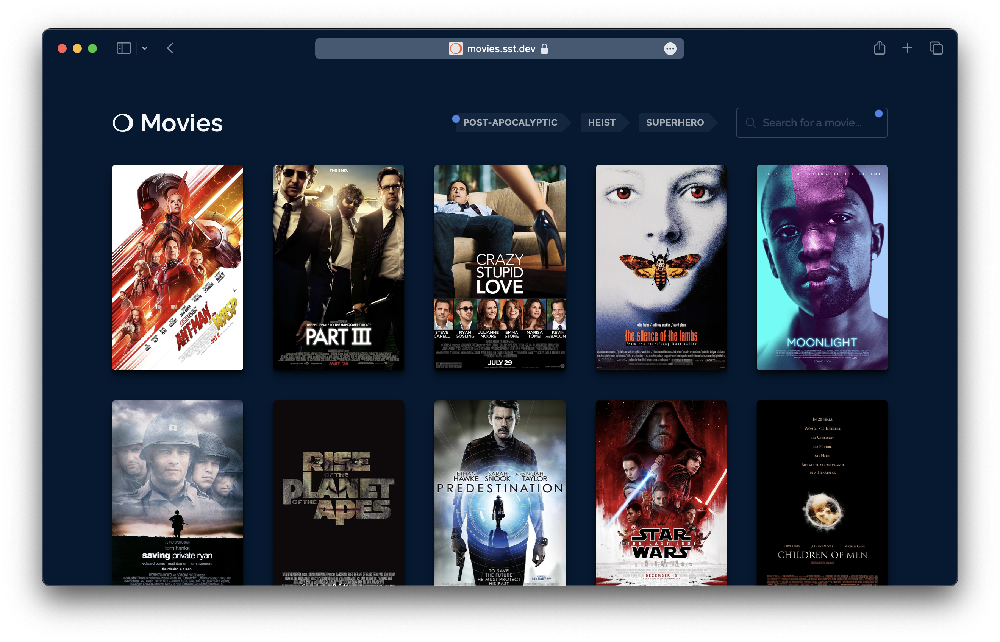

import pulumiTweet from '../../../assets/blog/sst-pulumi-tweet.png';

You might've heard that we are working on a new version of SST (called [Ion](https://github.com/sst/ion)), that's not based on CDK. In this post we'll talk about why we are moving away from CDK and what's going to change.

You might've also seen the demo AI app we built with it — [movies.sst.dev](https://movies.sst.dev)

[](https://movies.sst.dev)

This is going to be a fairly long post, so here's an outline of what we'll be covering.

1. [What is Ion](#what-is-ion)
2. [What’s Wrong With CDK & CFN?](#whats-wrong-with-cdk--cfn)
   - [Design Flaws](#design-flaws)
     1. [CFN Is a Black Box](#1-cfn-is-a-black-box)
     2. [CDK Is Not IaC, It’s a CFN Hack](#2-cdk-is-not-iac-its-a-cfn-hack)
   - [Practical Problems](#practical-problems)
     1. [Linking Resources](#1-linking-resources)
     2. [Cyclical Dependencies](#2-cyclical-dependencies)
     3. [Export in Use](#3-export-in-use)
     4. [Swallowing Errors](#4-swallowing-errors)
     5. [Custom Resource Hacks](#5-custom-resource-hacks)
     6. [Rollback Hell](#6-rollback-hell)
     7. [Double Builds](#7-double-builds)
     8. [Stack Resource Limits](#8-stack-resource-limits)
     9. [Orphan Stacks](#9-orphan-stacks)
     10. [Importing Resources](#10-importing-resources)
     11. [Slowness](#11-slowness)
3. [Why The Change](#why-the-change)
   - [Background](#background)
   - [Supporting Non-AWS Providers](#supporting-non-aws-providers)
   - [What Changed](#what-changed)
   - [Working With Pulumi](#working-with-pulumi)
4. [How Does Ion Work](#how-does-ion-work)
5. [Roadmap](#roadmap)
   - [Step 0: Ion Prototype Demo](#step-0-ion-prototype-demo)
   - [Step 1: Ion General Release](#step-1-ion-general-release)
   - [Step 2: Ion → SST v3](#step-2-ion--sst-v3)
6. [What About SST v2](#what-about-sst-v2)
7. [What About Migrating](#what-about-migrating)
   - [Is Ion Right For Me](#is-ion-right-for-me)
   - [What Ion Is Not](#what-ion-is-not)
8. [What’s Our Goal](#whats-our-goal)
9. [FAQ](#faq)

We also covered this post on a livestream.

<div class="youtube-container">
  <iframe src="https://www.youtube-nocookie.com/embed/4jphEjFIys8" frameborder="0" allow="accelerometer; autoplay; clipboard-write; encrypted-media; gyroscope; picture-in-picture" allowfullscreen></iframe>
</div>

---

# What Is Ion?

Ion is a code name for a new engine for deploying SST applications. The constructs (or components) are defined using [Terraform](https://www.terraform.io) providers and deployed using [Pulumi](https://www.pulumi.com); as opposed to CDK and CloudFormation (CFN).

The components look roughly the same as they do today and it'll still be completely open source. But there are some differences. The biggest one being that you cannot use a CDK construct in Ion. You'll need to migrate it over.

Once Ion is stable, it'll be released as SST v3. This is a huge change, so let's look at why we are doing this.

---

# What's Wrong With CDK & CFN?

If you've spent time in the SST community or if you've talked to other SST users, you've probably heard complaints about CDK or CloudFormation being slow. Or you've run into deployment failures and rollbacks. While these are annoying, is it enough to switch?

In the following sections I'll outline some of the underlying design flaws with the CDK & CFN model. I'll also talk about the practical implications of these problems and how some of these have turned into deal-breakers for us.

## Design Flaws

Most of the problems with CDK & CFN stem from two specific design flaws. Let's start with the basics. This is what deploying a CDK (and SST) app roughly looks like.

```txt
CDK Constructs > CloudFormation Templates > CloudFormation Deployment
```

Your CDK constructs generate a CloudFormation template (JSON), that is then sent to CloudFormation (the service) and it deploys your infrastructure. It's important to understand that this is a two step process.

The CloudFormation template defines *what* infrastructure you want to create. It does not describe *how* to create it. That is determined completely by AWS CloudFormation, the service.

### 1. CFN Is a Black Box

You give AWS CloudFormation a list of resources to create. It'll internally call the AWS SDK to create a resource. Then poll it until it's complete. It'll also maintain state of the resources it's managing.

Both the process it runs and the state it maintains are completely opaque and handled on the AWS side. CloudFormation does not run locally. You cannot customize it as a user and as we'll see later, neither can CDK.

> CloudFormation is a black box that does not run locally.

As a framework author that's trying to build a better developer experience on AWS, this limits what we can do. And this turns out to be a deal-breaker. We'll look at why below. We'll also look at the alternative from the Terraform world.

### 2. CDK Is Not IaC, It's a CFN Hack

On the CDK side, we write TypeScript code that defines our infrastructure. But CDK doesn't *create* the infrastructure you define. It generates a CloudFormation template (JSON) that CloudFormation will use to create your infrastructure.

> CDK doesn't create the infrastructure you define.

The distinction might seem subtle but it's a big reason for a lot of problems people run into. Let's look at an example with some *CDK like* code.

```ts
const fn = new Function();

const dist = new CloudFront();

fn.addEnvironment({
  key: "endpoint",
  value: dist.url,
});
```

Here, CDK converts your function and CloudFront distribution definition into a CloudFormation JSON block for each resource, it fills in the unknown values (distribution URL that the function environment needs) with *tokens* that'll be resolved once the resources are deployed. It also uses this to figure out the order in which your resources need to be created.

This has two key implications:

1. The order you write your code in, is not the order in which it'll be deployed. Here the distribution will be created first.
2. Since this is converted into a large JSON object, you cannot do certain operations in your CDK code.

This odd behaviour makes a lot more sense when you realize that CDK is masquerading as a an IaC. When in reality it's just a CloudFormation hack. 

One other place where this hack becomes apparent is in CDK's concept of an *app*. A CDK app is a collection of multiple stacks. CloudFormation doesn't have a concept of an app. So CDK has to hack your stacks together to make them seem like an app.

We'll look at the practical implications of this design flaw below. We'll also look at an alternative design that sidesteps all these issues.

## Practical Problems

The above might sound like *theoretical* problems and you might be wondering how this impacts me as a user. Let's look at the practical implications of these design flaws.

The list below is not comprehensive but they make up most of our support cases.

### 1. Linking Resources

Say you have a Next.js app that shows a list of blog posts; where these posts are stored in a DynamoDB table. When your Next.js app builds, it'll generate this page by querying your database for these posts. So to generate your Next.js build, you'll need to deploy the table first. But CloudFormation needs you to provide the assets that your resources need (the Next.js site) to do a deploy.

Effectively meaning that you need to first deploy your database before deploying your Next.js site. This needs two deploys. It applies to any two resources where an asset for one depends on another (there's a Custom Resource hack that's used for cases like this but it won't work here and has its own problems).

This problem is a deal-breaker for users that are deploying to multiple environments. Since every time they create a new environment, they'll need to deploy their app in two steps.

> You'll need to deploy your app in two steps, this makes it a deal-breaker.

Let's assume you are able to put up with this at your company. You'll run into a new problem. Let's say your Next.js site depends on the value of a resource that's set as a part of the deploy process. Something like a [Config Parameter](https://docs.sst.dev/config). SST needs to pull this value before the deploy, to build your Next.js site. But since this hasn't been re-deployed yet, it can only fetch its previously deployed value. This can be really hard to debug because it's not immediately apparent what's going on.

SST exists today because of two main reasons; [Live Lambda](https://docs.sst.dev/live-lambda-development) & [Resource Binding](https://docs.sst.dev/resource-binding). And due to the CDK & CFN deployment model we cannot do Resource Binding well.

### 2. Cyclical Dependencies

There's another similar problem that's turning into a deal-breaker for our users. Recall that CDK isn't truly IaC, it's a JSON generator. This means that it'll generate JSON CloudFormation templates that won't work. A very common failure case is where some resources depend on each other. These are called cyclical dependencies. They come in two flavours.

#### Type 1: Resources

Similar to the example we used above, let's say you create a Lambda function with a function URL and you create a CloudFront distribution that points to the function's URL. And you want the function to have an environment variable with the CloudFront distribution URL.

```ts
const fn = new Function();
const dist = new CloudFront({
  route: {
    "/my-function": fn.url,
  },
});

// You cannot do this
fn.addEnvironment({
  key: "endpoint",
  value: dist.url,
});
```

This looks perfectly fine in CDK code but cannot be expressed in a JSON CloudFormation template. This is because the three resources now reference one another. It's a cyclical dependency.

Unfortunately this comes up in our support pretty often. A *solution* for this is telling people to configure a custom domain so they know the URL before it's deployed. Or storing the distribution URL somewhere that can be later fetched inside the Lambda function. We have ways to make this easier but it requires *top level await* and that doesn't work in many environments and frameworks.

#### Type 2: Stacks

There's another version of this that's even more confusing. Let's say we are creating a queue and a function. The function needs to know the queue URL and the queue has a consumer that needs to know the function URL.

```ts
const q = new SQS();
const fn = new Function({
  environment: {
    q: q.url,
  }
});

q.consumer = new Function({
  environment: {
    fn: fn.url,
  }
});
```

This isn't a cyclical dependency. The reasoning is subtle but related to the underlying resources that are being created. It looks the same as the one above in terms of CDK code but it's not the same when written in CloudFormation.

CloudFormation stacks have resource limits. Meaning that if you have more than 500 resources in a stack, you need to move them out to a new stack. This happens with larger teams. They'll need to refactor their stacks often.

Say you split this into two stacks. One for the functions:

```ts
function FnStack() {
  const fn = new Function();

  return fn;
}
```

And one for the queues:

```ts
function QStack() {
  const fn = use(FnStack);

  const q = new SQS();
  q.consumer = new Function({
    environment: {
      fn: fn.url,
    }
  });
  
  fn.addEnvironment({
    q: q.url,
  });
  
  return q;
}
```

When you deploy an app with these two stacks, you'll get a different cyclical dependency error. Here CloudFormation cannot deploy this because these stacks depend on each other.

A fix for this is to refactor it in a way that the queue stack can be deployed first.

```ts
function QStack() {
  const q = new SQS();

  return q;
}
```

And then deploy the function stack.

```ts
function FnStack() {
  const q = use(QStack);

  const fn = new Function({
    environment: {
      q: q.url,
    },
  });

  q.consumer = new Function({
    environment: {
      fn: fn.url,
    }
  });

  return fn;
}
```

Try and look at these two cases again. They look basically the same, yet one works and the other doesn't.

The reason for this is subtle. The `addEnvironment` call in the first case *modifies* an existing resource definition. While the `q.consumer` call *adds* a new resource definition. Something that's non-obvious from looking at the code.

> CDK is leaking implementation details from CloudFormation.

The core problem is that CDK is leaking an implementation detail from CloudFormation. A sign that the system is poorly designed.

### 3. Export in Use

Like the cyclical dependency issue `Export in use` is another dreaded error. It usually looks like this.

```txt
Export stackA:ExportsOutput****** cannot be deleted as it is in use by stackB
```

Let's say there is a Bucket in the `stackA`, and `stackB` references its `bucket.bucketName`. You now want to remove the bucket. But if you do, you'll run into the error above.

To fix this, you need to do two deploys. You'll need to create a *fake* export with `bucket.bucketName` in `stackA`, remove the reference in `stackB`, and deploy. Then remove the bucket and the fake export in `stackA` and deploy again.

This happens when the references between the stacks in your CDK app change. CDK makes it really easy to share references between stacks in your app. It's a hack on top of CloudFormation that makes exports easier to use. CloudFormation also doesn't have a concept of an *app*. So it doesn't know this export has been removed in a stack that is about to be deployed.

This error happens frequently and is incredibly non-obvious to people that are new to CDK. We realized that it's almost impossible to explain this through our docs or through support. So we built a feature in SST to auto-detect this and add the *fake* export for you.

> CDK creates a hack on top of CloudFormation to make it easier to use. SST then adds a hack to unwind the damage caused by that hack to make CDK easier to use.

This specific error and its subsequent handling is a microcosm of the problem with the entire model. CDK creates a hack on top of CloudFormation to make it easier to use. SST then adds a hack to unwind the damage caused by that hack to make CDK easier to use.

### 4. Swallowing Errors

A consequence of CloudFormation being a black box is that it handles any errors internally. So you'll see the error from CloudFormation as opposed to the underlying error with the resource. This is the reason why many AWS deployment errors are cryptic and vague.

Here's an example.

```txt
Error Message: 18:59:16 UTC-0500 CREATE_FAILED  AWS::Route53::RecordSetGroup DatabaseDNSRecord Invalid request
```

What's happening here is that there was an error within CloudFormation while creating the resource. But it swallows the real error and instead gives you the generic `Invalid request` error.

> As a framework author, it's these types of things that drive you crazy.

The *workaround* for this is to look at AWS CloudTrail, their audit log service. It'll show you the original event and error message. As a framework author, it's these types of things that drive you crazy.

### 5. Custom Resource Hacks

So we know that CDK translates to CloudFormation that then gets executed. But what if you wanted some custom logic. For example, you have an S3 bucket that your users use for file uploads and you want to remove all the files in it when you remove your app.

You might think you can just write some CDK code that does this. But you cannot do this natively because it cannot be expressed as a CloudFormation JSON template. To fix this there's an escape hatch called a Custom Resource. It's a Lambda function that can execute as a part of the deployment process.

The reason it needs to be a Lambda function is because CloudFormation is a black box and it cannot run any local code. You'll need to package it up as a Lambda function.

Still, this sounds passable. Just run some extra scripts as a workaround. In practice though, Custom resources have their own set of problems; they are slow, have side effects, and when they fail it can be crippling. Unfortunately, the CDK community (and us included) need to rely on this for basically anything that isn't supported.

#### Hacking Multi-Region

Custom Resources get used for something seemingly trivial like emptying a bucket to something as crazy as multi-region deployments. CDK *supports* multi-region deployments. But it does this via a Custom Resource. The problem is that CloudFormation is a single-region service. There's no way to link stacks across regions. So when you deploy stacks across regions you'll rely on Custom Resources to share references across them.

You can see the design flaw with the CDK & CFN model here. CloudFormation is a black box and CDK has to create these hacks to work around it.

#### Orphan Log Groups

The Lambda functions in Custom Resources create Log Groups in CloudWatch that they write to. When you remove your app, you want to remove these Log Groups, but you can't completely remove them. If your Custom Resource tries to remove its Log Group, it'll recreate it after it finishes running. There's a similar issue with setting the log retention for Lambda functions.

> Custom Resources are trying to create another deployment model on top of CloudFormation.

There are other problems with Custom Resources but the core issue is that these are hacking together another deployment model on top of CloudFormation. That's a huge red flag.

### 6. Rollback Hell

CloudFormation can sometimes run into issues when deploying a stack. When it does, it'll rollback all the changes it makes. This sounds good but it has two problems:

1. It's really slow. CloudFormation deployments in general take very long and when they try to roll back, they take even longer.
2. Rollbacks can fail and get stuck because some resources might fail to rollback. If this happens you are in *rollback hell*. You won't be able to redeploy the stack. You'll need to go to the AWS Console and try to redo the rollback. If it still fails, you'll need to specifically pick the resources that are failing to rollback and tell it not to rollback.

This is a pretty serious problem and we've gotten plenty of panicked support messages from teams that get stuck in this when they are deploying a big update to prod. People complained about this enough that CloudFormation added a setting to skip rollbacks in the case of failures.

However, we tried this as a default with SST and immediately we had a bunch of users get into states that they couldn't get out of. We were forced to revert the change.

Fun fact, if a Custom Resource has some faulty code you are guaranteed to be stuck in *rollback hell*. This is because on deploy, the faulty resource will fail, then it'll try to rollback the stack, and the faulty resource will run again and fail again.

### 7. Double Builds

CDK will sometimes do a lookup for a resource and save that information in a `cdk.context.json`. This file is meant to be committed and acts as a cache. If the cache doesn't exist, it'll build your app to create that cache, then build again while using the cached values. You need to commit this file to your Git repo.

However, if your deploys to prod are run in a CI environment and prod happens to be a separate AWS account, it'll always do a double build. As a developer on the team, you might not have access to prod from your local machine, meaning that you can't generate this file locally and commit it. Or commit the changes when it needs to be updated.

> CDK tries to maintain its own state on top of CloudFormation.

This again stems from the design flaws of the system. CloudFormation maintains state internally for your deployed resources. But since it's a black box, CDK tries to maintain its own state on top of it.

### 8. Stack Resource Limits

As mentioned above, there's a resource limit of 500 for each CloudFormation stack. Say you have a Next.js site and a DynamoDB table, you might think that's 2 resources. But resources are counted in terms of the low level infrastructure that AWS needs to create these. The Next.js site creates around 68 resources. So you end up hitting this pretty quickly.

Once you hit this limit, you'll need to split resources into multiple stacks. But that process is not intuitive. You'll likely run into the cyclical dependency issue that we mentioned above.

### 9. Orphan Stacks

When you are trying to refactor your stacks, you'll be tempted to rename a stack. If you do that, CDK will just recreate all the resources in that stack with new names. And the old stack and its resources will be orphaned.

People run into this *gotcha* all the time. The right approach here is to delete the old stack and create a new one. But what if you have resources that cannot be removed; like your database. Well you can't change the stack name. You'll need to tell CDK not to generate a new stack name and continue to use the old stack name. Your infrastructure definition will now forever have this line in it.

Unless you reimport the resources into your new stack, which is not easy as we'll see.

### 10. Importing Resources

CloudFormation keeps state internally of the resources its managing in a stack. But because this is not available locally, it introduces some problems. The biggest one is importing resources. As in, adding a previously created resource to a CloudFormation stack. SST users try to do this frequently because they need to link to previously created resources in their app.

In theory an import should be simple. Just tell CloudFormation about a new resource and it'll manage it moving forward. In practice though it's extremely painful. You need to mock the resource in your current app, generate the CloudFormation template for your app, remove any extra info from the template, go to the CloudFormation console and ask it to import resources, set a unique ID for the resource, run a diff to see if your local stack is similar to the version that CloudFormation has, and finally do a drift check to make sure they are in sync.

In short, most people don't do this. This hurts SST as a framework, as it limits how effective it can be for an existing AWS user.

### 11. Slowness

I won't spend too much time here but for a myriad of reasons CDK and CloudFormation are extremely slow. There is slow, as-in something is noticeably slow. And then there is *CloudFormation slow*. It's behaviour altering. This was maybe acceptable for a world where you bring up servers and clusters, those are expected to be slow. But if you are dealing with managed services, it really shouldn't be this slow.

> There is slow, as-in something is noticeably slow. And then there is "CloudFormation slow".

What's frustrating to us as framework authors is that we have no control over this. CloudFormation arbitrarily waits for resources to get updated because they optimize for the lowest common denominator use case. Imagine migrating from something like Vercel and waiting for 30 minutes for your first SST deployment.

---

# Why The Change

We've looked at all the problems that we are facing with the current CDK & CFN model. But these are not new issues. So why did we decide to make a change now?

#### Background

Before we get into that, let me give you some background. We've worked on SST for 3 years now. You may also know us as the creators of [Seed](https://seed.run) — a *git push to deploy* service for serverless apps. We started Seed in 2017. Prior to it supporting SST, Seed was exclusively for [Serverless Framework](https://www.serverless.com) apps. We've seen the ups and downs of Serverless Framework and their misstep with the [Serverless Components](https://github.com/serverless/components) idea.

If you are not familiar with that story, I'll give you the gist of it. Serverless Framework uses CloudFormation to deploy your serverless apps. At some point they decided to launch their own infrastructure deployment service, called Serverless Components. It was not based on CloudFormation or Terraform. It would run deployments through their servers (though there was a way to opt out of that). Long story short, it did not work.

At this point you are probably wondering if we are just repeating that mistake. Having lived through that it took us a really long time to consider options outside CDK. The problems listed above, are not new, we've known them for the better part of 2 years. We've also played around with Terraform versions of SST in the past.

There's also…

#### Supporting Non-AWS Providers

Back in 2017, AWS had a complete stranglehold on the serverless space. And rightfully so. Today in 2024, that is less true. Other providers now have services that are better than the AWS versions. Most notably Cloudflare. Slowly but steadily they've gotten better. To the point that there is now genuine demand from the SST community wanting to use Cloudflare. We are also seeing companies that are using serverless to build their applications and they are completely not on AWS.

To do this with the current CDK & CFN model we'd have to create Custom Resources for these providers. And as we have seen above, the Custom Resource hack is not worth it. That effectively means we'd have to go outside this model.

We've known in the back of our minds that at some point we were going to have to do this. However this was going to be such a big change that we basically avoided thinking about it too hard.

#### What Changed

Then something shifted over the last year, we launched [OpenNext](https://open-next.js.org). Suddenly SST became the best way to deploy not just Next.js, but Remix, Astro, SvelteKit, and more to your AWS account.

Now some of the largest Next.js sites in the world are deployed through SST. The resource linking problem that we described up top went from a fringe concern to something that I personally have to deal with in support every single week.

Added to that we had to ask ourselves, if we weren't limited to the CDK & CFN model could we potentially build a better Next.js experience than Vercel. And we realized that we could. Vercel has to run some complicated infrastructure to support their multi-tenant use case. SST doesn't. Next.js apps deployed with SST are not just cheaper (Vercel's enterprise pricing is absurd) but also faster.

#### Working With Pulumi

Also this happened.

[](https://twitter.com/funcOfJoe/status/1690115160877535232)

We decided to build a prototype a couple of months ago. We worked with the Pulumi team and founders closely to understand how their system works. We figured out how we could create a fully open source deployment experience with the Pulumi deployment engine and their bridged Terraform providers.

You simply install the SST CLI globally, create an `sst.config.ts`, and run `sst deploy`. There's nothing else to install, there are no `node_modules`, no CDK version conflicts, no services to sign up for, and no black boxes. Everything runs on your local machine.

---

# How Does Ion Work

In Ion you define your infrastructure almost exactly like you do in SST today. Except instead of using CDK underneath it uses a TS version of the underlying Terraform provider. Note that Terraform providers are written in Go and are basically calls to the AWS SDK. There's some additional code to make sure these run safely, so you aren't hammering AWS.

When you run `sst deploy`, those resources make a call to an embedded Pulumi engine that makes a call to their bridged Terraform provider, and this makes the AWS SDK calls to create your resources. A _bridged Terraform provider_ is a Pulumi provider that's programmatically bridged to the underlying Terraform Go provider.

If you are familiar with Terraform you might be wondering, isn't Terraform like CloudFormation templates in that you write JSON or HCL. When you deploy these templates through the Terraform engine, it translates these to calls to the Terraform Go providers for those resources. In Ion's case we don't use the Terraform engine, we use Pulumi.

> You don't need to install Pulumi or Terraform or sign up for anything.

You don't need to install Pulumi or sign up for it, their engine is embedded in the Ion CLI. Your deployments create a state file locally that are synced with an S3 bucket in your AWS account.

There are a couple of key things with this model that pretty much addresses all the above issues.

1. The code is executed exactly how you write it. The deployment engine is run from your local machine and it creates the resources directly. There is no layer or service in between.
2. This simple execution order means there are no cyclical dependencies. If you have a linked resource, you need to create it in the order it is used.
3. If you want to do something like the CloudFront and Lambda function example, where you want to set the distribution URL back into the function environment, you'll need to create a *dynamic provider*, this is basically code that's going to run locally after those resources have both been created. Again, the code you write is what's being executed and deployed. It's Infrastructure as Code.
4. Any deployment errors are displayed directly and in full.
5. Importing resources is a lot easier because you have visibility and control over the state of your deployment.

> The code you write is what's being executed and deployed. It's Infrastructure as Code.

This model isn't all perfect. Over the last couple of months we've had to work around some issues. But we have a couple of key tools at our disposal.

1. We can submit PRs to Terraform providers, since these are open source.
2. There is a process of patching Terraform providers if the changes in the PR are urgent.
3. We can also fork the provider if necessary and create our own.
4. We talk to the Pulumi team regularly and can work with them to find fixes or work arounds.

The upshot is that we are not dealing with the CloudFormation black box. So we can ultimately do something about the problems we run into.

---

# Roadmap

Let's look at where we are currently and what we've done for Ion so far.

#### Step 0: Ion Prototype Demo

Status: *Complete*

- Created a prototype by embedding the Pulumi engine
- Created a repo for Ion on [GitHub](https://github.com/sst/ion)
- Implemented the most complicated SST construct in Ion — Next.js
- Implemented a few other components, including a new Vector component based on Amazon Bedrock
- Built a complete full-stack demo application with Ion — [movies.sst.dev](https://movies.sst.dev)

You can view the repo for our demo movies app on [GitHub](https://github.com/sst/demo-ai-app). The entire SST team worked on this app and it was great watching all the CDK issues we listed basically vanish.

#### Step 1: Ion General Release

Timeline: *Couple of weeks from now*

Here's what we need to do next for a general release.

- Implement a few more components and CLI features
- Write up the docs
- Do a lot of testing
- Launch a new site — `ion.sst.dev`

At this point you'll be able to create new apps from scratch in Ion. It'll give you a chance to try it out. We'll be directing new users that want to get started with SST to start with Ion first.

#### Step 2: Ion → SST v3

Timeline: *Couple of months from now*

Once Ion is stable, it'll give current SST users an opportunity to migrate their apps to Ion. We'll create some tools and documentation that'll help with this process.

Once we feel comfortable with it and we know many people will be able to move over, we'll set a date for the SST v3 release. This is when `ion.sst.dev` will become `sst.dev` and it'll become SST v3. While SST v2's docs will be moved to a separate site.

---

# What About SST v2

So what happens to SST v2 once Ion becomes SST v3? Here's what we are planning:

- We'll release updates
- We'll accept PRs
- We won't add new constructs
- We won't introduce breaking changes

There might be caveats here of course but we are planning to let the community drive a lot of what happens with SST v2.

---

# What About Migrating

Ion is obviously a big change. If you are using mostly SST constructs in your apps, the migration won't be a big problem.

But what if you are using a ton of CDK constructs currently in your SST apps? There are two types of these:

1. L1s or low level CDK constructs
    
    This is far easier to move over because the Terraform AWS providers have support for these.
    
2. High level CDK constructs
    
    But CDK is filled with a ton of high level constructs, especially ones that use the Custom Resource hack described above to make changes that are not in CloudFormation (and also not in Terraform).
    
The latter tends to be really messy. There is no way to sugar coat this. Migrating those over is not going to be easy. We'd argue that the new Ion model is better but there are no drop-in replacements for those. You could leave your old SST app around with those resources and not move them over. They'll continue to work because SST v2 isn't going anywhere.

We'll share more details on the migrations steps through the Ion docs. But in the long run you might have to make a choice.

#### Is Ion Right For Me

That brings me to something we should address directly. If your company is completely invested in the CDK & CFN model and you were using SST because of its strong ties to CDK; Ion is probably not going to be right for you. We'd still invite you to give it a try and build something non-trivial with it. But we know some folks are married to CDK.

In this case, the solution would be to migrate your SST apps to CDK when you can. At the end of the day, SST v2 is open source and built on CDK. We chose this architecture because we did not want you to be locked in to us in case something happened.

#### What Ion Is Not

It's also worth mentioning what we are not trying to be. We are not trying to be an extension of CDK or Terraform or Pulumi. We are not AWS purists.

So if you are choosing SST or Ion because it's basically CDK or Terraform but *nicer*, you might end up disappointed. SST is fundamentally trying to create something that didn't exist before. We've discovered many of our design patterns as a result of our personal experience with building products and working with teams that are doing the same.

---

# What's Our Goal

So then what is our goal? Why are we doing all of this?

We want SST to be the best way to deploy an application. Let's take an example. This `sst.config.ts` is based on the movies demo from above. It includes AWS, OpenAI, and Cloudflare as components.

```ts
const db = new aws.dynamodb.Table("Movies");

const bucket = new sst.Bucket("Assets");

const vector = new sst.Vector("Vector", {
  openAiApiKey: new sst.Secret("OpenAiApiKey").value,
});

const site = new sst.Nextjs("Web", {
  link: [db, bucket, vector],
});

new cloudflare.cdn("Cdn", {
  domain: "movies.sst.dev",
  route: {
    "/": site.url,
  },
});
```

We want you to be able to drop a single type-safe config file in your repo root, and run `sst deploy`. This should be able to create any kind of resource, in any cloud provider, and link them all together. We also want you to be able to customize any of this to the degree that the provider will let you.

> Drop a type-safe config file and deploy it with a single command.

We want the best possible developer experience for this idea. And to accomplish it we need to bet on tools that we think will get us there.

---

# FAQ

I'm sure you have a lot of questions. I'm going to try and add to this section as I address more of them.

#### 1. Is Ion completely open source and self hosted?

Yes it's open source and it'll run on your local machine without you having to sign up for anything Pulumi or Terraform related.

#### 2. Our company only uses AWS, can we still use Ion?

Yes. While Ion will support multiple providers, if you are using AWS it will deploy completely to your AWS account. There won't be any other services or providers involved outside of the one you choose.

#### 3. Isn't Terraform not open source anymore?

There's been some recent fallout from the Terraform licensing change but that applies to the Terraform engine itself. Ion doesn't use this.

#### 4. What happens to the SST Console?

It'll support Ion and SST v2 apps. We have some plans for making it easy to self-host the Console. We'll share more details once we launch Ion.
