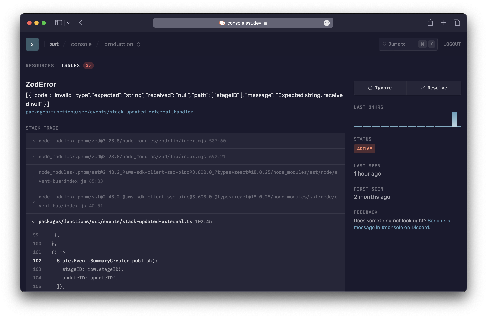
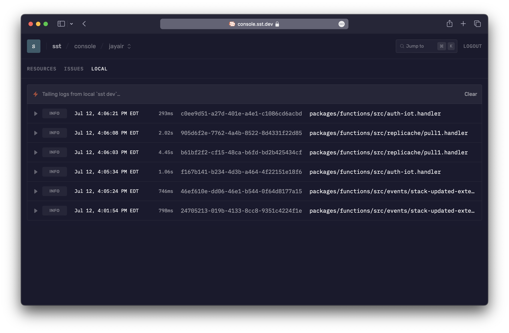
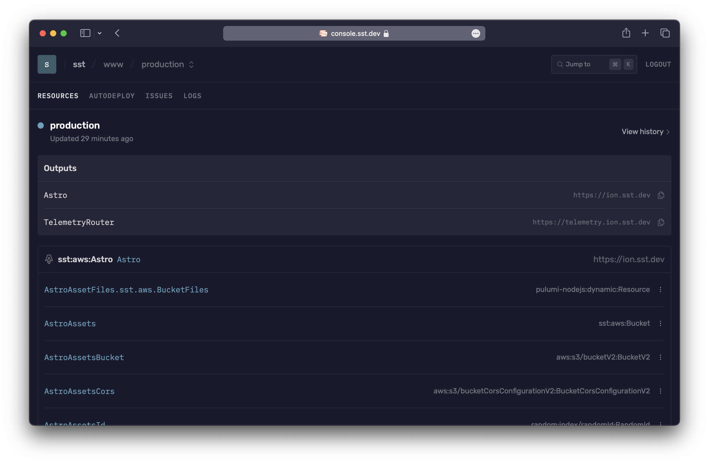

import { Tabs, TabItem } from '@astrojs/starlight/components';

The Console is a web based dashboard to manage your SST apps. With it you can **invoke functions**, **debug issues**, **view logs**, and **_git push to deploy_** your apps, with your team — [**console.sst.dev**](https://console.sst.dev)

[](https://console.sst.dev)

:::tip
The Console is completely optional and comes with a generous free tier.
:::

---

## Get started

Start by creating an account and connecting your AWS account.

:::note
Currently the Console only supports apps **deployed to AWS**.
:::

1. **Create an account with your email**

   It's better to use your work email so that you can invite your team to your workspace later — [**console.sst.dev**](https://console.sst.dev)

2. **Create a workspace**
   
   You can add your apps and invite your team to a workspace. A workspace can be for a personal project or for your team at work. You can create as many workspaces as you want.

   :::tip
   Create a workspace for your organization. You can use it to invite your team and connect all your AWS accounts.
   :::

2. **Connect your AWS account**

   This will ask you to create a CloudFormation stack in your AWS account. Make sure that this stack is being added to **us-east-1**. Scroll down and click **Create stack**.

   :::caution
   The CloudFormation stack needs to be created in **us-east-1**. If you create it in the wrong region by mistake, remove it and create it again.
   :::

   This stack will scan all the regions in your account for SST apps and subscribe to them. Once created, you'll see all your apps, stages, and the functions in the apps.

3. **Invite your team**

   Use the email address of your teammates to invite them. They just need to login with the email you've used and they'll be able to join your workspace.

---

## How it works

At a high level, here's how the Console works.

- It's hosted on our side

  It stores some metadata about what resources you have deployed. We'll have a version that can be self-hosted in the future.

- You can view all your apps and stages

  Once you've connected your AWS accounts, it'll deploy a separate CloudFormation stack and connect to any SST apps in it. And all your apps and stages will show up automatically.

- You can manage your apps

  You can view all the functions in your app. You can view all the issues in your functions in real-time with the source maps automatically applied. You can view their logs, invoke them, or replay invocations. You can also save event payloads to your workspace.

  For your functions running [Live](/docs/live/), the logs will be streamed in real-time from your local machine.

- It's open-source, built with SST, and deployed with [Seed](https://seed.run)

  The Console is a full-stack SST app. You can view the [source on GitHub](https://github.com/sst/console).

---

## Security

The CloudFormation stack that the Console uses, creates an IAM Role in your account to manage your resources. If this is a concern for your production environments, we have a couple of options.

By default, this role is granted `AdministratorAccess`, but you can customize it to restrict access. We'll look at this below. Additionally, if you'd like us to sign a BAA, feel free to [contact us][contact-us].

There maybe cases where you don't want any data leaving your AWS account. For this, we'll be supporting self-hosting the Console in the future.

---

#### IAM permissions

Permissions for the Console fall into two categories: read and write:

- **Read Permissions**: The Console needs specific permissions to display information about resources within your SST apps.

  | Purpose                                | AWS IAM Action                   |
  |----------------------------------------|----------------------------------|
  | Fetch stack outputs                    | `cloudformation:DescribeStacks`  |
  | Retrieve function runtime and size     | `lambda:GetFunction`      |
  | Access stack metadata                  | `ec2:DescribeRegions`<br/>`s3:GetObject`<br/>`s3:ListBucket`|
  | Display function logs                  | `logs:DescribeLogStreams`<br/>`logs:FilterLogEvents`<br/>`logs:GetLogEvents`<br/>`logs:StartQuery`|
  | Monitor invocation usage               | `cloudwatch:GetMetricData`       |

  Attach the `arn:aws:iam::aws:policy/ReadOnlyAccess` AWS managed policy to the IAM Role for comprehensive read access.

- **Write Permissions**: The Console requires the following write permissions.

  | Purpose                                          | AWS IAM Action                                                               |
  |-----------------------------------------------------|------------------------------------------------------------------------------|
  | Forward bootstrap bucket events to event bus     | `s3:PutBucketNotification`                                      |
  | Send events to Console                       | `events:PutRule`<br/>`events:PutTargets`                           |
  | Grant event bus access for Console           | `iam:CreateRole`<br/>`iam:DeleteRole`<br/>`iam:DeleteRolePolicy`<br/>`iam:PassRole`<br/>`iam:PutRolePolicy` |
  | Enable Issues to subscribe logs                  | `logs:CreateLogGroup`<br/>`logs:PutSubscriptionFilter` |
  | Invoke Lambda functions and replay invocations   | `lambda:InvokeFunction` |


It's good practice to periodically review and update these policies.

---

#### Customize policy

To customize IAM permissions for the CloudFormation stack:

1. On the CloudFormation create stack page, download the default `template.json`.

2. Edit the template file with necessary changes.

   <details>
   <summary>_View the template changes_</summary>
   
     ```diff title="template.json"
         "SSTRole": {
           "Type": "AWS::IAM::Role",
           "Properties": {
             ...
             "ManagedPolicyArns": [
     -         "arn:aws:iam::aws:policy/AdministratorAccess"
     +         "arn:aws:iam::aws:policy/ReadOnlyAccess"
     +       ],
     +       "Policies": [
     +         {
     +           "PolicyName": "SSTPolicy",
     +           "PolicyDocument": {
     +             "Version": "2012-10-17",
     +             "Statement": [
     +               {
     +                 "Effect": "Allow",
     +                 "Action": [
     +                   "s3:PutBucketNotification"
     +                 ],
     +                 "Resource": [
     +                   "arn:aws:s3:::sstbootstrap-*"
     +                 ]
     +               },
     +               {
     +                 "Effect": "Allow",
     +                 "Action": [
     +                   "events:PutRule",
     +                   "events:PutTargets"
     +                 ],
     +                 "Resource": {
     +                   "Fn::Sub": "arn:aws:events:*:${AWS::AccountId}:rule/SSTConsole*"
     +                 }
     +               },
     +               {
     +                 "Effect": "Allow",
     +                 "Action": [
     +                   "iam:CreateRole",
     +                   "iam:DeleteRole",
     +                   "iam:DeleteRolePolicy",
     +                   "iam:PassRole",
     +                   "iam:PutRolePolicy"
     +                 ],
     +                 "Resource": {
     +                   "Fn::Sub": "arn:aws:iam::${AWS::AccountId}:role/SSTConsolePublisher*"
     +                 }
     +               },
     +               {
     +                 "Effect": "Allow",
     +                 "Action": [
     +                   "logs:CreateLogGroup",
     +                   "logs:PutSubscriptionFilter"
     +                 ],
     +                 "Resource": {
     +                   "Fn::Sub": "arn:aws:logs:*:${AWS::AccountId}:log-group:*"
     +                 }
     +               },
     +               {
     +                 "Effect": "Allow",
     +                 "Action": [
     +                   "lambda:InvokeFunction"
     +                 ],
     +                 "Resource": {
     +                   "Fn::Sub": "arn:aws:lambda:*:${AWS::AccountId}:function:*"
     +                 }
     +               }
     +             ]
     +           }
     +         }
             ]
           }
         }
     ```
   
   </details>

3. Upload your edited `template.json` file to an S3 bucket.

4. Return to the CloudFormation create stack page and replace the template URL in the page URL.

---

## Pricing

The Console pricing is based on the number of times the Lambda functions in your SST apps are invoked per month and it uses the following tiers.

| Invocations | Rate (per invocation) |
|-------------|------|
| First 1M    | Free |
| 1M - 10M    | $0.00002 |
| 10M+        | $0.000002 |

A couple of things to note.

- These are calculated for a given workspace on a monthly basis.
- This does not apply to personal stages, they'll be free forever.
- There's also a soft limit for Issues on all accounts.
- For volume pricing, feel free to [contact us][contact-us].

---

## Features

Here are a few of the things the Console does for you.

1. [**Logs**](#logs): View logs from the functions in your app
2. [**Issues**](#issues): Get real-time alerts for any errors in your functions
3. [**Local logs**](#local-logs): View logs from your local `sst dev` session
4. [**Resources**](#resources): View the resources in your app and their history
5. [**Autodeploy**](#autodeploy): Auto-deploy your app when you _git push_ to your repo

---

### Logs

With the Console, you don't need to go to CloudWatch to look at the logs for your functions. You can view:

- Past logs
- Live logs
- Jump to a specific time


---

### Issues

The Console will automatically show you any errors in your Lambda functions in real-time. And notify you through Slack or email.



With Issues, there is:

- **Nothing to setup**, no code to instrument
- **Source maps** are supported **automatically**
- **No impact on performance** or cold starts, since the functions aren't modified

:::tip
Issues works out of the box and has no impact on performance or cold starts.
:::

---

#### Behind the scenes

Here's how it works.

1. When an app is deployed or when an account is first synced, we add a log subscriber to your Lambda functions. 
   - There's a maximum of 2 subscribers allowed. More on this below.
2. The subscriber filters for anything that looks like an error and processes those log lines.
3. It applies the source maps to the error stack trace.
4. Finally, it groups similar looking errors together.

---

#### Log subscriber

The process of adding a log subscriber to your Lambda functions might fail. This can happen if:

- We don't have enough permissions to add a subscriber. In this case, update the permissions that you've granted to the Console.
- We've hit the limit for the number of subscribers. To fix this, you can remove one of the existing subscribers.

You can see these errors in the Issues tab. Once you've fixed these issues, you can hit **Retry** and it'll try attaching the subscriber again. 

---

#### Error detection

Issues reports Lambda function failures. In addition, for Node.js it reports errors that are logged using `console.error(new Error("my-error"))`.

:::tip
In Node.js functions you can use `console.error` to report your errors.
:::

For the Console to automatically report your errors, you need to pass in an error object with the `console.error` call.

```js title="src/lambda.ts"
console.error(new Error("my-error"));
```

---

#### Limits

There's a soft limit of 10K issues per hour per workspace. If your account goes over this limit, Issues will be temporarily paused. You can [contact us][contact-us] if this happens.

---

### Local logs

When the Console starts up, it checks if you are running `sst dev` locally. If so, then it'll show you real-time logs from your local terminal. This works by connecting to a local server that's run as a part of the SST CLI.



:::info
The local server only allows access from `localhost` and `console.sst.dev`.
:::

The local logs works in all browsers and environments. But for certain browsers like Safari or Brave, and Gitpod, it needs some additional configuration.

---

#### Safari & Brave

Certain browsers like Safari and Brave require the local connection between the browser and the `sst dev` CLI to be running on HTTPS.

SST can automatically generate a locally-trusted certificate using the [`sst cert`](/docs/reference/cli#cert) command.

```bash
sst cert
```

You'll only need to **run this once** on your machine.

---

#### Gitpod

If you are using [Gitpod](https://www.gitpod.io/), you can use the Gitpod Local Companion app to connect to the `sst dev`  process running inside your Gitpod workspace.

To get started:

1. [Install Gitpod Local Companion app](https://www.gitpod.io/blog/local-app#installation)
2. [Run the Companion app](https://www.gitpod.io/blog/local-app#running)
3. Navigate to Console in the browser

The companion app runs locally and creates a tunnelled connection to your Gitpod workspace.

---

### Resources

The Console shows you the complete [state of the resources](/docs/state/) in your app. You can view:

1. Each resource in your app 
2. The relation between resources
3. The outputs of a given resource
4. The full URN of the resource
5. The update where the resource was created or modified



---

#### Update history

The Console also tracks all the updates that were made to your app. And the resources that were modified as a part of the update.

It also shows the SST command that was run that triggered the update. If the update was a part of an [Autodeploy](#autodeploy), it shows the related git commit as well.

---

### Autodeploy

The Console can auto-deploy your apps when you _git push_ to your repo. Autodeploy uses [AWS CodeBuild](https://aws.amazon.com/codebuild/) in your account to run the build.


:::note
Autodeploy is currently free while in beta.
:::

You are only charged for the number of build minutes that you use. The pricing is based on the machine config used. [Learn more about CodeBuild pricing](https://aws.amazon.com/codebuild/pricing/).

:::tip
You can configure how Autodeploy works through your `sst.config.ts`.
:::

By default, a small CodeBuild machine is used. But you can configure this, we'll look at how below.

---

#### Setup

To get started with Autodeploy:

1. **Enable the GitHub integration**

   Head over to your **Workspace settings** >  **Integrations** and enable GitHub. This will ask you to login to GitHub and you'll be asked to pick the GitHub organization or user you want to link to.

   :::tip
   You can only associate your workspace with a single GitHub org.
   :::

   If you have multiple GitHub orgs, you can create multiple workspaces in the Console.

2. **Connect a repo**

   To auto-deploy an app, head over to the **App's Settings** > **Autodeploy** and select the repo for the app.

3. **Configure an environment**

   Next you can configure a branch or PR environment by selecting the **stage** you want deployed to an **AWS account**. You can optionally configure **environment variables** as well.

   :::note
   Stage names by default are generated based on the branch or PR that's configured.
   :::

   By default, stages are based on the branch name or PR. We'll look at this in detail below.

4. **Git push**

   Finally, _git push_ to the environment you configured and head over to your app's **Autodeploy** tab to see it in action.

   :::note
   PR stages are removed when the PR is closed while branch stages are not.
   :::

   For example, if you configures a branch environment for the stage `production`, any git pushes to the `production` branch will be auto-deployed. Similarly, if you create a new PR, say PR#12, the Console will auto-deploy a stage called `pr-12`.

5. **Setup alerts**

   Once your deploys are working, you can set the Console to send alerts for your deploys. Head over to your **Workspace Settings** > **Alerts** and add a new alert to be notified on any Autodeploys, or only on Autodeploy errors.

---

#### Config

The above behavior can be configured through the [`console.autodeploy`](/docs/reference/config/#console-autodeploy) option in the `sst.config.ts`.

For example, if you want git pushes to the `main` branch auto-deploy the `production` stage and use a _large_ build machine, you set something like this in your `sst.config.ts`.

```ts title="sst.config.ts"
console: {
  autodeploy: {
    target(event) {
      if (event.type === "branch" && event.branch === "main" && event.action === "pushed") {
        return {
          stage: "production",
          runner: { engine: "codebuild", compute: "large" }
        };
      }
    }
  }
}
```

Read more about this over on the [Config doc](/docs/reference/config/#console-autodeploy).

---

#### Environments

The Console needs to know which account it needs to autodeploy into. You configure this under **App's Settings** > **Autodeploy**. Each environment takes:

1. **Stage**

   The stage that is being deployed. By default, the stage name comes from the name of the branch. Branch names are sanitized to only letters/numbers and hyphens. So for example:
   - A push to a branch called `production` will deploy a stage called `production`.
   - A push to PR#12 will deploy to a stage called `pr-12`.

   As mentioned, above you can customize this through your `sst.config.ts`.

   :::tip
   You can specify a pattern to match the stage name in your environments.
   :::

   If multiple stages share the same environment, you can use a glob pattern. For example, `pr-*` matches all stages that start with `pr-`.

2. **AWS Account**

   The AWS account that you are deploying to.

3. **Environment Variables**

   Any environment variables you need for the build process. These are made available under `process.env.*` in your `sst.config.ts`.

---

#### Build image

Autodeploy is run on an `x86_64` machine using the [`al2/standard/5.0`](https://github.com/aws/aws-codebuild-docker-images/tree/master/al2/x86_64/standard/5.0) build image.

You can change the architecture to use `arm64` and it'll use the [`al2/aarch64/standard/3.0`](https://github.com/aws/aws-codebuild-docker-images/tree/master/al2/aarch64/standard/3.0) image instead. You change this by setting `runner.architecture` through the [Config](/docs/reference/config/#console). 

You can also configure what's used in the image:

- **Node**

  To specify the version of Node you want to use in your build, you can use the `.node-version`, `.nvmrc`, or use the `engine` field in your `package.json`.

  <Tabs>
    <TabItem label="package.json">
    ```js title="package.json"
    {
      engine: {
        node: "20.15.1"
      }
    }
    ```
    </TabItem>
    <TabItem label="node-version">
    ```bash title=".node-version"
    20.15.1
    ```
    </TabItem>
    <TabItem label="nvmrc">
    ```bash title=".nvmrc"
    20.15.1
    ```
    </TabItem>
  </Tabs>

- **Package manager**

  To specify the package manager you want to use you can configure it through your `package.json`. 

  ```js title="package.json"
  {
    packageManager: "pnpm@8.6.3"
  }
  ```

Feel free to get in touch if you want to use your own build image or configure what's used in the build image further.

---

## FAQ

- Do I need to use the Console to use SST?

  You don't need the Console to use SST. It displays the local logs from your terminal in a UI that's more convenient.

- What if I don't want to pay for the Console?

  You can still invite your team and use it to view your local logs and stages.

- Do I need a credit card to get started?

  The Console is free to get started and **doesn't need a credit card**.

- Which Lambda functions are included in the number of invocations?

  The number of invocations are only counted for the **Lambda functions in your SST apps**. Other Lambda functions in your AWS accounts are not included.

- Do the functions in my personal stages count as a part of the invocations?

  Lambda functions that are invoked **locally are not included**.

- Can I access the personal stages if I'm above the free tier?

  If you go above the free tier in your _production_ stages, you **can still access your personal stages**. Just make sure you have `sst dev` running locally, otherwise the Console won't be able to detect that it's a personal stage.

- My invocation volume is far higher than the listed tiers. Are there any other options?

  Feel free to [contact us][contact-us] and we can figure out a pricing plan that works for you.

If you have any further questions, feel free to [send us an email][contact-us].


[contact-us]: mailto:hello@sst.dev
