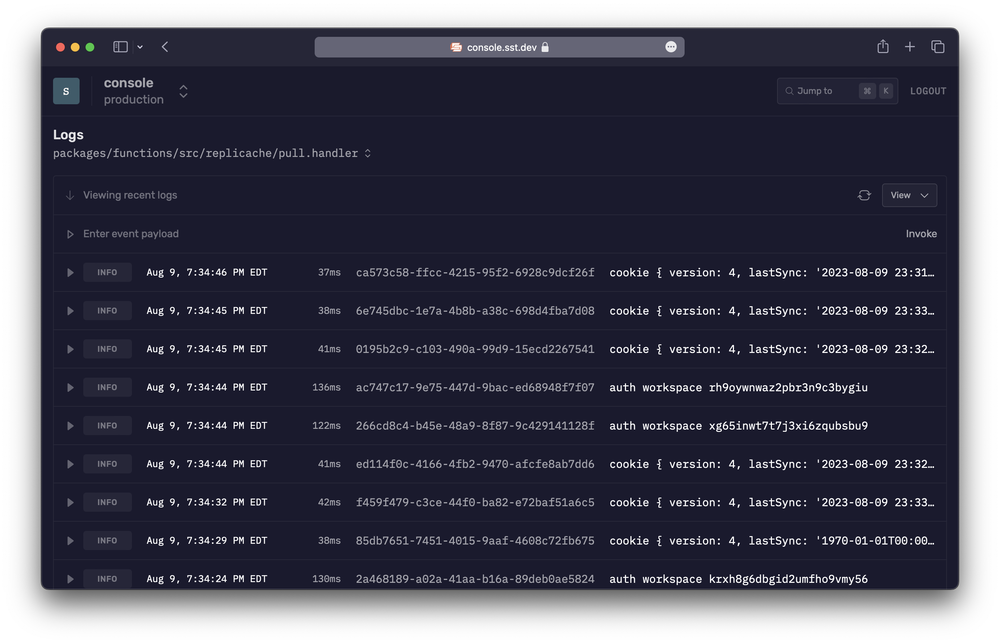

import { Tabs, TabItem } from '@astrojs/starlight/components';

Ion is a new engine for deploying [SST](https://sst.dev) apps. It uses [Pulumi](https://www.pulumi.com) and [Terraform](https://www.terraform.io) as opposed to CDK and CloudFormation. It's currently in alpha.

:::tip
Ion is **currently in alpha**. We'll be sharing more details on how to migrate your existing SST apps soon.
:::

Once Ion is stable, it’ll be released as SST v3. [Read the full announcement](https://sst.dev/blog/moving-away-from-cdk.html).

---

Aside from the underlying engine, there are a few differences between SST v2 and Ion.

- There are no _"stacks"_ or stack resource limits.
- There are no npm packages, just a CLI and the `sst.config.ts`.
- The `bind` command has been merged into the `dev` command. You won't need to run both of them.

---

SST is a framework that makes it easy to build modern full-stack applications on your own infrastructure.

:::note
Ion currently **supports Node.js** applications on **macOS, Linux, and WSL**. Support for other runtimes and OSes are on the roadmap.
:::

If you are new to SST, here's how it works.

---

## Frontend

You start by defining, _**in code**_, the frontend you are using. Or if you don't have a frontend, you can start with an API.

<Tabs>
  <TabItem label="Next.js">
  ```js title="sst.config.ts"
  new sst.aws.Nextjs("MyWeb", {
    domain: "my-app.com"
  });
  ```
  </TabItem>
  <TabItem label="Remix">
  ```js title="sst.config.ts"
  new sst.aws.Remix("MyWeb", {
    domain: "my-app.com"
  });
  ```
  </TabItem>
  <TabItem label="Astro">
  ```js title="sst.config.ts"
  new sst.aws.Astro("MyWeb", {
    domain: "my-app.com"
  });
  ```
  </TabItem>
  <TabItem label="API">
  ```js title="sst.config.ts"
  new sst.aws.ApiGatewayV2("MyApi", {
    domain: "api.my-app.com"
  });
  ```
  </TabItem>
</Tabs>

Support for other frontends are on the roadmap.

---

## Backend

Just like configuring the frontend, you can configure backend features _in code_. Features like cron jobs, buckets, queues, databases, and more.

<Tabs>
  <TabItem label="Cron">
  ```js title="sst.config.ts"
  new sst.aws.Cron("MyCronJob", {
    job: "src/cron.handler",
    schedule: "rate(1 minute)"
  });
  ```
  </TabItem>
  <TabItem label="Bucket">
  ```js title="sst.config.ts"
  new sst.aws.Bucket("MyBucket");
  ```
  </TabItem>
  <TabItem label="Queue">
  ```js title="sst.config.ts"
  const myQueue = new sst.aws.Queue("MyQueue");

  myQueue.subscribe("src/subscriber.handler");
  ```
  </TabItem>
  <TabItem label="Postgres">
  ```js title="sst.config.ts"
  new sst.aws.Postgres("MyDatabase");
  ```
  </TabItem>
</Tabs>

You can check out the full list of components on the sidebar.

---

## Infrastructure

The above snippets are called **Components**. They are a way of defining the features of your application in code. You can define any feature of your application with them.

They create the necessary infrastructure in your account. AWS in the above examples, all without using the AWS Console.

:::tip
Ion currently supports AWS and Cloudflare.
:::

Learn more about [Components](/docs/components/).

---

### Configure

SST's components come with sensible defaults designed to get you started. But they can also be configured completely.

For example, the `sst.aws.Function` can be configured with all the common Lambda function props.

```js {3,4} title="sst.config.ts"
new sst.aws.Function("MyFunction", {
  handler: "src/lambda.handler",
  timeout: "3 minutes",
  memory: "1024 MB"
});
```

But with SST you can take it a step further and transform how the Function component creates its low level infrastructure. The Function component also creates an IAM Role. You can transform the IAM Role using the `transform` prop.

```js {3-7} title="sst.config.ts"
new sst.aws.Function("MyFunction", {
  handler: "src/lambda.handler",
  transform: {
    role: (args) => ({
      name: `${args.name}-MyRole`
    })
  }
});
```

Read more about [transforms](/docs/components#transforms).

---

### Extend

If you want to add a feature to your app that's not supported by SST's components yet, you can use Pulumi components directly in your SST app. This is because components in SST are built on Pulumi components.

```js title="sst.config.ts"
import * as aws from "@pulumi/aws";

new aws.s3.BucketV2("b", {
  bucket: "mybucket",
  tags: {
    Name: "My bucket"
  }
});
```

Pulumi's [AWS Classic provider](https://www.pulumi.com/registry/packages/aws/) is automatically included in your SST app.

---

## Link resources

Once you've added a couple of features, SST can help you link them together. This is great because you **won't need to hardcode** anything in your app.

Let's say your app has a Next.js frontend and an S3 bucket for file uploads, you can `link` them together.

```js title="sst.config.ts" {4}
const myBucket = new sst.aws.Bucket("MyBucket");

new sst.aws.Nextjs("MyWeb", {
  link: [myBucket]
});
```

You can then use SST's [Node client](/docs/reference/client/) to access the S3 bucket in your Next.js app.

```ts title="app/page.tsx"
import { Resource } from "sst";

console.log(Resource.MyBucket.name);
```

Learn more about [resource linking](/docs/linking/).

---

## Project structure

We've looked at a couple of different types of files. Let's take a step back and see what an SST app looks like in practice.

---

#### Drop-in mode

The simplest way to run SST is to use it as a part of your frontend. This is called _drop-in mode_. For example, if you are using Next.js, you can add a `sst.config.ts` file to the root.

```plaintext {3}
my-nextjs-app
├─ next.config.js
├─ sst.config.ts
├─ package.json
├─ app
├─ lib
└─ public
```

---

#### Monorepo mode

Alternatively, you can use SST in a monorepo. This is useful if you have multiple frontends or you are working on a large project. In this case the `sst.config.ts` is in the root of your monorepo.

```plaintext {2}
my-sst-app
├─ sst.config.ts
├─ package.json
├─ packages
│  ├─ functions
│  ├─ core
│  └─ web
└─ stacks
```

---

## CLI

To make this all work, Ion comes with a CLI that you install globally.

```bash
curl -fsSL https://ion.sst.dev/install | bash
```

The CLI currently supports macOS, Linux, and WSL.

---

### Dev

The CLI includes a `dev` command that starts a local development environment.

```bash
sst dev
```

It lets you make and test changes to your function live, without having to redeloy them.

:::tip
The `sst dev` command runs your functions _**live**_, letting you test changes to your functions in milliseconds. [Learn more](/docs/live/).
:::

You can also use this command to start your frontend locally, and it'll automatically link your frontend to your backend resources.

<Tabs>
  <TabItem label="Next.js">
  ```bash
  sst dev next dev
  ```
  </TabItem>
  <TabItem label="Remix">
  ```bash
  sst dev remix dev
  ```
  </TabItem>
  <TabItem label="Astro">
  ```bash
  sst dev astro dev
  ```
  </TabItem>
</Tabs>

---

### Deploy

When you're ready to deploy your app, you can use the `deploy` command.

```bash
sst deploy
```

---

#### Environments

The `deploy` command can also deploy your app to a specific stage or environment. This lets you create separate environments for development, production, pull-requests, or branches.

```bash
# Deploy to dev
npx sst deploy --stage dev

# Deploy a PR environment
npx sst deploy --stage pr-123

# Deploy to production
npx sst deploy --stage prod
```

---

## Console

Once your app is in production, you can use the [SST Console](/docs/console/) to monitor and manage your app — [**console.sst.dev**](https://console.sst.dev)

[](https://console.sst.dev)

---

Next, you can get started with one of our quick starts, like [Next.js](/docs/starts/nextjs/).
