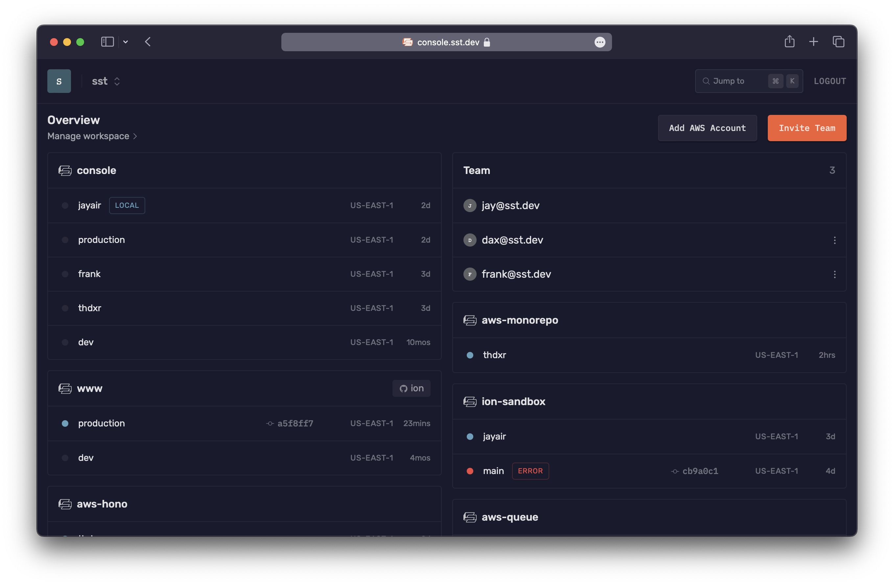

import { Tabs, TabItem } from '@astrojs/starlight/components';
import config from '../../../../config.ts';

export const github  = config.github;

SST is a framework that makes it easy to build modern full-stack applications on your own infrastructure.

What makes SST different is that your _entire_ app is **defined in code** — in a single `sst.config.ts` file. This includes your databases, buckets, queues, your Stripe webhooks, or any one of the **150+ providers**.

With SST, **everything is automated**.

---

Ion is a new engine for deploying [SST](https://sst.dev) apps. It uses [Pulumi](https://www.pulumi.com) and [Terraform](https://www.terraform.io), as opposed to CDK and CloudFormation.

:::note
Ion is open source, does not require a Pulumi account, and only depends on the open source parts of Pulumi and Terraform.
:::

Ion is generally available and **recommended for new SST users**. We are working on a migration path for SST v2 users. Once Ion is stable, it’ll be released as SST v3. [Read the full announcement](https://sst.dev/blog/moving-away-from-cdk.html).

If you are new to SST, here's how it works.

---

## Frontend

You start by defining parts of your app, _**in code**_. For example, your frontend. Or if you don't have a frontend, your API.

<Tabs>
  <TabItem label="Next.js">
  ```ts title="sst.config.ts"
  new sst.aws.Nextjs("MyWeb", {
    domain: "my-app.com"
  });
  ```
  </TabItem>
  <TabItem label="Remix">
  ```ts title="sst.config.ts"
  new sst.aws.Remix("MyWeb", {
    domain: "my-app.com"
  });
  ```
  </TabItem>
  <TabItem label="Astro">
  ```ts title="sst.config.ts"
  new sst.aws.Astro("MyWeb", {
    domain: "my-app.com"
  });
  ```
  </TabItem>
  <TabItem label="Svelte">
  ```ts title="sst.config.ts"
  new sst.aws.SvelteKit("MyWeb", {
    domain: "my-app.com"
  });
  ```
  </TabItem>
  <TabItem label="Solid">
  ```ts title="sst.config.ts"
  new sst.aws.SolidStart("MyWeb", {
    domain: "my-app.com"
  });
  ```
  </TabItem>
  <TabItem label="API">
  ```ts title="sst.config.ts"
  new sst.aws.ApiGatewayV2("MyApi", {
    domain: "api.my-app.com"
  });
  ```
  </TabItem>
</Tabs>

Your app might even have multiple frontends.

---

## Backend

Just like the frontend, you can configure backend features _in code_. Features like cron jobs, buckets, queues, databases, and more.

<Tabs>
  <TabItem label="Cron">
  ```ts title="sst.config.ts"
  new sst.aws.Cron("MyCronJob", {
    job: "src/cron.handler",
    schedule: "rate(1 minute)"
  });
  ```
  </TabItem>
  <TabItem label="Bucket">
  ```ts title="sst.config.ts"
  new sst.aws.Bucket("MyBucket");
  ```
  </TabItem>
  <TabItem label="Email">
  ```ts title="sst.config.ts"
  new sst.aws.Email("MyEmail", {
    sender: "example.com"
  });
  ```
  </TabItem>
  <TabItem label="Realtime">
  ```ts title="sst.config.ts"
  new sst.aws.Realtime("MyServer", {
    authorizer: "src/authorizer.handler"
  });
  ```
  </TabItem>
  <TabItem label="Queue">
  ```ts title="sst.config.ts"
  const myQueue = new sst.aws.Queue("MyQueue");

  myQueue.subscribe("src/subscriber.handler");
  ```
  </TabItem>
  <TabItem label="Postgres">
  ```ts title="sst.config.ts"
  new sst.aws.Postgres("MyDatabase");
  ```
  </TabItem>
</Tabs>

You can check out the full list of components in the sidebar.

---

## Infrastructure

The above are called **Components**. They are a way of defining the features of your application in code. You can define any feature of your application with them.

In the above examples, they create the necessary infrastructure in your AWS account. All without using the AWS Console.

Read more about [Components](/docs/components/).

---

### Configure

SST's components come with sensible defaults designed to get you started. But they can also be configured completely.

For example, the `sst.aws.Function` can be configured with all the common Lambda function props.

```ts {3,4} title="sst.config.ts"
new sst.aws.Function("MyFunction", {
  handler: "src/lambda.handler",
  timeout: "3 minutes",
  memory: "1024 MB"
});
```

But with SST you can take it a step further and transform how the Function component creates its low level infrastructure. For example, the Function component also creates an IAM Role. You can transform the IAM Role using the `transform` prop.

```ts {3-7} title="sst.config.ts"
new sst.aws.Function("MyFunction", {
  handler: "src/lambda.handler",
  transform: {
    role: (args) => ({
      name: `${args.name}-MyRole`
    })
  }
});
```

Read more about [transforms](/docs/components#transforms).

---

### Providers

SST has components for AWS and Cloudflare that make these services easier to use.

However it also supports components from any one of the 150+ Pulumi/Terraform providers. This is because components in SST are built on Pulumi components.

For example, you can use Vercel for your frontends.

```ts title="sst.config.ts"
new vercel.Project("MyFrontend", {
  name: "my-nextjs-app"
});
```

Read more about [Providers](/docs/providers) and check out the full list in the [Directory](/docs/providers#directory)

---

## Link resources

Once you've added a couple of features, SST can help you link them together. This is great because you **won't need to hardcode** anything in your app.

Let's say your app has a Next.js frontend and an S3 bucket for file uploads. You can `link` the bucket to your Next.js app.

```ts title="sst.config.ts" {4}
const bucket = new sst.aws.Bucket("MyBucket");

new sst.aws.Nextjs("MyWeb", {
  link: [bucket]
});
```

You can then use SST's [SDK](/docs/reference/sdk/) to access the S3 bucket in your Next.js app.

```ts title="app/page.tsx" "Resource.MyBucket.name"
import { Resource } from "sst";

console.log(Resource.MyBucket.name);
```

Read more about [resource linking](/docs/linking/).

---

## Project structure

We've looked at a couple of different types of files. Let's take a step back and see what an SST app looks like in practice.

---

### Drop-in mode

The simplest way to run SST is to use it as a part of your frontend. This is called _drop-in mode_. For example, if you are using Next.js, you can add a `sst.config.ts` file to the root.

```txt {3}
my-nextjs-app
├─ next.config.js
├─ sst.config.ts
├─ package.json
├─ app
├─ lib
└─ public
```

View an <a href={`${github}/tree/dev/examples/aws-nextjs`}>example Next.js</a> app using SST in drop-in mode.

---

### Monorepo

Alternatively, you can use SST in a monorepo. This is useful if you have multiple frontends or you are working on a large project. In this case the `sst.config.ts` is in the root of your monorepo.

```txt {2}
my-sst-app
├─ sst.config.ts
├─ package.json
├─ packages
│  ├─ functions
│  ├─ frontend
│  ├─ scripts
│  └─ core
└─ infra
```

Read more about our [monorepo setup](/docs/examples/#aws-monorepo).

---

## CLI

To make this all work, SST comes with a [CLI](/docs/reference/cli/) that you install globally.

```bash
curl -fsSL https://ion.sst.dev/install | bash
```

:::note
SST currently supports **macOS, Linux, and WSL**. Support for Windows is on the roadmap.
:::

The CLI currently supports macOS, Linux, and WSL.

---

### Dev

The CLI includes a `dev` command that starts a local development environment.

```bash
sst dev
```

It lets you make and test changes to your functions live, without having to redeploy them.

:::tip
The `sst dev` command runs your functions _**live**_, letting you test changes to your functions in milliseconds. [Read more](/docs/live/).
:::

You can also use this command to start your frontend locally, and it'll automatically load your linked resources in your frontend's environment.

<Tabs>
  <TabItem label="Next.js">
  ```bash
  sst dev next dev
  ```
  </TabItem>
  <TabItem label="Remix">
  ```bash
  sst dev remix dev
  ```
  </TabItem>
  <TabItem label="Astro">
  ```bash
  sst dev astro dev
  ```
  </TabItem>
</Tabs>

---

### Deploy

When you're ready to deploy your app, you can use the `deploy` command.

```bash
sst deploy --stage production
```

---

#### Stages

The `deploy` command can also deploy your app to a specific stage or environment.

```bash
# Deploy to dev
npx sst deploy --stage dev

# Deploy a PR environment
npx sst deploy --stage pr-123
```

This lets you create separate environments for your app. Read more about [stages](/docs/reference/cli#stage).

---

## Console

Once you are ready to go to production, you can use the [SST Console](/docs/console/) to **auto-deploy** your app, create **preview environments**, and **monitor** for any issues.



Read more about the [Console](/docs/console/).

---

#### Next steps

1. Create your first SST app
   - [Deploy a Next.js app to AWS](/docs/start/aws/nextjs/)
   - [Send emails from your API](/docs/start/aws/email/)
   - [Build a Hono API with on Cloudflare](/docs/start/cloudflare/hono/)
2. [Learn about the SST workflow](/docs/workflow/)
