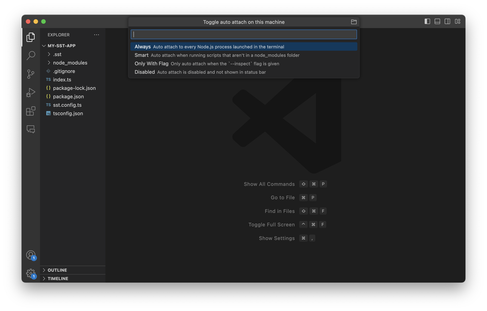

Live is a feature of SST that lets you test changes made to your AWS Lambda functions in milliseconds. Your changes work without having to redeploy. And they can be invoked remotely.

:::tip
By default, `sst dev` will run all the functions in your app _"live"_.
:::

It works by proxying requests from AWS to your local machine, executing it locally, and proxying the response back.


---

## Advantages

This setup of running your functions locally and proxying the results back allows you to do a couple of things:

- Your changes are **reloaded in under 10ms**.
- You can set **breakpoints to debug** your function in your favorite IDE.
- Functions can be invoked remotely. For example, say `https://my-api.com/hello` is your API endpoint. Hitting that will run the local version of that function.
  - This applies to more than just APIs. Any cron job or async event that gets invoked remotely will also run your local function.
  - It allows you to very easily debug and **test webhooks**, since you can just give the webhook your API endpoint.
  - Supports all function triggers, there's no need to mock an event.
- Uses the **right IAM permissions**, so if a Lambda fails on AWS due to the lack of IAM permissions, it would fail locally as well.

---

## How it works

Live uses [IoT over WebSocket](https://docs.aws.amazon.com/iot/latest/developerguide/protocols.html) to communicate between your local machine and the remote Lambda function.

:::note
Every AWS account comes with a AWS IoT Core endpoint by default.
:::

This is roughly what the flow looks like:

1. When you run `sst dev`, it deploys your app and replaces the Lambda functions with a _stub_ version.
2. It also starts up a local WebSocket client and connects to your AWS accounts' IoT endpoint.
3. When a Lambda function in your app is invoked, it publishes an event, where the payload is the Lambda function request.
4. Your local WebSocket client receives this event. It publishes an event acknowledging that it received the request.
5. Next, it runs the local version of the function and publishes an event with the function response as the payload. The local version is run as a Node.js Worker.
6. Finally, the stub Lambda function receives the event and responds with the payload.

---

### Quirks

There are a couple of quirks with this setup that are worth noting.

1. **Initial IoT delay**

   New AWS accounts (or accounts that have not previously used AWS IoT Core) need around **10 minutes** before it can be used. The `sst dev` CLI starts this up as early as possible but you might run into this error.

   ```
   failed to connect to mqtt: network Error : dial tcp: lookup
   xxx.iot.eu-central-1.amazonaws.com: no such host
   ```

   This will only happen once in that account.

2. **Runtime change**

   The stub function that's deployed uses a **different runtime** than your Lambda function. You might run into this when you change the runtime in your config but the runtime of the Lambda function in the AWS Console doesn't change.

   :::tip
   The _stub_ function that’s deployed uses a different runtime than the actual function.
   :::

   We use a different runtime because we want the function to be as fast as possible at proxying requests.

3. **Live mode persists**

   If you kill the `sst dev` CLI, your functions are not run locally anymore but the stub function in AWS are still there. This means that it'll attempt to proxy requests to your machine and timeout.

   :::tip
   Only use `sst dev` in your personal stage.
   :::

   You can fix this by running `sst deploy` and it'll deploy the real version of your app. But the next time you run `sst dev` it'll need to deploy the stub back. This'll take a couple of minutes. So we recommend only using your personal stages for `sst dev`. And avoid flipping back and forth between `dev` and `deploy`.

---

### Live mode

When a function is running live it sets the `SST_DEV` environment variable to `true`. So in your Node.js functions you can access it using `process.env.SST_DEV`.

```js title="src/lambda.js" "process.env.SST_DEV"
export async function main(event) {
  const body = process.env.SST_DEV ? "Hello, Live!" : "Hello, World!";

  return {
    body,
    statusCode: 200,
  };
}
```

This is useful if you want to access some resources locally.

---

#### Connect to a local DB

For example, when running locally you might want to connect to a local database. You can do that with the `SST_DEV` environment variable.

```js
const dbHost = process.env.SST_DEV
  ? "localhost"
  : "amazon-string.rds.amazonaws.com";
```

---

## Cost

AWS IoT that powers Live is **completely serverless**. So you don't get charged when it's not in use.

It's also pretty cheap. With a free tier of 500k events per month and roughly $1.00 per million for the next billion messages. You can [check out the details here](https://aws.amazon.com/iot-core/pricing/).

This approach has been economical even for large teams with dozens of developers.

---

## Privacy

All the data stays between your local machine and your AWS account. There are **no 3rd party services** that are used.

Live also supports connecting to AWS resources inside a VPC.

---

### Using a VPC

By default your local functions cannot connect to resources in a VPC. You'll need to:

1. Setup a VPN connection from your local machine to your VPC network. You can use the AWS Client VPN service to set it up. [Follow the Mutual authentication section in this doc](https://docs.aws.amazon.com/vpn/latest/clientvpn-admin/client-authentication.html#mutual) to setup the certificates and import them into your Amazon Certificate Manager.
2. Then [create a Client VPC Endpoint](https://aws.amazon.com/blogs/networking-and-content-delivery/introducing-aws-client-vpn-to-securely-access-aws-and-on-premises-resources/), and associate it with your VPC.
3. And, finally install [Tunnelblick](https://tunnelblick.net) locally to establish the VPN connection.

Note that, the AWS Client VPC service is billed on an hourly basis but it's fairly inexpensive. [Read more on the pricing here](https://aws.amazon.com/vpn/pricing/).

---

## Breakpoints

Since Live runs your functions locally, you can set breakpoints and debug your functions in your favorite IDE.



For VS Code, you'll need to enable Auto Attach from the Command Palette. Hit `Ctrl+Shift+P` or `Cmd+Shift+P`, type in **Debug: Toggle Auto Attach** and select **Always**.

:::note
You need to start a new terminal after enabling Auto Attach.
:::

Now open a new terminal VS Code, run `sst dev`, set a breakpoint in a function, and invoke the function.
