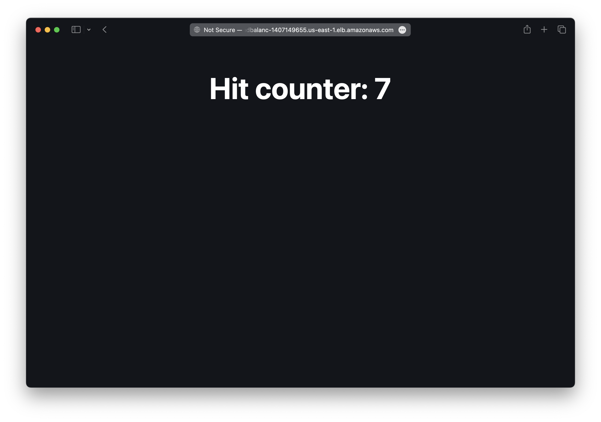

There are two ways to deploy an Astro site to AWS with SST.

1. [Serverless](#serverless)
2. [Containers](#containers)

We'll use both to build a couple of simple apps below.

---

#### Examples

We also have a few other Astro examples that you can refer to.

- [Enabling streaming in your Astro app](/docs/examples/#aws-astro-streaming)

---

## Serverless

We are going to create an Astro site, add an S3 Bucket for file uploads, and deploy it using the `Astro` component.

:::tip[View source]
You can [view the source](https://github.com/sst/ion/tree/dev/examples/aws-astro) of this example in our repo.
:::

Before you get started, make sure to [configure your AWS credentials](/docs/iam-credentials#credentials).

---

### 1. Create a project

Let's start by creating our project.

```bash
npm create astro@latest aws-astro
cd aws-astro
```

We are picking all the default options.

---

##### Init SST

Now let's initialize SST in our app.

```bash
npx sst@latest init
npm install
```

Select the defaults and pick **AWS**. This'll create a `sst.config.ts` file in your project root.

It'll also ask you to update your `astro.config.mjs` with something like this.

```diff lang="js" title="astro.config.mjs"
+ import aws from "astro-sst";

export default defineConfig({
+  output: "server",
+  adapter: aws()
});
```

---

##### Start dev mode

Run the following to start dev mode. This'll start SST and your Astro site.

```bash
npx sst dev
```

Once complete, click on **MyWeb** in the sidebar and open your Astro site in your browser.

---

### 2. Add an S3 Bucket

Let's allow public `access` to our S3 Bucket for file uploads. Update your `sst.config.ts`.

```js title="sst.config.ts"
const bucket = new sst.aws.Bucket("MyBucket", {
  access: "public"
});
```

Add this above the `Astro` component.

##### Link the bucket

Now, link the bucket to our Astro site.

```js title="sst.config.ts" {2}
new sst.aws.Astro("MyWeb", {
  link: [bucket],
});
```

---

### 3. Create an upload form

Add the upload form client in `src/pages/index.astro`. Replace the `<Layout />` component with:

```astro title="src/pages/index.astro"
<Layout title="Astro x SST">
  <main>
    <form action={url}>
      <input name="file" type="file" accept="image/png, image/jpeg" />
      <button type="submit">Upload</button>
    </form>
    <script>
      const form = document.querySelector("form");
      form!.addEventListener("submit", async (e) => {
        e.preventDefault();

        const file = form!.file.files?.[0]!;

        const image = await fetch(form!.action, {
          body: file,
          method: "PUT",
          headers: {
            "Content-Type": file.type,
            "Content-Disposition": `attachment; filename="${file.name}"`,
          },
        });

        window.location.href = image.url.split("?")[0] || "/";
      });
    </script>
  </main>
</Layout>
```

Add some styles, replace the `<style />` tag with:

```astro title="src/pages/index.astro"
<style>
	main {
		margin: auto;
		padding: 1.5rem;
		max-width: 60ch;
	}
	form {
		color: white;
		padding: 2rem;
		display: flex;
		align-items: center;
		justify-content: space-between;
		background-color: #23262d;
		background-image: none;
		background-size: 400%;
		border-radius: 0.6rem;
		background-position: 100%;
		box-shadow: 0 4px 6px -1px rgba(0, 0, 0, 0.1), 0 2px 4px -2px rgba(0, 0, 0, 0.1);
	}
	button {
		appearance: none;
		border: 0;
		font-weight: 500;
		border-radius: 5px;
		font-size: 0.875rem;
		padding: 0.5rem 0.75rem;
		background-color: white;
		border: 1px solid rgb(var(--accent));
		color: rgb(var(--accent));
	}
	button:active:enabled {
		background-color: #EEE;
	}
</style>
```

---

### 4. Generate a pre-signed URL

When our app loads, we'll generate a pre-signed URL for the file upload and use it in the form.

```astro title="src/pages/index.astro" {9}
---
import { Resource } from "sst";
import Layout from '../layouts/Layout.astro';
import { getSignedUrl } from "@aws-sdk/s3-request-presigner";
import { S3Client, PutObjectCommand } from "@aws-sdk/client-s3";

const command = new PutObjectCommand({
  Key: crypto.randomUUID(),
  Bucket: Resource.MyBucket.name,
});
const url = await getSignedUrl(new S3Client({}), command);
---
```

:::tip
We are directly accessing our S3 bucket with `Resource.MyBucket.name`.
:::

And install the npm packages.

```bash
npm install @aws-sdk/client-s3 @aws-sdk/s3-request-presigner
```

Head over to the local Astro site in your browser, `http://localhost:4321` and try **uploading an image**. You should see it upload and then download the image.

---

### 5. Deploy your app

Now let's deploy your app to AWS.

```bash
npx sst deploy --stage production
```

You can use any stage name here but it's good to create a new stage for production.

---

## Containers

We are going to build a hit counter Astro site with Redis. We'll deploy it to AWS in a container using the `Cluster` component.

:::tip[View source]
You can [view the source](https://github.com/sst/ion/tree/dev/examples/aws-astro-container) of this example in our repo.
:::

Before you get started, make sure to [configure your AWS credentials](/docs/iam-credentials#credentials).

---

### 1. Create a project

Let's start by creating our project.

```bash
npm create astro@latest aws-astro-container
cd aws-astro
```

We are picking all the default options.

---

##### Init SST

Now let's initialize SST in our app.

```bash
npx sst@latest init
npm install
```

Select the defaults and pick **AWS**. This'll create a `sst.config.ts` file in your project root.

It'll also ask you to update your `astro.config.mjs` but we'll instead use the [**Node.js adapter**](https://docs.astro.build/en/guides/integrations-guide/node/) since we're deploying it through a container.

```bash
npx astro add node
```

---

### 2. Add a Cluster

To deploy our Astro site in a container, we'll use [AWS Fargate](https://aws.amazon.com/fargate/) with [Amazon ECS](https://aws.amazon.com/ecs/). Replace the `run` function in your `sst.config.ts`.

```js title="sst.config.ts" {9-11}
async run() {
  const vpc = new sst.aws.Vpc("MyVpc", { bastion: true });
  const cluster = new sst.aws.Cluster("MyCluster", { vpc });

  cluster.addService("MyService", {
    public: {
      ports: [{ listen: "80/http", forward: "4321/http" }],
    },
    dev: {
      command: "npm run dev",
    },
  });
}
```

This creates a VPC with a bastion host, an ECS Cluster, and adds a Fargate service to it.

The `dev.command` tells SST to run our Astro site locally in dev mode.

---

### 3. Add Redis

Let's add an [Amazon ElastiCache](https://aws.amazon.com/elasticache/) Redis cluster. Add this below the `Vpc` component in your `sst.config.ts`.

```js title="sst.config.ts"
const redis = new sst.aws.Redis("MyRedis", { vpc });
```

This shares the same VPC as our ECS cluster.

---

#### Link Redis

Now, link the Redis cluster to the container.

```ts title="sst.config.ts" {3}
cluster.addService("MyService", {
  // ...
  link: [redis],
});
```

This will allow us to reference the Redis cluster in our Astro site.

---

#### Install a tunnel

Since our Redis cluster is in a VPC, we'll need a tunnel to connect to it from our local machine.

```bash "sudo"
sudo npx sst tunnel install
```

This needs _sudo_ to create a network interface on your machine. You'll only need to do this once on your machine.

---

#### Start dev mode

Start your app in dev mode.

```bash
npx sst dev
```

This will deploy your app, start a tunnel in the **Tunnel** tab, and run your Astro site locally in the **MyServiceDev** tab.

---

### 4. Connect to Redis

We want the `/` route to increment a counter in our Redis cluster. Let's start by installing the npm package we'll use.

```bash
npm install ioredis
```

We'll increment the counter when `index.astro` loads.

```astro title="src/pages/index.astro" {5}
import { Resource } from "sst";
import { Cluster } from "ioredis";

const redis = new Cluster(
  [{ host: Resource.MyRedis.host, port: Resource.MyRedis.port }],
  {
    dnsLookup: (address, callback) => callback(null, address),
    redisOptions: {
      tls: {},
      username: Resource.MyRedis.username,
      password: Resource.MyRedis.password,
    },
  }
);

const counter = await redis.incr("counter");

---
```

:::tip
We are directly accessing our Redis cluster with `Resource.MyRedis.*`.
:::

Let's update our component to show the counter. Replace the `<Layout />` component in `src/pages/index.astro`.

```astro title="src/pages/index.astro"
<Layout title="Welcome to Astro.">
	<main>
		<h1>Hit counter: {counter}</h1>
	</main>
</Layout>
```

---

#### Test your app

Let's head over to `http://localhost:4321` in your browser and it'll show the current hit counter.

You should see it increment every time you **refresh the page**.

---

### 5. Deploy your app

To deploy our app we'll add a `Dockerfile`.

<details>
<summary>View Dockerfile</summary>

```Dockerfile title="Dockerfile"
# From https://docs.astro.build/en/recipes/docker/

FROM node:lts AS base
WORKDIR /app

# By copying only the package.json and package-lock.json here, we ensure that the following `-deps` steps are independent of the source code.
# Therefore, the `-deps` steps will be skipped if only the source code changes.
COPY package.json package-lock.json ./

FROM base AS prod-deps
RUN npm install --omit=dev

FROM base AS build-deps
RUN npm install

FROM build-deps AS build
COPY . .
RUN npm run build

FROM base AS runtime
COPY --from=prod-deps /app/node_modules ./node_modules
COPY --from=build /app/dist ./dist

ENV HOST=0.0.0.0
ENV PORT=4321
EXPOSE 4321
CMD node ./dist/server/entry.mjs
```
</details>

:::tip
You need to be running [Docker Desktop](https://www.docker.com/products/docker-desktop/) to deploy your app.
:::

Let's also add a `.dockerignore` file in the root.

```bash title=".dockerignore"
.DS_Store
node_modules
dist
```

Now to build our Docker image and deploy we run:

```bash
npx sst deploy --stage production
```

You can use any stage name here but it's good to create a new stage for production.

Congrats! Your app should now be live!



---

## Connect the console

As a next step, you can setup the [SST Console](/docs/console/) to _**git push to deploy**_ your app and monitor it for any issues. 


You can [create a free account](https://console.sst.dev) and connect it to your AWS account.

