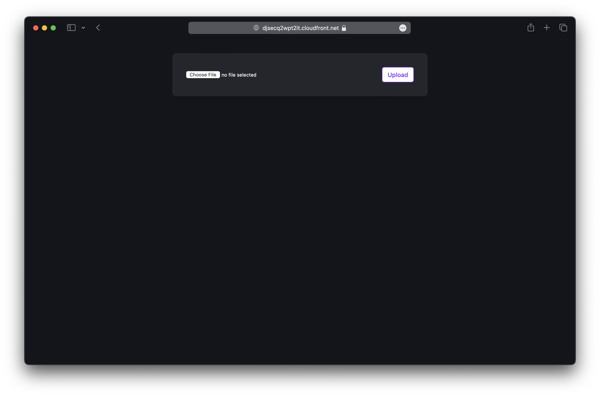
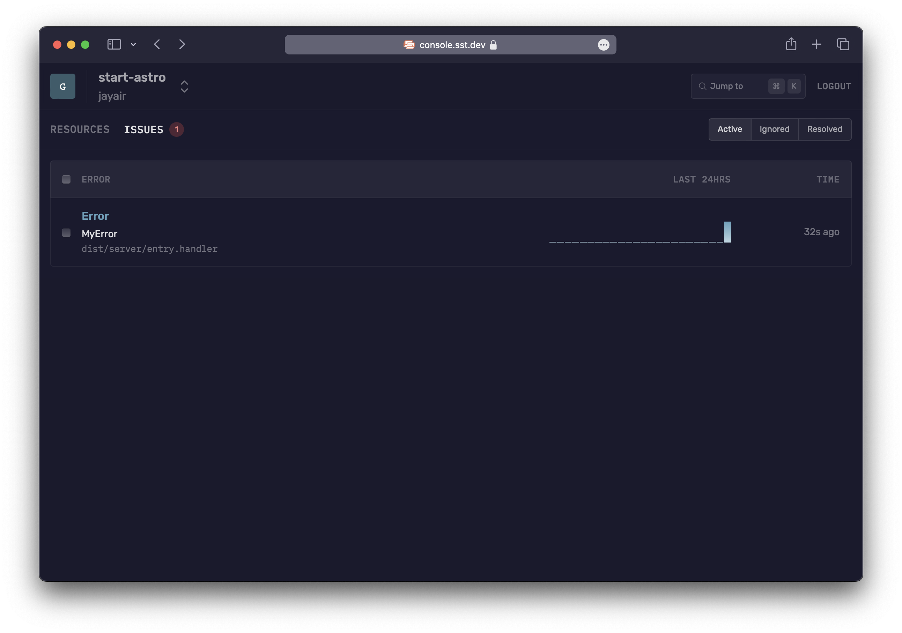

We are going to create an Astro site, add an S3 Bucket for file uploads, and deploy it to AWS using SST.

:::tip[View source]
You can [view the source](https://github.com/sst/ion/tree/dev/examples/aws-astro) of this example in our repo.
:::

Before you get started:

1. [Configure your AWS credentials](https://docs.sst.dev/advanced/iam-credentials#loading-from-a-file)
2. [Install the SST CLI](/docs/reference/cli)

---

## 1. Create a project

Let's start by creating our project.

```bash
npm create astro@latest
cd aws-astro
```

#### Init SST

Now let's initialize SST in our app. Make sure you have the [CLI installed](/docs/reference/cli/).

```bash
sst init
```

This'll detect that you are in an Astro project and create a `sst.config.ts` file in the root.

#### Start dev mode

Start the dev mode for your Astro site and link it to SST.

```bash
npm run dev
```

:::note
You are starting `astro dev` wrapped in `sst dev astro dev`.
:::

---

## 2. Add an S3 Bucket

Let's add a `public` S3 Bucket for file uploads. Update your `sst.config.ts`.

```js title="sst.config.ts"
const bucket = new sst.aws.Bucket("MyBucket", {
  public: true
});
```

#### Link the bucket

Now, link the bucket to our Astro site.

```js title="sst.config.ts" {2}
new sst.aws.Astro("MyWeb", {
  link: [bucket],
});
```

---

## 3. Create an upload form

Add the upload form client in `src/pages/index.astro`. Replace the `<Layout />` component with:

```astro title="src/pages/index.astro"
<Layout title="Astro x SST">
  <main>
    <form action={url}>
      <input name="file" type="file" accept="image/png, image/jpeg" />
      <button type="submit">Upload</button>
    </form>
    <script>
      const form = document.querySelector("form");
      form!.addEventListener("submit", async (e) => {
        e.preventDefault();

        const file = form!.file.files?.[0]!;

        const image = await fetch(form!.action, {
          body: file,
          method: "PUT",
          headers: {
            "Content-Type": file.type,
            "Content-Disposition": `attachment; filename="${file.name}"`,
          },
        });

        window.location.href = image.url.split("?")[0] || "/";
      });
    </script>
  </main>
</Layout>
```

Add some styles, replace the `<style />` tag with:

```astro title="src/pages/index.astro"
<style>
	main {
		margin: auto;
		padding: 1.5rem;
		max-width: 60ch;
	}
	form {
		color: white;
		padding: 2rem;
		display: flex;
		align-items: center;
		justify-content: space-between;
		background-color: #23262d;
		background-image: none;
		background-size: 400%;
		border-radius: 0.6rem;
		background-position: 100%;
		box-shadow: 0 4px 6px -1px rgba(0, 0, 0, 0.1), 0 2px 4px -2px rgba(0, 0, 0, 0.1);
	}
	button {
		appearance: none;
		border: 0;
		font-weight: 500;
		border-radius: 5px;
		font-size: 0.875rem;
		padding: 0.5rem 0.75rem;
		background-color: white;
		border: 1px solid rgb(var(--accent));
		color: rgb(var(--accent));
	}
	button:active:enabled {
		background-color: #EEE;
	}
</style>
```

---

## 4. Generate a pre-signed URL

When our app loads, we'll generate a pre-signed URL for the file upload and use it in the form.

```astro title="src/pages/index.astro" {9}
---
import { Resource } from "sst";
import Layout from '../layouts/Layout.astro';
import { getSignedUrl } from "@aws-sdk/s3-request-presigner";
import { S3Client, PutObjectCommand } from "@aws-sdk/client-s3";

const command = new PutObjectCommand({
  Key: crypto.randomUUID(),
  Bucket: Resource.MyBucket.name,
});
const url = await getSignedUrl(new S3Client({}), command);
---
```

:::tip
We are directly accessing our S3 bucket with `Resource.MyBucket.name`.
:::

And install the npm packages.

```bash
npm install @aws-sdk/client-s3 @aws-sdk/s3-request-presigner
```

Head over to the local Astro site in your browser, `http://localhost:4321` and try **uploading an image**. You should see it upload and then download the image.

---

## 5. Deploy your app

Now let's deploy your app to AWS.

```bash
sst deploy
```

Congrats! Your site should now be live!



---

## Connect the console

As a next step, you can manage your app and view issues in the [SST Console](/docs/console/).



You can [create a free account](https://console.sst.dev) and connect it to your AWS account.

