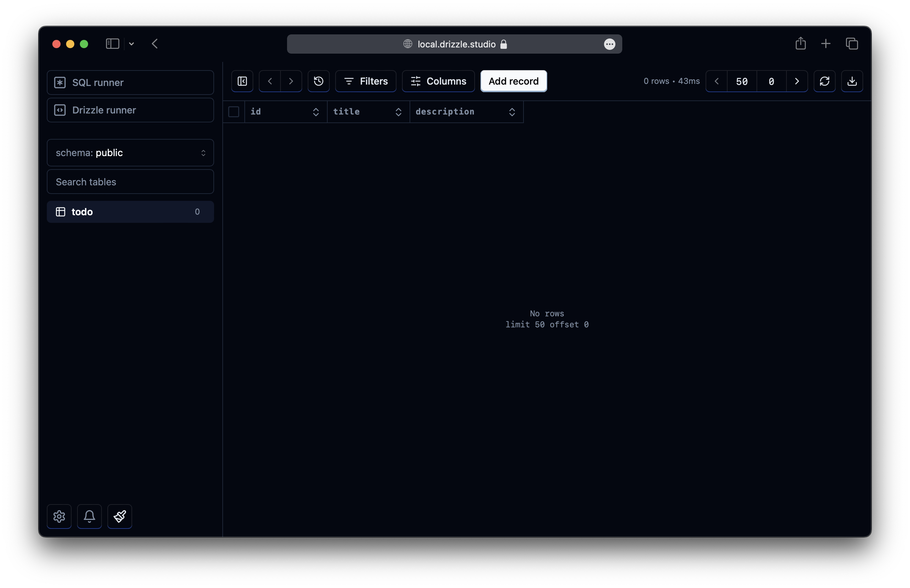
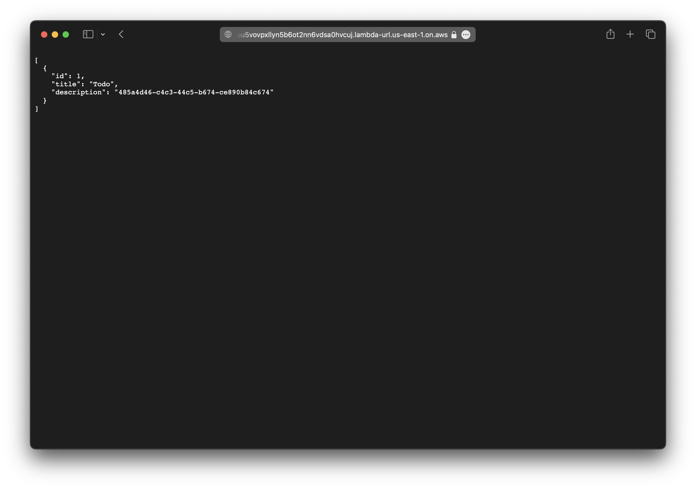

We are going to use Drizzle and SST to manage and deploy an Amazon Postgres RDS database.

:::tip[View source]
You can [view the source](https://github.com/sst/ion/tree/dev/examples/aws-drizzle) of this example in our repo.
:::

Before you get started, make sure to [configure your AWS credentials](/docs/iam-credentials#credentials).

---

## 1. Create a project

Let's start by creating a Node.js app.

```bash
mkdir my-drizzle-app && cd my-drizzle-app
npm init -y
```

---

#### Init SST

Now let's initialize SST in our app.

```bash
npx sst@latest init
npm install
```

Select the defaults and pick **AWS**. This'll create a `sst.config.ts` file in your project root.

---

#### Init Drizzle

Add Drizzle to your project. We're also adding the `pg` client that Drizzle will use.

```bash
npm install pg @types/pg drizzle-orm drizzle-kit
```

Drizzle ORM is what will be used to query our database, while Drizzle Kit will allow us to run migrations. It also comes with Drizzle Studio, a query browser.

Let's add the following to the `scripts` in the `package.json`.

```json title="package.json"
"scripts": {
  "db": "sst shell drizzle-kit",
  "db:studio": "sst shell drizzle-kit studio"
},
```

SST will pass the credentials to Drizzle Kit and allow it to connect to your database.

---

## 2. Add a Postgres db

Let's add a Postgres database using [Amazon RDS](https://docs.aws.amazon.com/AmazonRDS/latest/UserGuide/Welcome.html). The `proxy` option configures an RDS Proxy behind the scenes making it ideal for serverless applications. Update your `sst.config.ts`. 

```ts title="sst.config.ts"
async run() {
  const vpc = new sst.aws.Vpc("MyVpc");
  const rds = new sst.aws.Postgres("MyPostgres", { vpc, proxy: true });
},
```

---

#### Add an API

We'll also add an API to query our database. Add the following to your `sst.config.ts` below the database config.

```ts title="sst.config.ts" {3}
const api = new sst.aws.Function("MyApi", {
  url: true,
  link: [rds],
  handler: "src/api.handler",
});

return {
  api: api.url,
};
```

We are linking our database to the API.

---

#### Start dev mode

Start your app in dev mode. This runs your functions [_Live_](/docs/live/).

```bash
npx sst dev
```

It'll take a few minutes to create your database. Once complete, you'll see this.

```bash frame="none"
+  Complete
   api: https://ouu5vovpxllyn5b6ot2nn6vdsa0hvcuj.lambda-url.us-east-1.on.aws
```

---

## 3. Create a schema

Let's define our Drizzle config. Add a `drizzle.config.ts` in your project root with this.

```ts title="drizzle.config.ts" {8-10}
import { Resource } from "sst";
import { defineConfig } from "drizzle-kit";

const cfg = Resource.MyPostgres;

export default defineConfig({
  dialect: "postgresql",
  // Pick up all our schema files
  schema: ["./src/**/*.sql.ts"],
  out: "./migrations",
  dbCredentials: {
    host: cfg.host,
    port: cfg.port,
    user: cfg.username,
    password: cfg.password,
    database: cfg.database,
  },
});

```

Here we are telling Drizzle that we'll be specifying your database schema in `.sql.ts` files in our `src/` directory.

:::tip
SST allows us to automatically access our database with `Resource.MyPostgres.*`.
:::

We are going to create a simple database to store some todos. Create a new file in `src/todo.sql.ts` with the following.

```ts title="src/todo.sql.ts"
import { text, serial, pgTable } from "drizzle-orm/pg-core";

export const todo = pgTable("todo", {
  id: serial("id").primaryKey(),
  title: text("title").notNull(),
  description: text("description"),
});
```

---

## 4. Generate a migration

We can use this to generate a migration.

```bash
npm run db generate
```

This in turn runs `sst shell drizzle-kit generate` and creates a new migration in the `migrations/` directory.

---

#### Apply the migration

Now we can apply our migration using.

```bash
npm run db migrate
```

This should create our new schema.

:::tip
Your RDS instance will be in a VPC, so remember to start the VPC tunnel by running `npx sst tunnel`. You can install the tunnel on your machine as shown below:
:::

```bash "sudo"
sudo npx sst tunnel install
```

This needs _sudo_ to create a network interface on your machine. You'll only need to do this once on your machine.

---

#### Drizzle Studio

To see our schema in action we can open the Drizzle Studio.

```bash
npm run db:studio
```

This will run `sst shell drizzle-kit studio` and direct you to opening `https://local.drizzle.studio`.




---

## 5. Query the database

To use Drizzle ORM to query our database, create a new `src/drizzle.ts` config file with the following.

```ts title="src/drizzle.ts"
import { drizzle } from "drizzle-orm/node-postgres";
import { Pool } from "pg";
import { Resource } from "sst";
import * as schema from "./todo.sql";

const cfg = Resource.MyPostgres;
const pool = new Pool({
  host: cfg.host,
  port: cfg.port,
  user: cfg.username,
  password: cfg.password,
  database: cfg.database,
});

export const db = drizzle(pool, { schema });
```

Now we can use that in the API. Create our API handler in `src/api.ts`.

```ts title="src/api.ts"
import { db } from "./drizzle";
import { todo } from "./todo.sql";
import { APIGatewayProxyHandlerV2 } from "aws-lambda";

export const handler: APIGatewayProxyHandlerV2 = async (evt) => {
  if (evt.requestContext.http.method === "GET") {
    const result = await db.select().from(todo).execute();

    return {
      statusCode: 200,
      body: JSON.stringify(result, null, 2),
    };
  }

  if (evt.requestContext.http.method === "POST") {
    const result = await db
      .insert(todo)
      .values({ title: "Todo", description: crypto.randomUUID() })
      .returning()
      .execute();

    return {
      statusCode: 200,
      body: JSON.stringify(result),
    };
  }
};
```

For _POST_ requests we create a new todo and for _GET_ requests we simply print out all our todos.

---

#### Test your app

To test our app, make a _POST_ request to our API.

```bash
curl -X POST https://ouu5vovpxllyn5b6ot2nn6vdsa0hvcuj.lambda-url.us-east-1.on.aws
```

Now if you head over to `https://ouu5vovpxllyn5b6ot2nn6vdsa0hvcuj.lambda-url.us-east-1.on.aws` in your browser, you'll see that a todo has been added.



You should see this in the Drizzle Studio as well.

---

## 6. Deploy your app

Finally, let's deploy your app.

```bash
npx sst deploy --stage production
```

You can use any stage name here but it's good to create a new stage for production.

---

## Connect the console

As a next step, you can setup the [SST Console](/docs/console/) to _**git push to deploy**_ your app and monitor it for any issues. 


You can [create a free account](https://console.sst.dev) and connect it to your AWS account.

