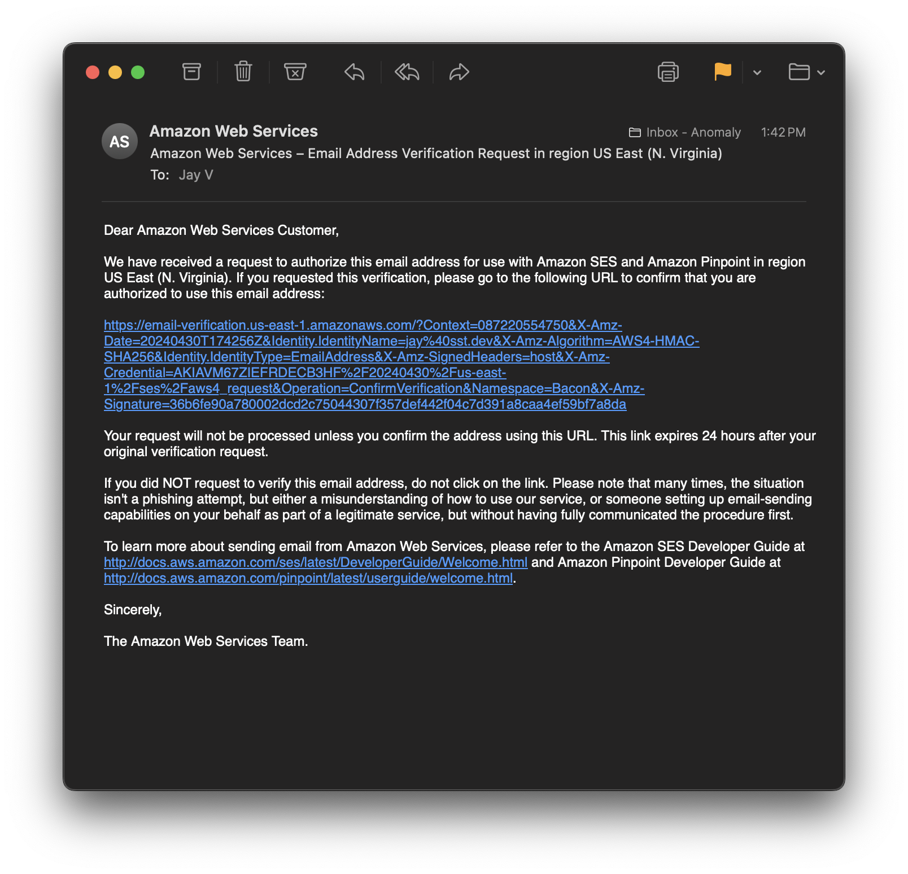
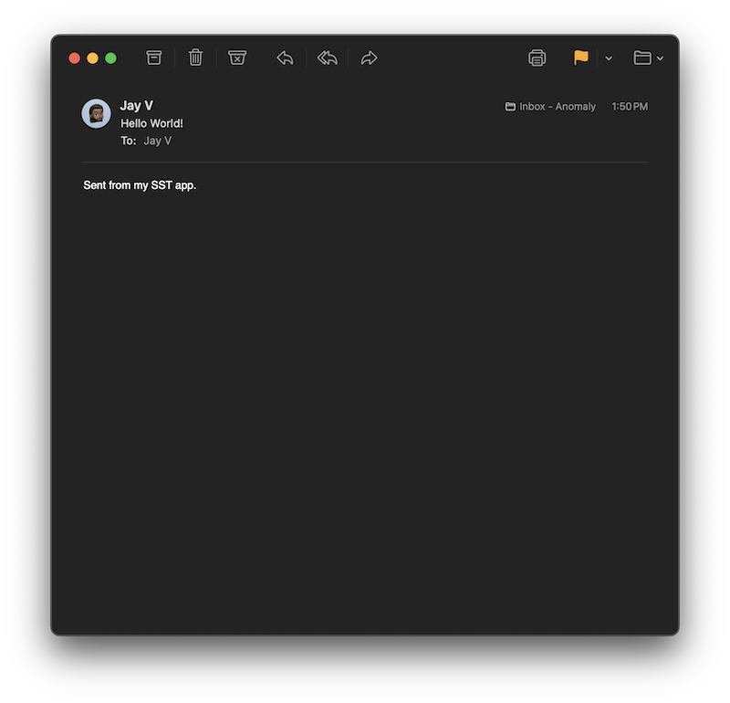

We are going to build a simple SST app in AWS with a serverless API, and send emails from it.

:::tip[View source]
You can [view the source](https://github.com/sst/sst/tree/dev/examples/aws-email) of this example in our repo.
:::

Before you get started, make sure to [configure your AWS credentials](/docs/iam-credentials#credentials).

---

## 1. Create a project

Let's start by creating our app.

```bash
mkdir my-email-app && cd my-email-app
npm init -y
```

#### Init SST

Now let's initialize SST in our app.

```bash
npx sst@latest init
npm install
```

Select the defaults and pick **AWS**. This'll create a `sst.config.ts` file in your project root.

---

## 2. Add email

Let's add Email to our app, it uses [Amazon SES](https://aws.amazon.com/ses/) behind the scenes. Update your `sst.config.ts`.

```js title="sst.config.ts" {3}
async run() {
  const email = new sst.aws.Email("MyEmail", {
    sender: "email@example.com",
  });
}
```

SES can send emails from a verified email address or domain. To keep things simple we'll be sending from an email. Make sure to use your email address here as we'll be verifying it in the next step.

---

## 3. Add an API

Next let's create a simple API that'll send out an email when invoked. Add this to your `sst.config.ts`.

```js title="sst.config.ts" {3}
const api = new sst.aws.Function("MyApi", {
  handler: "sender.handler",
  link: [email],
  url: true,
});

return {
  api: api.url,
};
```

We are linking the our email component to our API.

---

#### Start dev mode

Start your app in dev mode. This runs your functions [_Live_](/docs/live/).

```bash
npx sst dev
```

This will give you your API URL.

```bash frame="none"
+  Complete
   api: https://wwwrwteda6kbpquppdz5i3lg4a0nvmbf.lambda-url.us-east-1.on.aws/
```

You should also get an email asking you to verify the sender email address.



Click the link to verify your email address. 

---

## 4. Send an email

We'll use the SES client to send an email when the API is invoked. Create a new `sender.ts` file and add the following to it.

```ts title="sender.ts" {4}
export const handler = async () => {
  await client.send(
    new SendEmailCommand({
      FromEmailAddress: Resource.MyEmail.sender,
      Destination: {
        ToAddresses: [Resource.MyEmail.sender],
      },
      Content: {
        Simple: {
          Subject: {
            Data: "Hello World!",
          },
          Body: {
            Text: {
              Data: "Sent from my SST app.",
            },
          },
        },
      },
    })
  );

  return {
    statusCode: 200,
    body: "Sent!"
  };
};
```

We are sending an email to the same verified email that we are sending from because your SES account might be in _sandbox_ mode and can only send to verified emails. We'll look at how to go to production below.

:::tip
We are accessing our email service with `Resource.Email.sender`.
:::

Add the imports.

```ts title="sender.ts"
import { Resource } from "sst";
import { SESv2Client, SendEmailCommand } from "@aws-sdk/client-sesv2";

const client = new SESv2Client();
```

And install the npm packages.

```bash
npm install @aws-sdk/client-sesv2
```

---

#### Test your app

To test our app, hit the API.

```bash
curl https://wwwrwteda6kbpquppdz5i3lg4a0nvmbf.lambda-url.us-east-1.on.aws
```

This should print out `Sent!` and you should get an email. You might have to check your spam folder since the sender and receiver email address is the same in this case.



---

## 5. Deploy your app

Now let's deploy your app.


```bash
npx sst deploy --stage production
```

You can use any stage name here but it's good to create a new stage for production.

Next, for production you can:

1. [Request production access](https://docs.aws.amazon.com/ses/latest/dg/request-production-access.html) for SES
2. And [use your domain](/docs/component/aws/email/) to send emails

This'll let you send emails from your domain to any email address.

---

## Connect the console

As a next step, you can setup the [SST Console](/docs/console/) to _**git push to deploy**_ your app and monitor it for any issues. 


You can [create a free account](https://console.sst.dev) and connect it to your AWS account.
