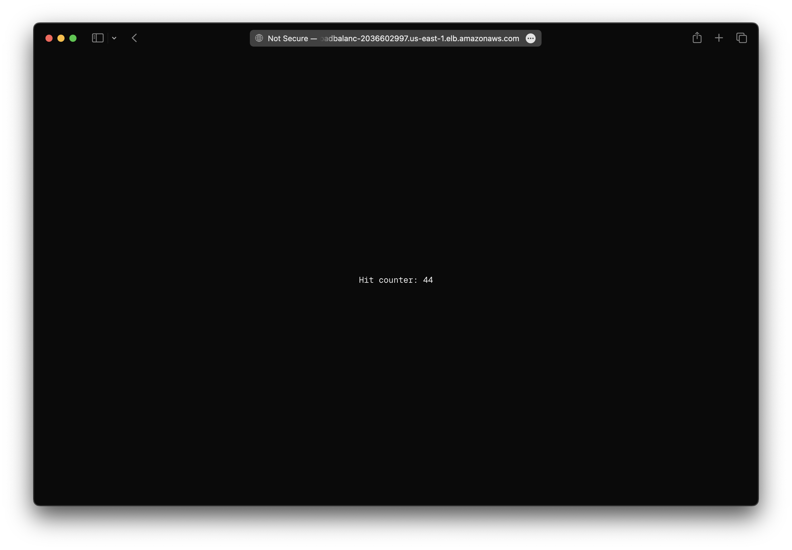

There are two ways to deploy a Next.js app to AWS with SST.

1. [Serverless with OpenNext](#serverless)
2. [Containers with Docker](#containers)

We'll use both to build a couple of simple apps below.

---

#### Examples

We also have a few other Next.js examples that you can refer to.

- [Adding basic auth to your Next.js app](/docs/examples/#aws-nextjs-basic-auth)
- [Enabling streaming in your Next.js app](/docs/examples/#aws-nextjs-streaming)

---

## Serverless

We are going to create a Next.js app, add an S3 Bucket for file uploads, and deploy it using [OpenNext](https://opennext.js.org) and the `Nextjs` component.

:::tip[View source]
You can [view the source](https://github.com/sst/ion/tree/dev/examples/aws-nextjs) of this example in our repo.
:::

Before you get started, make sure to [configure your AWS credentials](/docs/iam-credentials#credentials).

---

### 1. Create a project

Let's start by creating our app.

```bash
npx create-next-app@latest aws-nextjs
cd aws-nextjs
```

We are picking all the default options.

---

##### Init SST

Now let's initialize SST in our app.

```bash
npx sst@latest init
```

Select the defaults and pick **AWS**. This'll create a `sst.config.ts` file in your project root.

---

##### Start dev mode

Run the following to start dev mode. This'll start SST and your Next.js app.

```bash
npx sst dev
```

Once complete, click on **MyWeb** in the sidebar and open your Next.js app in your browser.

---

### 2. Add an S3 Bucket

Let's allow public `access` to our S3 Bucket for file uploads. Update your `sst.config.ts`.

```js title="sst.config.ts"
const bucket = new sst.aws.Bucket("MyBucket", {
  access: "public"
});
```

Add this above the `Nextjs` component.

##### Link the bucket

Now, link the bucket to our Next.js app.

```js title="sst.config.ts" {2}
new sst.aws.Nextjs("MyWeb", {
  link: [bucket]
});
```

---

### 3. Create an upload form

Add a form client component in `components/form.tsx`.

```tsx title="components/form.tsx"
"use client";

import styles from "./form.module.css";

export default function Form({ url }: { url: string }) {
  return (
    <form
      className={styles.form}
      onSubmit={async (e) => {
        e.preventDefault();

        const file = (e.target as HTMLFormElement).file.files?.[0]!;

        const image = await fetch(url, {
          body: file,
          method: "PUT",
          headers: {
            "Content-Type": file.type,
            "Content-Disposition": `attachment; filename="${file.name}"`,
          },
        });

        window.location.href = image.url.split("?")[0];
      }}
    >
      <input name="file" type="file" accept="image/png, image/jpeg" />
      <button type="submit">Upload</button>
    </form>
  );
}
```

Add some styles.

```css title="components/form.module.css"
.form {
  padding: 2rem;
  border-radius: 0.5rem;
  background-color: var(--gray-alpha-100);
}

.form input {
  margin-right: 1rem;
}

.form button {
  appearance: none;
  padding: 0.5rem 0.75rem;
  font-weight: 500;
  font-size: 0.875rem;
  border-radius: 0.375rem;
  background-color: transparent;
  font-family: var(--font-geist-sans);
  border: 1px solid var(--gray-alpha-200);
}

.form button:active:enabled {
  background-color: var(--gray-alpha-200);
}
```

---

### 4. Generate a pre-signed URL

When our app loads, we'll generate a pre-signed URL for the file upload and render the form with it. Replace your `Home` component in `app/page.tsx`.

```ts title="app/page.tsx" {6}
export const dynamic = "force-dynamic";

export default async function Home() {
  const command = new PutObjectCommand({
    Key: crypto.randomUUID(),
    Bucket: Resource.MyBucket.name,
  });
  const url = await getSignedUrl(new S3Client({}), command);

  return (
    <div className={styles.page}>
      <main className={styles.main}>
        <Form url={url} />
      </main>
    </div>
  );
}
```

We need the `force-dynamic` because we don't want Next.js to cache the pre-signed URL.

:::tip
We are directly accessing our S3 bucket with `Resource.MyBucket.name`.
:::

Add the relevant imports.

```ts title="app/page.tsx"
import { Resource } from "sst";
import Form from "@/components/form";
import { getSignedUrl } from "@aws-sdk/s3-request-presigner";
import { S3Client, PutObjectCommand } from "@aws-sdk/client-s3";
import styles from "./page.module.css";
```

And install the npm packages.

```bash
npm install @aws-sdk/client-s3 @aws-sdk/s3-request-presigner
```

---

#### Test your app

Head over to the local Next.js app in your browser, `http://localhost:3000` and try **uploading an image**. You should see it upload and then download the image.

---

### 5. Deploy your app

Now let's deploy your app to AWS.

```bash
npx sst deploy --stage production
```

You can use any stage name here but it's good to create a new stage for production.

Congrats! Your app should now be live!


---

## Containers

We are going to build a hit counter Next.js app with Redis. We’ll the deploy it to AWS in a container using the `Cluster` component.

:::tip[View source]
You can [view the source](https://github.com/sst/ion/tree/dev/examples/aws-nextjs-container) of this example in our repo.
:::

Before you get started, make sure to [configure your AWS credentials](/docs/iam-credentials#credentials).

---

### 1. Create a project

Let's start by creating our app.

```bash
npx create-next-app@latest aws-nextjs-container
cd aws-nextjs-container
```

We are picking all the default options.

---

##### Init SST

Now let's initialize SST in our app.

```bash
npx sst@latest init
```

Select the defaults and pick **AWS**. This'll create a `sst.config.ts` file in your project root.

---

### 2. Add a Cluster

To deploy our Next.js app in a container, we'll use [AWS Fargate](https://aws.amazon.com/fargate/) with [Amazon ECS](https://aws.amazon.com/ecs/). Replace the `run` function in your `sst.config.ts`.

```js title="sst.config.ts" {9-11}
async run() {
  const vpc = new sst.aws.Vpc("MyVpc", { bastion: true });
  const cluster = new sst.aws.Cluster("MyCluster", { vpc });

  cluster.addService("MyService", {
    public: {
      ports: [{ listen: "80/http", forward: "3000/http" }],
    },
    dev: {
      command: "npm run dev",
    },
  });
}
```

This creates a VPC with a bastion host, an ECS Cluster, and adds a Fargate service to it.

The `dev.command` tells SST to run our Next.js app locally in dev mode.

---

### 3. Add Redis

Let's add an [Amazon ElastiCache](https://aws.amazon.com/elasticache/) Redis cluster. Add this below the `Vpc` component in your `sst.config.ts`.

```js title="sst.config.ts"
const redis = new sst.aws.Redis("MyRedis", { vpc });
```

This shares the same VPC as our ECS cluster.

---

#### Link Redis

Now, link the Redis cluster to the container.

```ts title="sst.config.ts" {3}
cluster.addService("MyService", {
  // ...
  link: [redis],
});
```

This will allow us to reference the Redis cluster in our Next.js app.

---

#### Install a tunnel

Since our Redis cluster is in a VPC, we'll need a tunnel to connect to it from our local machine.

```bash "sudo"
sudo npx sst tunnel install
```

This needs _sudo_ to create a network interface on your machine. You'll only need to do this once on your machine.

---

#### Start dev mode

Start your app in dev mode.

```bash
npx sst dev
```

This will deploy your app, start a tunnel in the **Tunnel** tab, and run your Next.js app locally in the **MyServiceDev** tab.

---

### 4. Connect to Redis

We want the `/` route to increment a counter in our Redis cluster. Let's start by installing the npm package we'll use.

```bash
npm install ioredis
```

Add the relevant imports to your `index.mjs`.

```ts title="app/page.tsx" {5}
import { Resource } from "sst";
import { Cluster } from "ioredis";

const redis = new Cluster(
  [{ host: Resource.MyRedis.host, port: Resource.MyRedis.port }],
  {
    dnsLookup: (address, callback) => callback(null, address),
    redisOptions: {
      tls: {},
      username: Resource.MyRedis.username,
      password: Resource.MyRedis.password,
    },
  }
);
```

:::tip
We are directly accessing our Redis cluster with `Resource.MyRedis.*`.
:::

Let's update the component. Replace the `Home` component in `app/page.tsx`.

```ts title="app/page.tsx"
export const dynamic = "force-dynamic";

export default async function Home() {
  const counter = await redis.incr("counter");

  return (
    <div className={styles.page}>
      <main className={styles.main}>
        <p>Hit counter: {counter}</p>
      </main>
    </div>
  );
}
```

We need the `force-dynamic` because we don't want Next.js to cache the counter.

Let's add some styles to `app/page.module.css`.

```css title="app/page.module.css"
.main p {
  font-family: var(--font-geist-mono);
  font-size: 14px;
  letter-spacing: -0.01em;
}
```

---

#### Test your app

Let's head over to `http://localhost:3000` in your browser and it'll show the current hit counter.

You should see it increment every time you **refresh the page**.

---

### 5. Deploy your app

To build our app for production, we'll enable Next.js's [standalone output](https://nextjs.org/docs/pages/api-reference/next-config-js/output#automatically-copying-traced-files). Let's update our `next.config.mjs`.

```js title="next.config.js" {2}
const nextConfig = {
  output: "standalone"
};
```

Now to deploy our app we'll add a `Dockerfile`.

<details>
<summary>View Dockerfile</summary>

```diff lang="dockerfile" title="Dockerfile"
# https://github.com/vercel/next.js/tree/canary/examples/with-docker

FROM node:18-alpine AS base

# Install dependencies only when needed
FROM base AS deps
# Check https://github.com/nodejs/docker-node/tree/b4117f9333da4138b03a546ec926ef50a31506c3#nodealpine to understand why libc6-compat might be needed.
RUN apk add --no-cache libc6-compat
WORKDIR /app

COPY sst-env.d.ts* ./

# Install dependencies based on the preferred package manager
COPY package.json yarn.lock* package-lock.json* pnpm-lock.yaml* ./
RUN \
  if [ -f yarn.lock ]; then yarn --frozen-lockfile; \
  elif [ -f package-lock.json ]; then npm ci; \
  elif [ -f pnpm-lock.yaml ]; then corepack enable pnpm && pnpm i --frozen-lockfile; \
  else echo "Lockfile not found." && exit 1; \
  fi

# Rebuild the source code only when needed
FROM base AS builder

+# Add linked resources to the environment
+ARG SST_RESOURCE_MyRedis

WORKDIR /app
COPY --from=deps /app/node_modules ./node_modules
COPY . .

# Next.js collects completely anonymous telemetry data about general usage.
# Learn more here: https://nextjs.org/telemetry
# Uncomment the following line in case you want to disable telemetry during the build.
# ENV NEXT_TELEMETRY_DISABLED=1

RUN \
  if [ -f yarn.lock ]; then yarn run build; \
  elif [ -f package-lock.json ]; then npm run build; \
  elif [ -f pnpm-lock.yaml ]; then corepack enable pnpm && pnpm run build; \
  else echo "Lockfile not found." && exit 1; \
  fi

# Production image, copy all the files and run next
FROM base AS runner
WORKDIR /app

ENV NODE_ENV=production
# Uncomment the following line in case you want to disable telemetry during runtime.
# ENV NEXT_TELEMETRY_DISABLED=1

RUN addgroup --system --gid 1001 nodejs
RUN adduser --system --uid 1001 nextjs

COPY --from=builder /app/public* ./public

# Set the correct permission for prerender cache
RUN mkdir .next
RUN chown nextjs:nodejs .next

# Automatically leverage output traces to reduce image size
# https://nextjs.org/docs/advanced-features/output-file-tracing
COPY --from=builder --chown=nextjs:nodejs /app/.next/standalone ./
COPY --from=builder --chown=nextjs:nodejs /app/.next/static ./.next/static

USER nextjs

EXPOSE 3000

ENV PORT=3000

# server.js is created by next build from the standalone output
# https://nextjs.org/docs/pages/api-reference/next-config-js/output
ENV HOSTNAME="0.0.0.0"
CMD ["node", "server.js"]
```
</details>

This builds our Next.js app in a Docker image. To make sure that the build process in Docker has access to our Redis cluster, we have the following.

```dockerfile title="Dockerfile" "MyRedis"
# Add linked resources to the environment
ARG SST_RESOURCE_MyRedis
```

Here `MyRedis` is the name of the component in our `sst.config.ts` file.

:::tip
You need to be running [Docker Desktop](https://www.docker.com/products/docker-desktop/) to deploy your app.
:::

Let's also add a `.dockerignore` file in the root.

```bash title=".dockerignore"
.git
.next
node_modules
```

Now to build our Docker image and deploy we run:

```bash
npx sst deploy --stage production
```

You can use any stage name here but it's good to create a new stage for production.

Congrats! Your app should now be live!



---

## Connect the console

As a next step, you can setup the [SST Console](/docs/console/) to _**git push to deploy**_ your app and monitor it for any issues. 


You can [create a free account](https://console.sst.dev) and connect it to your AWS account.

