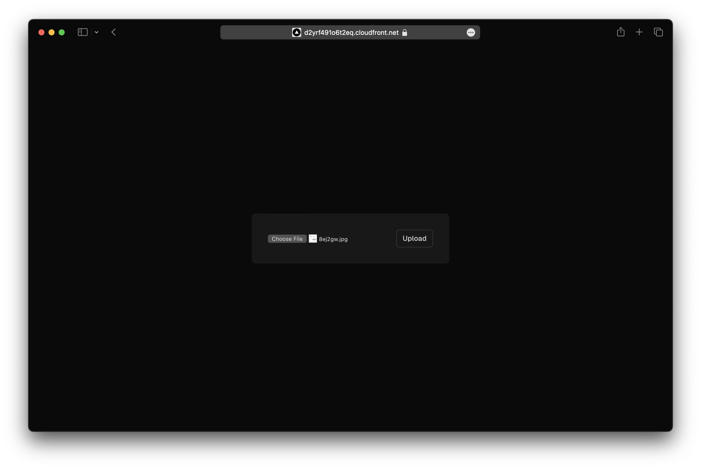

We are going to create a Next.js app, add an S3 Bucket for file uploads, and deploy it to AWS using SST.

:::tip[View source]
You can [view the source](https://github.com/sst/ion/tree/dev/examples/aws-nextjs) of this example in our repo.
:::

Before you get started, make sure to [configure your AWS credentials](https://docs.sst.dev/advanced/iam-credentials#loading-from-a-file).

---

## 1. Create a project

Let's start by creating our app.

```bash
npx create-next-app@latest aws-nextjs
cd aws-nextjs
```

We are picking all the default options.

---

#### Init SST

Now let's initialize SST in our app.

```bash
npx sst@latest init
npm install
```

Select the defaults and pick **AWS**. This'll create a `sst.config.ts` file in your project root.

---

#### Start dev mode

Run the following to start dev mode. This'll start SST and your Next.js app.

```bash
npx sst dev
```

Once complete, click on **MyWeb** in the sidebar and open your Next.js app in your browser.

---

## 2. Add an S3 Bucket

Let's add a `public` S3 Bucket for file uploads. Update your `sst.config.ts`.

```js title="sst.config.ts"
const bucket = new sst.aws.Bucket("MyBucket", {
  public: true
});
```

Add this above the `Nextjs` component.

#### Link the bucket

Now, link the bucket to our Next.js app.

```js title="sst.config.ts" {2}
new sst.aws.Nextjs("MyWeb", {
  link: [bucket]
});
```

---

## 3. Create an upload form

Add a form client component in `components/form.tsx`.

```tsx title="components/form.tsx"
"use client";

import styles from "./form.module.css";

export default function Form({ url }: { url: string }) {
  return (
    <form
      className={styles.form}
      onSubmit={async (e) => {
        e.preventDefault();

        const file = (e.target as HTMLFormElement).file.files?.[0]!;

        const image = await fetch(url, {
          body: file,
          method: "PUT",
          headers: {
            "Content-Type": file.type,
            "Content-Disposition": `attachment; filename="${file.name}"`,
          },
        });

        window.location.href = image.url.split("?")[0];
      }}
    >
      <input name="file" type="file" accept="image/png, image/jpeg" />
      <button type="submit">Upload</button>
    </form>
  );
}
```

Add some styles.

```css title="components/form.module.css"
.form {
  padding: 1rem;
  border-radius: var(--border-radius);
  background-color: rgba(var(--callout-rgb), 0.5);
  border: 1px solid rgba(var(--callout-border-rgb), 0.3);
}

.form input {
  margin-right: 1rem;
  font-family: var(--font-mono);
}

.form button {
  appearance: none;
  padding: 0.5rem 0.75rem;
  font-weight: 500;
  font-size: 0.875rem;
  border-radius: calc(1rem - var(--border-radius));
  background: linear-gradient(
    to bottom right,
    rgba(var(--tile-start-rgb), 1),
    rgba(var(--tile-end-rgb), 1)
  );
  border: 1px solid rgba(var(--callout-border-rgb), 1);
}

.form button:active:enabled {
  background: linear-gradient(
    to top left,
    rgba(var(--tile-start-rgb), 1),
    rgba(var(--tile-end-rgb), 1)
  );
}
```

---

## 4. Generate a pre-signed URL

When our app loads, we'll generate a pre-signed URL for the file upload and render the form with it. Replace your `Home` component in `app/page.tsx`.

```ts title="app/page.tsx" {4}
export default async function Home() {
  const command = new PutObjectCommand({
    Key: crypto.randomUUID(),
    Bucket: Resource.MyBucket.name,
  });
  const url = await getSignedUrl(new S3Client({}), command);

  return (
    <main className={styles.main}>
      <Form url={url} />
    </main>
  );
}
```

:::tip
We are directly accessing our S3 bucket with `Resource.MyBucket.name`.
:::

Add the relevant imports.

```ts title="app/page.tsx"
import { Resource } from "sst";
import Form from "@/components/form";
import { getSignedUrl } from "@aws-sdk/s3-request-presigner";
import { S3Client, PutObjectCommand } from "@aws-sdk/client-s3";
import styles from "./page.module.css";
```

Add the styles.

```css title="app/page.module.css"
.main {
  display: flex;
  flex-direction: column;
  justify-content: space-between;
  align-items: center;
  padding: 6rem;
  min-height: 100vh;
}
```

And install the npm packages.

```bash
npm install @aws-sdk/client-s3 @aws-sdk/s3-request-presigner
```

Head over to the local Next.js app in your browser, `http://localhost:3000` and try **uploading an image**. You should see it upload and then download the image.

---

## 5. Deploy your app

Now let's deploy your app to AWS.

```bash
npx sst deploy --stage production
```

You can use any stage name here but it's good to create a new stage for production.

Congrats! Your app should now be live!



---

## Connect the console

As a next step, you can setup the [SST Console](/docs/console/) to _**git push to deploy**_ your app and monitor it for any issues. 


You can [create a free account](https://console.sst.dev) and connect it to your AWS account.

