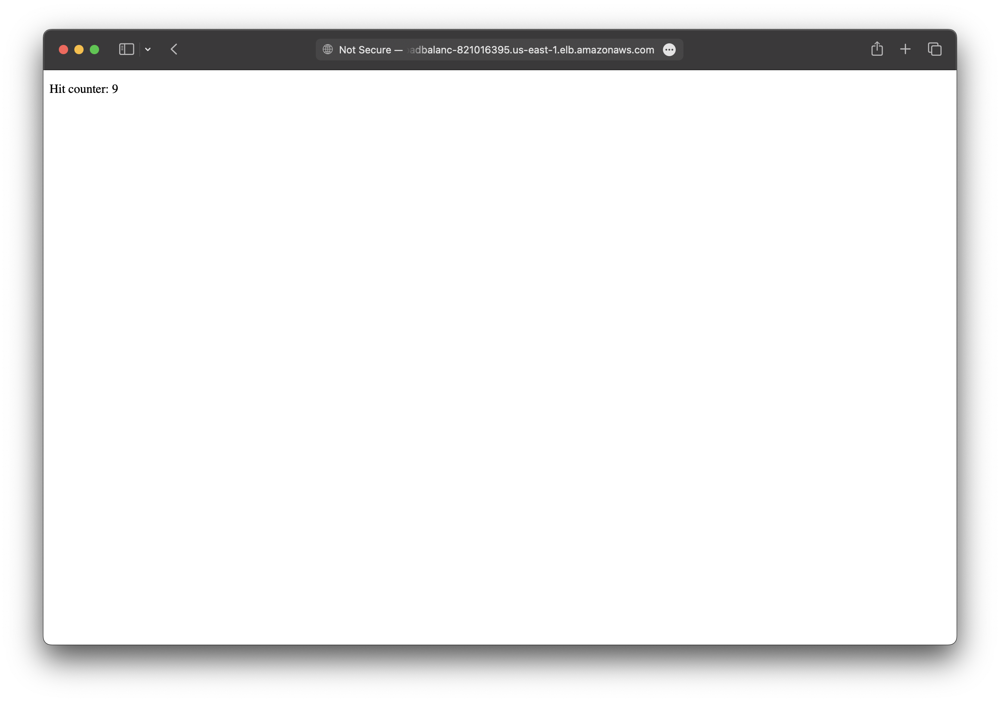

There are two ways to deploy a Nuxt app to AWS with SST.

1. [Serverless](#serverless)
2. [Containers](#containers)

We'll use both to build a couple of simple apps below.

---

## Serverless

We are going to create a Nuxt app, add an S3 Bucket for file uploads, and deploy it using the `Nuxt` component.

:::tip[View source]
You can [view the source](https://github.com/sst/ion/tree/dev/examples/aws-nuxt) of this example in our repo.
:::

Before you get started, make sure to [configure your AWS credentials](/docs/iam-credentials#credentials).

---

### 1. Create a project

Let's start by creating our project.

```bash
npx nuxi@latest init aws-nuxt
cd aws-nuxt
```

We are picking the **npm** as the package manager.

---

##### Init SST

Now let's initialize SST in our app.

```bash
npx sst@latest init
npm install
```

Select the defaults and pick **AWS**. This'll create a `sst.config.ts` file in your project root.

It'll also ask you to update your `nuxt.config.ts` with something like this.

```diff lang="ts" title="nuxt.config.ts"
export default defineNuxtConfig({
  compatibilityDate: '2024-04-03',
+  nitro: {
+    preset: 'aws-lambda'
+  },
  devtools: { enabled: true }
})
```

---

##### Start dev mode

Run the following to start dev mode. This'll start SST and your Nuxt app.

```bash
npx sst dev
```

Once complete, click on **MyWeb** in the sidebar and open your Nuxt app in your browser.

---

### 2. Add an S3 Bucket

Let's allow public `access` to our S3 Bucket for file uploads. Update your `sst.config.ts`.

```ts title="sst.config.ts"
const bucket = new sst.aws.Bucket("MyBucket", {
  access: "public"
});
```

Add this above the `Nuxt` component.

##### Link the bucket

Now, link the bucket to our Nuxt app.

```ts title="sst.config.ts" {2}
new sst.aws.Nuxt("MyWeb", {
  link: [bucket],
});
```

---

### 3. Generate a pre-signed URL

When our app loads, we'll call an API that'll generate a pre-signed URL for the file upload. Create a new `server/api/presigned.ts` with the following.

```tsx title="server/api/presigned.ts" {4}
export default defineEventHandler(async () => {
  const command = new PutObjectCommand({
    Key: crypto.randomUUID(),
    Bucket: Resource.MyBucket.name,
  });

  return await getSignedUrl(new S3Client({}), command);
})
```

:::tip
We are directly accessing our S3 bucket with `Resource.MyBucket.name`.
:::

Add the relevant imports.

```tsx title="src/app.tsx"
import { Resource } from "sst";
import { getSignedUrl } from "@aws-sdk/s3-request-presigner";
import { S3Client, PutObjectCommand } from "@aws-sdk/client-s3";
```

And install the npm packages.

```bash
npm install @aws-sdk/client-s3 @aws-sdk/s3-request-presigner
```

---

### 4. Create an upload form

Add a form to upload files to the presigned URL. Replace our `app.vue` with:

```vue title="app.vue"
<script setup>
  const file = ref(null);
  const { data } = await useFetch('/api/presigned');

  async function onSubmit() {
    const upload = file.value.files[0];
    const image = await fetch(data.value, {
      body: upload,
      method: "PUT",
      headers: {
        "Content-Type": upload.type,
        "Content-Disposition": `attachment; filename="${upload.name}"`,
      },
    });

    window.location.href = image.url.split("?")[0];
  }
</script>
<template>
  <form novalidate @submit.prevent="onSubmit">
    <input type="file" ref="file" accept="image/png, image/jpeg" />
    <button type="submit">Upload</button>
  </form>
</template>
```

Head over to the local app in your browser, `http://localhost:3000` and try **uploading an image**. You should see it upload and then download the image.

---

### 5. Deploy your app

Now let's deploy your app to AWS.

```bash
npx sst deploy --stage production
```

You can use any stage name here but it's good to create a new stage for production.

Congrats! Your site should now be live!


---

## Containers

We are going to build a hit counter Nuxt app with Redis. We'll deploy it to AWS in a container using the `Cluster` component.

:::tip[View source]
You can [view the source](https://github.com/sst/ion/tree/dev/examples/aws-nuxt-container) of this example in our repo.
:::

Before you get started, make sure to [configure your AWS credentials](/docs/iam-credentials#credentials).

---

### 1. Create a project

Let's start by creating our project.

```bash
npx nuxi@latest init aws-nuxt-container
cd aws-nuxt-container
```

We are picking the **npm** as the package manager.

---

##### Init SST

Now let's initialize SST in our app.

```bash
npx sst@latest init
npm install
```

Select the defaults and pick **AWS**. This'll create a `sst.config.ts` file in your project root.

It'll also ask you to update your `nuxt.config.ts`. But instead we'll use the **default Node preset**.

```ts title="nuxt.config.ts"
export default defineNuxtConfig({
  compatibilityDate: '2024-04-03',
  devtools: { enabled: true }
})
```

---

### 2. Add a Cluster

To deploy our Nuxt app in a container, we'll use [AWS Fargate](https://aws.amazon.com/fargate/) with [Amazon ECS](https://aws.amazon.com/ecs/). Replace the `run` function in your `sst.config.ts`.

```js title="sst.config.ts" {9-11}
async run() {
  const vpc = new sst.aws.Vpc("MyVpc", { bastion: true });
  const cluster = new sst.aws.Cluster("MyCluster", { vpc });

  cluster.addService("MyService", {
    public: {
      ports: [{ listen: "80/http", forward: "3000/http" }],
    },
    dev: {
      command: "npm run dev",
    },
  });
}
```

This creates a VPC with a bastion host, an ECS Cluster, and adds a Fargate service to it.

The `dev.command` tells SST to run our Nuxt app locally in dev mode.

---

### 3. Add Redis

Let's add an [Amazon ElastiCache](https://aws.amazon.com/elasticache/) Redis cluster. Add this below the `Vpc` component in your `sst.config.ts`.

```js title="sst.config.ts"
const redis = new sst.aws.Redis("MyRedis", { vpc });
```

This shares the same VPC as our ECS cluster.

---

#### Link Redis

Now, link the Redis cluster to the container.

```ts title="sst.config.ts" {3}
cluster.addService("MyService", {
  // ...
  link: [redis],
});
```

This will allow us to reference the Redis cluster in our Nuxt app.

---

#### Install a tunnel

Since our Redis cluster is in a VPC, we'll need a tunnel to connect to it from our local machine.

```bash "sudo"
sudo npx sst tunnel install
```

This needs _sudo_ to create a network interface on your machine. You'll only need to do this once on your machine.

---

#### Start dev mode

Start your app in dev mode.

```bash
npx sst dev
```

This will deploy your app, start a tunnel in the **Tunnel** tab, and run your Nuxt app locally in the **MyServiceDev** tab.

---

### 4. Connect to Redis

We want the `/` route to increment a counter in our Redis cluster. Let's start by installing the npm package we'll use.

```bash
npm install ioredis
```

We'll call an API that'll increment the counter when the app loads. Create a new `server/api/counter.ts` with the following.

```ts title="server/api/counter.ts" {5}
import { Resource } from "sst";
import { Cluster } from "ioredis";

const redis = new Cluster(
  [{ host: Resource.MyRedis.host, port: Resource.MyRedis.port }],
  {
    dnsLookup: (address, callback) => callback(null, address),
    redisOptions: {
      tls: {},
      username: Resource.MyRedis.username,
      password: Resource.MyRedis.password,
    },
  }
);

export default defineEventHandler(async () => {
  return await redis.incr("counter");
})
```

:::tip
We are directly accessing our Redis cluster with `Resource.MyRedis.*`.
:::

Let's update our component to show the counter. Replace our `app.vue` with:

```vue title="app.vue"
<script setup lang="ts">
const { data: counter } = await useFetch("/api/counter")
</script>

<template>
  <p>Hit counter: {{ counter }}</p>
</template>
```

---

#### Test your app

Let's head over to `http://localhost:3000` in your browser and it'll show the current hit counter.

You should see it increment every time you **refresh the page**.

---

### 5. Deploy your app

To deploy our app we'll add a `Dockerfile`.

<details>
<summary>View Dockerfile</summary>

```dockerfile title="Dockerfile"
FROM node:lts AS base

WORKDIR /src

# Build
FROM base as build

COPY --link package.json package-lock.json ./
RUN npm install

COPY --link . .

RUN npm run build

# Run
FROM base

ENV PORT=3000
ENV NODE_ENV=production

COPY --from=build /src/.output /src/.output

CMD [ "node", ".output/server/index.mjs" ]
```

</details>

:::tip
You need to be running [Docker Desktop](https://www.docker.com/products/docker-desktop/) to deploy your app.
:::

Let's also add a `.dockerignore` file in the root.

```bash title=".dockerignore"
node_modules
```

Now to build our Docker image and deploy we run:

```bash
npx sst deploy --stage production
```

You can use any stage name here but it's good to create a new stage for production.

Congrats! Your app should now be live!



---

## Connect the console

As a next step, you can setup the [SST Console](/docs/console/) to _**git push to deploy**_ your app and monitor it for any issues. 


You can [create a free account](https://console.sst.dev) and connect it to your AWS account.
