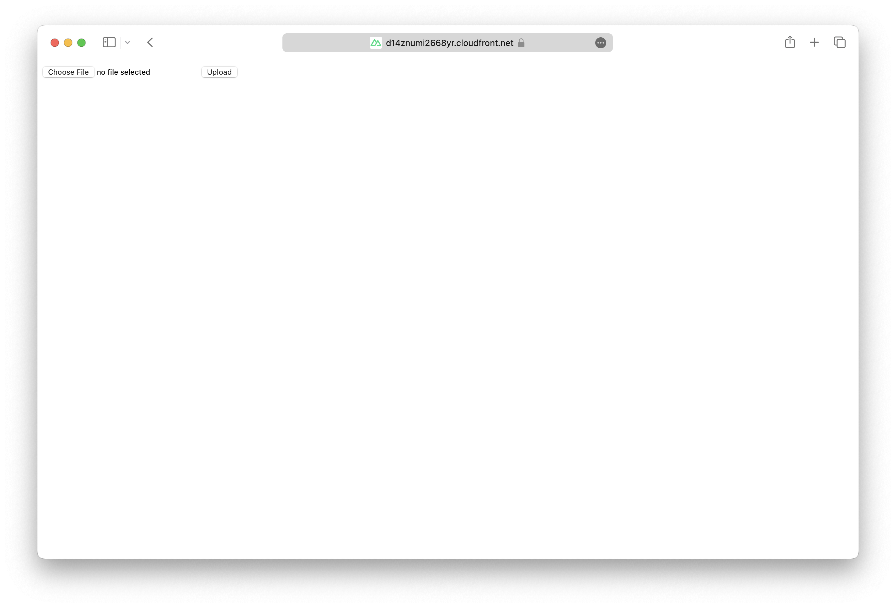

We are going to create a Nuxt app, add an S3 Bucket for file uploads, and deploy it to AWS using SST.

:::tip[View source]
You can [view the source](https://github.com/sst/ion/tree/dev/examples/aws-nuxt) of this example in our repo.
:::

Before you get started, make sure to [configure your AWS credentials](/docs/iam-credentials#credentials).

---

## 1. Create a project

Let's start by creating our project.

```bash
npx nuxi@latest init my-nuxt-app
cd my-nuxt-app
```

We are picking the **npm** as the package manager.

---

#### Init SST

Now let's initialize SST in our app.

```bash
npx sst@latest init
npm install
```

Select the defaults and pick **AWS**. This'll create a `sst.config.ts` file in your project root.

It'll also ask you to update your `nuxt.config.ts` with something like this.

```diff lang="ts" title="nuxt.config.ts"
export default defineNuxtConfig({
  compatibilityDate: '2024-04-03',
+  nitro: {
+    preset: 'aws-lambda'
+  },
  devtools: { enabled: true }
})
```

---

#### Start dev mode

Run the following to start dev mode. This'll start SST and your Nuxt app.

```bash
npx sst dev
```

Once complete, click on **MyWeb** in the sidebar and open your Nuxt app in your browser.

---

## 2. Add an S3 Bucket

Let's add a `public` S3 Bucket for file uploads. Update your `sst.config.ts`.

```ts title="sst.config.ts"
const bucket = new sst.aws.Bucket("MyBucket", {
  public: true
});
```

Add this above the `Nuxt` component.

#### Link the bucket

Now, link the bucket to our Nuxt app.

```ts title="sst.config.ts" {2}
new sst.aws.Nuxt("MyWeb", {
  link: [bucket],
});
```

---

## 3. Generate a pre-signed URL

When our app loads, we'll call an API that'll generate a pre-signed URL for the file upload. Create a new `server/api/presigned.ts` with the following.

```tsx title="server/api/presigned.ts" {4}
export default defineEventHandler(async () => {
  const command = new PutObjectCommand({
    Key: crypto.randomUUID(),
    Bucket: Resource.MyBucket.name,
  });

  return await getSignedUrl(new S3Client({}), command);
})
```

:::tip
We are directly accessing our S3 bucket with `Resource.MyBucket.name`.
:::

Add the relevant imports.

```tsx title="src/app.tsx"
import { Resource } from "sst";
import { getSignedUrl } from "@aws-sdk/s3-request-presigner";
import { S3Client, PutObjectCommand } from "@aws-sdk/client-s3";
```

And install the npm packages.

```bash
npm install @aws-sdk/client-s3 @aws-sdk/s3-request-presigner
```

---

## 4. Create an upload form

Add a form to upload files to the presigned URL. Replace our `app.vue` with:

```vue title="app.vue"
<script setup>
  const file = ref(null);
  const { data } = await useFetch('/api/presigned');

  async function onSubmit() {
    const upload = file.value.files[0];
    const image = await fetch(data.value, {
      body: upload,
      method: "PUT",
      headers: {
        "Content-Type": upload.type,
        "Content-Disposition": `attachment; filename="${upload.name}"`,
      },
    });

    window.location.href = image.url.split("?")[0];
  }
</script>
<template>
  <form novalidate @submit.prevent="onSubmit">
    <input type="file" ref="file" accept="image/png, image/jpeg" />
    <button type="submit">Upload</button>
  </form>
</template>
```

Head over to the local app in your browser, `http://localhost:3000` and try **uploading an image**. You should see it upload and then download the image.

---

## 5. Deploy your app

Now let's deploy your app to AWS.

```bash
npx sst deploy --stage production
```

You can use any stage name here but it's good to create a new stage for production.

Congrats! Your site should now be live!



---

## Connect the console

As a next step, you can setup the [SST Console](/docs/console/) to _**git push to deploy**_ your app and monitor it for any issues. 


You can [create a free account](https://console.sst.dev) and connect it to your AWS account.

