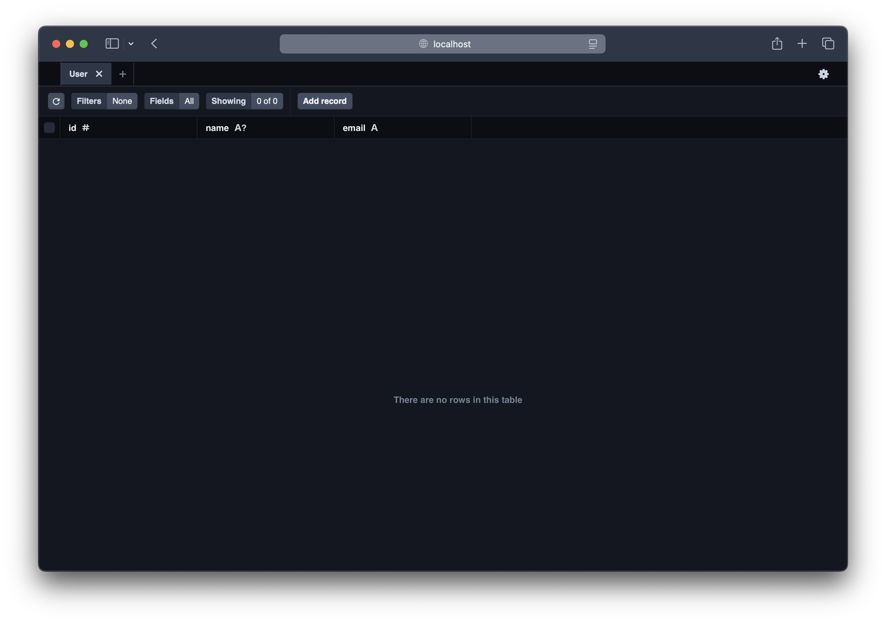
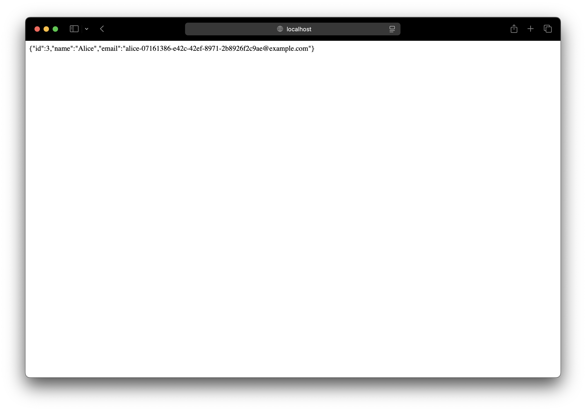

We are going to use Prisma and SST to deploy an Amazon Postgres RDS database and connect to it from an Express app in a container.

:::tip[View source]
You can [view the source](https://github.com/sst/sst/tree/dev/examples/aws-prisma) of this example in our repo.
:::

Before you get started, make sure to [configure your AWS credentials](/docs/iam-credentials#credentials).

---

#### Examples

We also an example for how to use Prisma in a Lambda function.

- [Use Prisma in a Lambda function](/docs/examples/#prisma-in-lambda)

---

## 1. Create a project

Let's start by creating a Node.js app.

```bash
mkdir aws-prisma && cd aws-prisma
npm init -y
```

We'll install Prisma, TypeScript, and Express.

```bash
npm install prisma typescript ts-node @types/node --save-dev
npm install express
```

Let's initialize TypeScript and Prisma.

```bash
npx tsc --init
npx prisma init
```

This will create a `prisma` directory with a `schema.prisma`.

---

#### Init Express

Create your Express app by adding an `index.mjs` to the root.

```js title="index.mjs"
import express from "express";

const PORT = 80;

const app = express();

app.get("/", (req, res) => {
  res.send("Hello World!")
});

app.listen(PORT, () => {
  console.log(`Server is running on http://localhost:${PORT}`);
});
```

---

#### Init SST

Now let's initialize SST in our app.

```bash
npx sst@latest init
npm install
```

Select the defaults and pick **AWS**. This'll create a `sst.config.ts` file in your project root.

---

## 2. Add a Postgres db

Let's add a Postgres database using [Amazon RDS](https://docs.aws.amazon.com/AmazonRDS/latest/UserGuide/Welcome.html). This needs a VPC.

```ts title="sst.config.ts" {5}
async run() {
  const vpc = new sst.aws.Vpc("MyVpc", { bastion: true });
  const rds = new sst.aws.Postgres("MyPostgres", { vpc });

  const DATABASE_URL = $interpolate`postgresql://${rds.username}:${rds.password}@${rds.host}:${rds.port}/${rds.database}`;
},
```

The `bastion` option will let us connect to the VPC from our local machine.

We are also building the `DATABASE_URL` variable using the outputs from our RDS database. We'll use this later.

---

#### Start Prisma Studio

When you run SST in dev it can start other dev processes for you. In this case we want to start Prisma Studio. Add this below the `DATABASE_URL` variable.

```ts title="sst.config.ts" {2}
new sst.x.DevCommand("Prisma", {
  environment: { DATABASE_URL },
  dev: {
    autostart: false,
    command: "npx prisma studio",
  },
});
```

This will run the given command in dev.

---

## 3. Add a Cluster

To deploy our Express app, let's add an [AWS Fargate](https://aws.amazon.com/fargate/) container with [Amazon ECS](https://aws.amazon.com/ecs/). Add this at the end of your `sst.config.ts`.

```ts title="sst.config.ts" {5}
const cluster = new sst.aws.Cluster("MyCluster", { vpc });

cluster.addService("MyService", {
  link: [rds],
  environment: { DATABASE_URL },
  public: {
    ports: [{ listen: "80/http" }],
  },
  dev: {
    command: "node --watch index.mjs",
  },
});
```

This uses the same VPC, and adds an ECS Cluster, with a Fargate service in it.

:::note
By default, your service in not deployed when running in _dev_.
:::

The `dev.command` tells SST to instead run our Express app locally in dev mode.

---

#### Install a tunnel

Since our database cluster is in a VPC, we'll need a tunnel to connect to it from our local machine.

```bash "sudo"
sudo npx sst tunnel install
```

This needs _sudo_ to create a network interface on your machine. You'll only need to do this once on your machine.

---

#### Start dev mode

Start your app in dev mode. This will take a few minutes.

```bash
npx sst dev
```

It'll deploy your app, start a tunnel in the **Tunnel** tab, run your Express app locally in the **MyServiceDev** tab, and have your Prisma Studio in the **Studio** tab.

We are setting Prisma Studio to not auto-start since it pops up a browser window. You can start it by clicking on it and hitting _Enter_.

---

## 4. Create a schema

Let's create a simple schema. Add this to your `schema.prisma`.

```prisma title="schema.prisma"
model User {
  id    Int     @id @default(autoincrement())
  name  String?
  email String  @unique
}
```

---

#### Generate a migration

We'll now generate a migration for this schema and apply it. In a separate terminal run:

```bash
npx sst shell --target Prisma -- npx prisma migrate dev --name init
```

We are wrapping the `prisma migrate dev --name init` command in `sst shell --target Prisma` because we want this command to have access to the `DATABASE_URL` defined in our `sst.config.ts`.

The `Prisma` target is coming from the `new sst.x.DevCommand("Prisma")` component defined above.

:::tip
You need a tunnel to connect to your database.
:::

This needs the tunnel to connect to the database. So you should have `sst dev` in a separate terminal.

```bash "sudo"
npx sst tunnel
```

Alternatively, you can just run the tunnel using the above command.

---

#### Prisma Studio

To see our schema in action we can open the Prisma Studio. Head over to the **Studio** tab in your `sst dev` session and hit enter to start it.



---

## 5. Query the database

Running the `migrate dev` command also installs the Prisma Client in our project. So let's use that to query our database.

Replace the `/` route in your `index.mjs` with.

```ts title="index.mjs"
import { PrismaClient } from '@prisma/client';

const prisma = new PrismaClient();

app.get("/", async (_req, res) => {
  const user = await prisma.user.create({
    data: {
      name: "Alice",
      email: `alice-${crypto.randomUUID()}@example.com`
    },
  });
  res.send(JSON.stringify(user));
});
```

---

#### Test your app

Let's head over to `http://localhost:80` in your browser and it'll show you the new user that was created.



You should see this in the Prisma Studio as well.

---

## 5. Deploy your app

To deploy our app we'll first add a `Dockerfile`.

```dockerfile title="Dockerfile"
FROM node:18-bullseye-slim

WORKDIR /app/

COPY package.json index.mjs prisma /app/
RUN npm install

RUN npx prisma generate

ENTRYPOINT ["node", "index.mjs"]
```

This just builds our Express app in a Docker image and runs the `prisma generate` command.

:::tip
You need to be running [Docker Desktop](https://www.docker.com/products/docker-desktop/) to deploy your app.
:::

Let's also add a `.dockerignore` file in the root.

```bash title=".dockerignore"
node_modules
```

Now to build our Docker image and deploy we run:

```bash
npx sst deploy --stage production
```

You can use any stage name here but it's good to create a new stage for production. This'll give the URL of your Express app deployed as a Fargate service.

```bash
✓  Complete
   MyService: http://jayair-MyServiceLoadBala-592628062.us-east-1.elb.amazonaws.com
```

---

## Connect the console

As a next step, you can setup the [SST Console](/docs/console/) to _**git push to deploy**_ your app and monitor it for any issues. 


You can [create a free account](https://console.sst.dev) and connect it to your AWS account.
