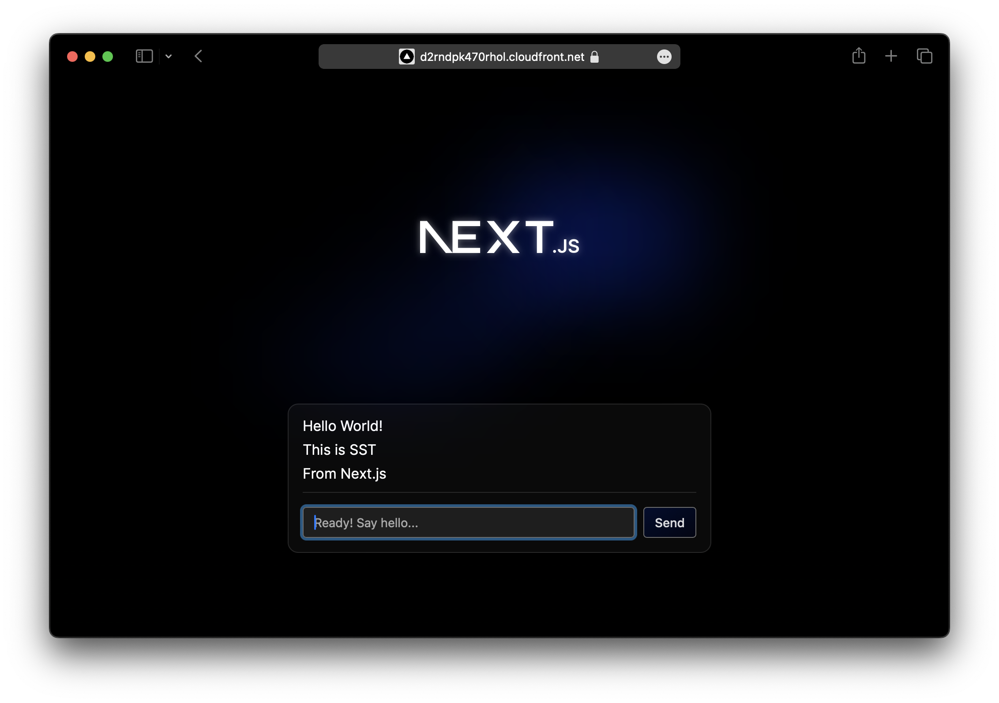

We are going to use SST to build and deploy a realtime chat app on AWS.

:::tip[View source]
You can [view the source](https://github.com/sst/ion/tree/dev/examples/aws-realtime-nextjs) of this example in our repo.
:::

Before you get started:

1. [Configure your AWS credentials](https://docs.sst.dev/advanced/iam-credentials#loading-from-a-file)
2. [Install the SST CLI](/docs/reference/cli)

---

## 1. Create a project

Let's start by creating a Node.js app.

```bash
npx create-next-app@latest my-realtime-app
cd my-realtime-app
```

#### Init SST

Now let's initialize SST in our app. Make sure you have the [CLI installed](/docs/reference/cli/).

```bash
sst init
```

This'll detect that you are in a Next.js project and create a `sst.config.ts` file in the root.

#### Start dev mode

Start the dev mode for your Next.js app and link it to SST.

```bash
npm run dev
```

:::note
You are starting `next dev` wrapped in `sst dev next dev`.
:::

---

## 2. Add Realtime

Let's add the `Realtime` component and link it to the Next.js app. Update your `sst.config.ts`.

```js title="sst.config.ts" {7}
async run() {
  const realtime = new sst.aws.Realtime("MyRealtime", {
    authorizer: "authorizer.handler",
  });

  new sst.aws.Nextjs("MyWeb", {
    link: [realtime],
  });
},
```

This component allows us to set up _topics_ that can be subscribed to. The `authorizer` function can be used control who has access to these.

---

#### Add an authorizer

Add the following to a new `authorizer.ts` file in your project root.

```ts title="authorizer.ts"
import { Resource, RealtimeAuthHandler } from "sst";

export const handler = RealtimeAuthHandler(async (token) => {
  const prefix = `${Resource.App.name}/${Resource.App.stage}`;

  // Validate token

  return {
    publish: [`${prefix}/*`],
    subscribe: [`${prefix}/*`],
  };
});
```

Here we are saying that a user has access to publish and subscribe to any topic namespaced user the app and stage name. In production, we would validate the given token against our database or auth provider.

---

## 3. Create the chat UI

Now let's create a chat interface in our app. Create a new component in `components/chat.tsx` with the following.

```tsx title="components/chat.tsx" {29-33}
"use client";

import { useState, useEffect } from "react";
import { iot, mqtt } from "aws-iot-device-sdk-v2";
import styles from "./chat.module.css";

export default function Chat(
  { topic, endpoint, authorizer }: { topic: string, endpoint: string, authorizer: string }
) {
  const [messages, setMessages] = useState<string[]>([]);
  const [connection, setConnection] = useState<mqtt.MqttClientConnection | null>(null);

  return (
    <div className={styles.chat}>
      {connection && messages.length > 0 &&
        <div className={styles.messages}>
          {messages.map((msg, i) => (
            <div key={i}>{msg}</div>
          ))}
        </div>
      }
      <form
        className={styles.form}
        onSubmit={async (e) => {
          e.preventDefault();

          const input = (e.target as HTMLFormElement).message;

          connection!.publish(
            topic,
            input.value,
            mqtt.QoS.AtLeastOnce
          );
          input.value = "";
        }}
      >
        <input
          required
          autoFocus
          type="text"
          name="message"
          placeholder={
            connection ? "Ready! Say hello..." : "Connecting..."
          }
        />
        <button type="submit" disabled={connection === null}>Send</button>
      </form>
    </div>
  );
}
```

Here we are going to publish a message that's submitted to the given topic. We'll create the realtime connection below.

Add some styles.

```css title="components/chat.module.css"
.chat {
  gap: 1rem;
  width: 30rem;
  display: flex;
  padding: 1rem;
  flex-direction: column;
  border-radius: var(--border-radius);
  background-color: rgba(var(--callout-rgb), 0.5);
  border: 1px solid rgba(var(--callout-border-rgb), 0.3);
}

.messages {
  padding-bottom: 0.125rem;
  border-bottom: 1px solid rgba(var(--callout-border-rgb), 0.3);
}
.messages > div {
  line-height: 1.1;
  padding-bottom: 0.625rem;
}

.form {
  display: flex;
  gap: 0.625rem;
}
.form input {
  flex: 1;
  font-size: 0.875rem;
  padding: 0.5rem 0.75rem;
  border-radius: calc(1rem - var(--border-radius));
  border: 1px solid rgba(var(--callout-border-rgb), 1);
}
.form button {
  font-weight: 500;
  font-size: 0.875rem;
  padding: 0.5rem 0.75rem;
  border-radius: calc(1rem - var(--border-radius));
  background: linear-gradient(
    to bottom right,
    rgba(var(--tile-start-rgb), 1),
    rgba(var(--tile-end-rgb), 1)
  );
  border: 1px solid rgba(var(--callout-border-rgb), 1);
}
.form button:active:enabled {
  background: linear-gradient(
    to top left,
    rgba(var(--tile-start-rgb), 1),
    rgba(var(--tile-end-rgb), 1)
  );
}
```

Install the npm packages.

```bash
npm install aws-iot-device-sdk-v2
```

---

#### Add to the page

Let's use the component in our page. Replace the `Home` component in `app/page.tsx`. 

```tsx title="app/page.tsx" {23-25}
import { Resource } from "sst";
import Chat from "@/components/chat";

const topic = "sst-chat";

export default function Home() {
  return (
    <main className={styles.main}>

      <div className={styles.center}>
        <Image
          className={styles.logo}
          src="/next.svg"
          alt="Next.js Logo"
          width={180}
          height={37}
          priority
        />
      </div>

      <div>
        <Chat
          endpoint={Resource.MyRealtime.endpoint}
          authorizer={Resource.MyRealtime.authorizer}
          topic={`${Resource.App.name}/${Resource.App.stage}/${topic}`}
        />
      </div>

    </main>
  );
}
```

:::tip
We are directly accessing our Realtime component with `Resource.MyRealtime.*`.
:::

Here we are going to publish and subscribe to a _topic_ called `sst-chat` and it's namespaced under the name of the app and the stage our app is deployed to.

---

## 4. Create a connection

When our chat component loads, it'll create a new connection to our realtime service. Add the following below the imports in `components/chat.tsx`.

```ts title="components/chat.tsx"
function createConnection(endpoint: string, authorizer: string) {
  const client = new mqtt.MqttClient();
  const id = window.crypto.randomUUID();

  return client.new_connection(
    iot.AwsIotMqttConnectionConfigBuilder.new_with_websockets()
      .with_clean_session(true)
      .with_client_id(`client_${id}`)
      .with_endpoint(endpoint)
      .with_custom_authorizer("", authorizer, "", "PLACEHOLDER_TOKEN")
      .build()
  );
}
```

We are using a _placeholder_ token here. In production this might be a user's session token.

Now let's subscribe to it and save the messages we receive. Add this to the `Chat` component.

```ts title="components/chat.tsx"
useEffect(() => {
  const connection = createConnection(endpoint, authorizer);

  connection.on("connect", async () => {
    try {
      await connection.subscribe(topic, mqtt.QoS.AtLeastOnce);
      setConnection(connection);
    } catch (e) { }
  });
  connection.on("message", (_fullTopic, payload) => {
    const message = new TextDecoder("utf8").decode(new Uint8Array(payload));
    setMessages((prev) => [...prev, message]);
  });
  connection.on("error", console.error);

  connection.connect();

  return () => {
    connection.disconnect();
    setConnection(null);
  };
}, [topic, endpoint, authorizer]);
```

:::note
If you have a new AWS account, you might have to wait a few minutes before your realtime service is ready to go.
:::

Head over to the local Next.js app in your browser, `http://localhost:3000` and try **sending a message**, you should see it appear right away. You can also open a new browser window and see them appear in both places.

---

## 5. Deploy your app

Now let's deploy your app to AWS.

```bash
sst deploy --stage production
```

You can use any stage name here but it's good to create a new stage for production.

Congrats! Your app should now be live!



Next you can:

- Let users create chat rooms
- Save them to a database
- Only show messages from the right chat rooms

This'll help you build realtime apps for production.

---

## Connect the console

As a next step, you can setup the [SST Console](/docs/console/) to _**git push to deploy**_ your app and monitor it for any issues. 


You can [create a free account](https://console.sst.dev) and connect it to your AWS account.
