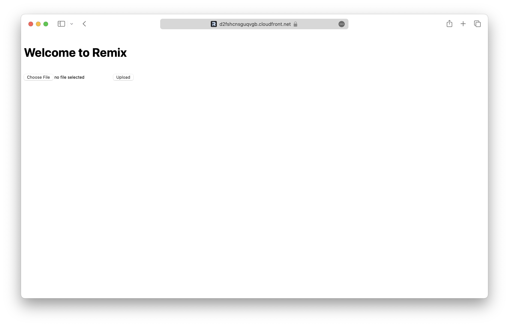
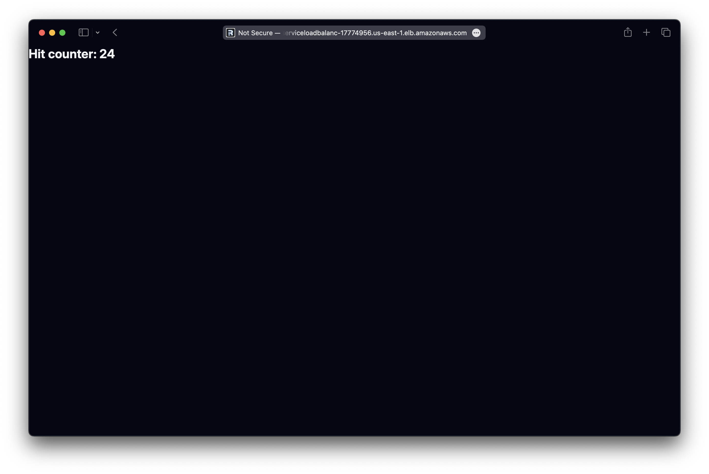

There are two ways to deploy a Remix app to AWS with SST.

1. [Serverless](#serverless)
2. [Containers](#containers)

We'll use both to build a couple of simple apps below.

---

#### Examples

We also have a few other Remix examples that you can refer to.

- [Enabling streaming in your Remix app](/docs/examples/#aws-remix-streaming)

---

## Serverless

We are going to create a Remix app, add an S3 Bucket for file uploads, and deploy it to using the `Remix` component.

:::tip[View source]
You can [view the source](https://github.com/sst/ion/tree/dev/examples/aws-remix) of this example in our repo.
:::

Before you get started, make sure to [configure your AWS credentials](/docs/iam-credentials#credentials).

---

### 1. Create a project

Let's start by creating our project.

```bash
npx create-remix@latest aws-remix
cd aws-remix
```

We are picking all the default options.

---

##### Init SST

Now let's initialize SST in our app.

```bash
npx sst@latest init
npm install
```

Select the defaults and pick **AWS**. This'll create a `sst.config.ts` file in your project root.

---

##### Start dev mode

Run the following to start dev mode. This'll start SST and your Remix app.

```bash
npx sst dev
```

Once complete, click on **MyWeb** in the sidebar and open your Remix app in your browser.

---

### 2. Add an S3 Bucket

Let's allow public `access` to our S3 Bucket for file uploads. Update your `sst.config.ts`.

```js title="sst.config.ts"
const bucket = new sst.aws.Bucket("MyBucket", {
  access: "public"
});
```

Add this above the `Remix` component.

##### Link the bucket

Now, link the bucket to our Remix app.

```js title="sst.config.ts" {2}
new sst.aws.Remix("MyWeb", {
  link: [bucket],
});
```

---

### 3. Create an upload form

Add the upload form client in `app/routes/_index.tsx`. Replace the `Index` component with:

```tsx title="app/routes/_index.tsx"
export default function Index() {
  const data = useLoaderData<typeof loader>();
  return (
    <div style={{ fontFamily: "system-ui, sans-serif", lineHeight: "1.8" }}>
      <h1>Welcome to Remix</h1>
      <form
        onSubmit={async (e) => {
          e.preventDefault();

          const file = (e.target as HTMLFormElement).file.files?.[0]!;

          const image = await fetch(data.url, {
            body: file,
            method: "PUT",
            headers: {
              "Content-Type": file.type,
              "Content-Disposition": `attachment; filename="${file.name}"`,
            },
          });

          window.location.href = image.url.split("?")[0];
        }}
      >
        <input name="file" type="file" accept="image/png, image/jpeg" />
        <button type="submit">Upload</button>
      </form>
    </div>
  );
}
```

---

### 4. Generate a pre-signed URL

When our app loads, we'll generate a pre-signed URL for the file upload and use it in the form.

```tsx title="app/routes/_index.tsx" {4}
export async function loader() {
  const command = new PutObjectCommand({
    Key: crypto.randomUUID(),
    Bucket: Resource.MyBucket.name,
  });
  const url = await getSignedUrl(new S3Client({}), command);

  return json({ url });
}
```

:::tip
We are directly accessing our S3 bucket with `Resource.MyBucket.name`.
:::

Add the relevant imports.

```tsx title="app/routes/_index.tsx"
import { Resource } from "sst";
import { json } from "@remix-run/node";
import { useLoaderData } from "@remix-run/react";
import { getSignedUrl } from "@aws-sdk/s3-request-presigner";
import { S3Client, PutObjectCommand } from "@aws-sdk/client-s3";
```

And install the npm packages.

```bash
npm install @aws-sdk/client-s3 @aws-sdk/s3-request-presigner
```

Head over to the local Remix app in your browser, `http://localhost:5173` and try **uploading an image**. You should see it upload and then download the image.

---

### 5. Deploy your app

Now let's deploy your app to AWS.

```bash
npx sst deploy --stage production
```

You can use any stage name here but it's good to create a new stage for production.

Congrats! Your site should now be live!



---

## Containers

We are going to build a hit counter Remix app with Redis. We’ll the deploy it to AWS in a container using the `Cluster` component.

:::tip[View source]
You can [view the source](https://github.com/sst/ion/tree/dev/examples/aws-remix-container) of this example in our repo.
:::

Before you get started, make sure to [configure your AWS credentials](/docs/iam-credentials#credentials).

---

### 1. Create a project

Let's start by creating our app.

```bash
npx create-remix@latest aws-remix-container
cd aws-remix-container
```

We are picking all the default options.

---

##### Init SST

Now let's initialize SST in our app.

```bash
npx sst@latest init
```

Select the defaults and pick **AWS**. This'll create a `sst.config.ts` file in your project root.

---

### 2. Add a Cluster

To deploy our Remix app in a container, we'll use [AWS Fargate](https://aws.amazon.com/fargate/) with [Amazon ECS](https://aws.amazon.com/ecs/). Replace the `run` function in your `sst.config.ts`.

```js title="sst.config.ts" {9-11}
async run() {
  const vpc = new sst.aws.Vpc("MyVpc", { bastion: true });
  const cluster = new sst.aws.Cluster("MyCluster", { vpc });

  cluster.addService("MyService", {
    public: {
      ports: [{ listen: "80/http", forward: "3000/http" }],
    },
    dev: {
      command: "npm run dev",
    },
  });
}
```

This creates a VPC with a bastion host, an ECS Cluster, and adds a Fargate service to it.

The `dev.command` tells SST to run our Remix app locally in dev mode.

---

### 3. Add Redis

Let's add an [Amazon ElastiCache](https://aws.amazon.com/elasticache/) Redis cluster. Add this below the `Vpc` component in your `sst.config.ts`.

```js title="sst.config.ts"
const redis = new sst.aws.Redis("MyRedis", { vpc });
```

This shares the same VPC as our ECS cluster.

---

#### Link Redis

Now, link the Redis cluster to the container.

```ts title="sst.config.ts" {3}
cluster.addService("MyService", {
  // ...
  link: [redis],
});
```

This will allow us to reference the Redis cluster in our Remix app.

---

#### Install a tunnel

Since our Redis cluster is in a VPC, we'll need a tunnel to connect to it from our local machine.

```bash "sudo"
sudo npx sst tunnel install
```

This needs _sudo_ to create a network interface on your machine. You'll only need to do this once on your machine.

---

#### Start dev mode

Start your app in dev mode.

```bash
npx sst dev
```

This will deploy your app, start a tunnel in the **Tunnel** tab, and run your Remix app locally in the **MyServiceDev** tab.

---

### 4. Connect to Redis

We want the `/` route to increment a counter in our Redis cluster. Let's start by installing the npm package we'll use.

```bash
npm install ioredis
```

We'll add a `loader` to increment the counter.

```ts title="app/routes/_index.tsx" {2}
const redis = new Cluster(
  [{ host: Resource.MyRedis.host, port: Resource.MyRedis.port }],
  {
    dnsLookup: (address, callback) => callback(null, address),
    redisOptions: {
      tls: {},
      username: Resource.MyRedis.username,
      password: Resource.MyRedis.password,
    },
  }
);

export async function loader() {
  const counter = await redis.incr("counter");

  return json({ counter });
}
```

:::tip
We are directly accessing our Redis cluster with `Resource.MyRedis.*`.
:::

Add the relevant imports.

```ts title="app/routes/_index.tsx"
import { Resource } from "sst";
import { Cluster } from "ioredis";
import { json } from "@remix-run/node";
import { useLoaderData } from "@remix-run/react";
```

Let's now use this in our `Index` component.

```ts title="app/routes/_index.tsx"
export default function Index() {
  const data = useLoaderData<typeof loader>();

  return (
    <h1 className="leading text-2xl font-bold text-gray-800 dark:text-gray-100">
      Hit counter: {data.counter}
    </h1>
  );
}
```

---

#### Test your app

Let's head over to `http://localhost:5173` in your browser and it'll show the current hit counter.

You should see it increment every time you **refresh the page**.

---

### 5. Deploy your app

To deploy our app we'll add a `Dockerfile`.

<details>
<summary>View Dockerfile</summary>

```Dockerfile title="Dockerfile"
# Based on https://github.com/remix-run/blues-stack/blob/main/Dockerfile

# base node image
FROM node:18-bullseye-slim as base

# set for base and all layer that inherit from it
ENV NODE_ENV production

# Install all node_modules, including dev dependencies
FROM base as deps

WORKDIR /myapp

ADD package.json ./
RUN npm install --include=dev

# Setup production node_modules
FROM base as production-deps

WORKDIR /myapp

COPY --from=deps /myapp/node_modules /myapp/node_modules
ADD package.json ./
RUN npm prune --omit=dev

# Build the app
FROM base as build

WORKDIR /myapp

COPY --from=deps /myapp/node_modules /myapp/node_modules

ADD . .
RUN npm run build

# Finally, build the production image with minimal footprint
FROM base

WORKDIR /myapp

COPY --from=production-deps /myapp/node_modules /myapp/node_modules

COPY --from=build /myapp/build /myapp/build
COPY --from=build /myapp/public /myapp/public
ADD . .

CMD ["npm", "start"]
```
</details>

:::tip
You need to be running [Docker Desktop](https://www.docker.com/products/docker-desktop/) to deploy your app.
:::

Let's also add a `.dockerignore` file in the root.

```bash title=".dockerignore"
node_modules
.cache
build
public/build
```

Now to build our Docker image and deploy we run:

```bash
npx sst deploy --stage production
```

You can use any stage name here but it's good to create a new stage for production.

Congrats! Your app should now be live!



---

## Connect the console

As a next step, you can setup the [SST Console](/docs/console/) to _**git push to deploy**_ your app and monitor it for any issues. 


You can [create a free account](https://console.sst.dev) and connect it to your AWS account.
