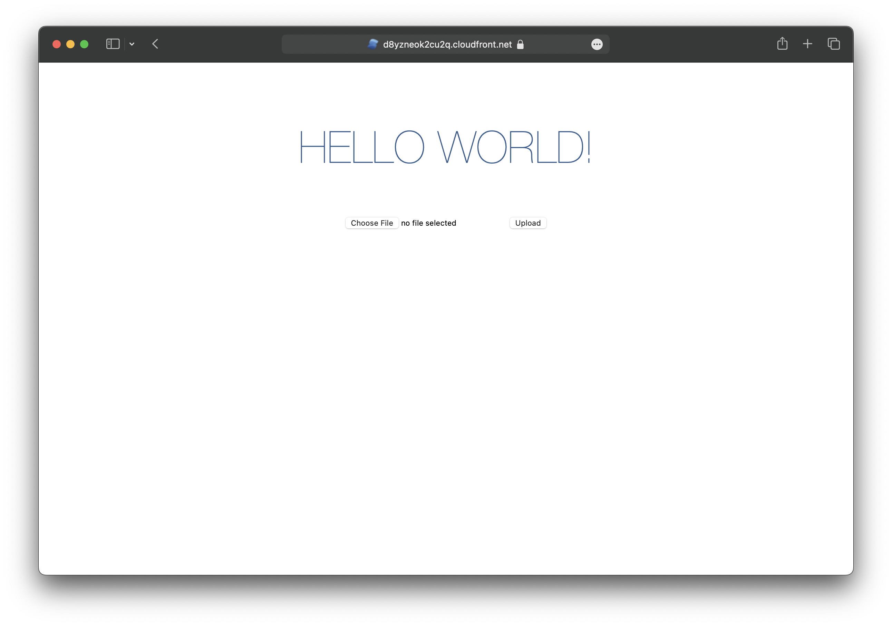

We are going to create a SolidStart app, add an S3 Bucket for file uploads, and deploy it to AWS using SST.

:::tip[View source]
You can [view the source](https://github.com/sst/ion/tree/dev/examples/aws-solid-start) of this example in our repo.
:::

Before you get started, make sure to [configure your AWS credentials](https://docs.sst.dev/advanced/iam-credentials#loading-from-a-file).

---

## 1. Create a project

Let's start by creating our project.

```bash
npm init solid@latest my-solid-app
cd my-solid-app
```

We are picking the **_bare_**, and **_TypeScript_** options.

---

#### Init SST

Now let's initialize SST in our app. Make sure to add the `@ion` part.

```bash "sst@ion"
npx sst@ion init
npm install
```

Select the defaults and pick **AWS**. This'll create a `sst.config.ts` file in your project root.

It'll also ask you to update your `app.config.ts` with something like this.

```diff lang="ts" title="app.config.ts"
export default defineConfig({
+  server: {
+    preset: "aws-lambda",
+  },
});
```

---

#### Start dev mode

Run the following to start dev mode. This'll start SST and your SolidStart app.

```bash
npx sst dev
```

Once complete, click on **MyWeb** in the sidebar and open your SolidStart app in your browser.

---

## 2. Add an S3 Bucket

Let's add a `public` S3 Bucket for file uploads. Update your `sst.config.ts`.

```js title="sst.config.ts"
const bucket = new sst.aws.Bucket("MyBucket", {
  public: true
});
```

#### Link the bucket

Now, link the bucket to our SolidStart app.

```js title="sst.config.ts" {2}
new sst.aws.SolidStart("MyWeb", {
  link: [bucket],
});
```

---

## 3. Generate a pre-signed URL

When our app loads, we'll generate a pre-signed URL for the file upload and use it in our form. Add this below the imports in `src/app.tsx`.

```tsx title="src/app.tsx" {5}
async function presignedUrl() {
  "use server";
  const command = new PutObjectCommand({
    Key: crypto.randomUUID(),
    Bucket: Resource.MyBucket.name,
  });
  return await getSignedUrl(new S3Client({}), command);
}

export const route = {
  load: () => presignedUrl(),
};
```

:::tip
We are directly accessing our S3 bucket with `Resource.MyBucket.name`.
:::

Add the relevant imports.

```tsx title="src/app.tsx"
import { Resource } from "sst";
import { createAsync } from "@solidjs/router";
import { getSignedUrl } from "@aws-sdk/s3-request-presigner";
import { S3Client, PutObjectCommand } from "@aws-sdk/client-s3";
```

And install the npm packages.

```bash
npm install @solidjs/router @aws-sdk/client-s3 @aws-sdk/s3-request-presigner
```

---

## 4. Create an upload form

Add a form to upload files to the presigned URL. Replace the `App()` component in `src/app.tsx` with:

```tsx title="src/app.tsx"
export default function App() {
  const url = createAsync(() => presignedUrl());

  return (
    <main>
      <h1>Hello world!</h1>
      <form
        onSubmit={async (e) => {
          e.preventDefault();

          const file = (e.target as HTMLFormElement).file.files?.[0]!;

          const image = await fetch(url() as string, {
            body: file,
            method: "PUT",
            headers: {
              "Content-Type": file.type,
              "Content-Disposition": `attachment; filename="${file.name}"`,
            },
          });

          window.location.href = image.url.split("?")[0];
        }}
      >
        <input name="file" type="file" accept="image/png, image/jpeg" />
        <button type="submit">Upload</button>
      </form>
    </main>
  );
}
```

Head over to the local app in your browser, `http://localhost:3000` and try **uploading an image**. You should see it upload and then download the image.

---

## 5. Deploy your app

Now let's deploy your app to AWS.

```bash
npx sst deploy --stage production
```

You can use any stage name here but it's good to create a new stage for production.

Congrats! Your site should now be live!



---

## Connect the console

As a next step, you can setup the [SST Console](/docs/console/) to _**git push to deploy**_ your app and monitor it for any issues. 


You can [create a free account](https://console.sst.dev) and connect it to your AWS account.
