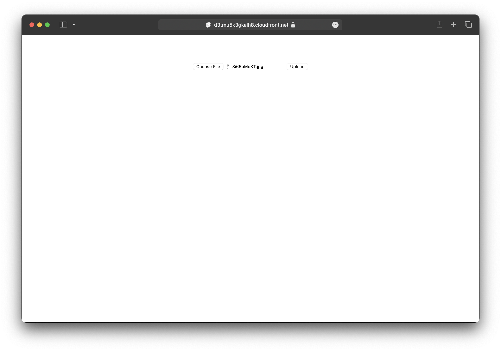

We are going to create a SvelteKit app, add an S3 Bucket for file uploads, and deploy it to AWS using SST.

:::tip[View source]
You can [view the source](https://github.com/sst/ion/tree/dev/examples/aws-svelte-kit) of this example in our repo.
:::

Before you get started, make sure to [configure your AWS credentials](https://docs.sst.dev/advanced/iam-credentials#loading-from-a-file).

---

## 1. Create a project

Let's start by creating our app.

```bash
npm create svelte@latest my-svelte-app
cd my-svelte-app
```

We are picking the **_Skeleton project_** and **_Yes, using TypeScript syntax_** options.

---

#### Init SST

Now let's initialize SST in our app.

```bash
npx sst init
npm install
```

Select the defaults and pick **AWS**. This'll create a `sst.config.ts` file in your project root.

It'll also ask you to update your `svelte.config.mjs` with something like this.

```diff lang="js" title="svelte.config.mjs"
- import adapter from '@sveltejs/adapter-auto';
+ import adapter from "svelte-kit-sst";
```

---

#### Start dev mode

Run the following to start dev mode. This'll start SST and your SvelteKit app.

```bash
npx sst dev
```

Once complete, click on **MyWeb** in the sidebar and open your SvelteKit app in your browser.

---

## 2. Add an S3 Bucket

Let's add a `public` S3 Bucket for file uploads. Update your `sst.config.ts`.

```js title="sst.config.ts"
const bucket = new sst.aws.Bucket("MyBucket", {
  public: true
});
```

#### Link the bucket

Now, link the bucket to our SvelteKit app.

```js title="sst.config.ts" {2}
new sst.aws.SvelteKit("MyWeb", {
  link: [bucket]
});
```

---

## 3. Create an upload form

Let's add a file upload form. Replace your `src/routes/+page.svelte`. This will upload a file to a given pre-signed upload URL.

```svelte title="src/routes/+page.svelte"
<script>
  /** @type {import('./$types').PageData} */
  export let data;

  const handleSubmit = async (e) => {
    const formData = new FormData(e.target);
    const file = formData.get("file");

    const image = await fetch(data.url, {
      body: file,
      method: "PUT",
      headers: {
        "Content-Type": file.type,
        "Content-Disposition": `attachment; filename="${file.name}"`,
      },
    });

    window.location.href = image.url.split("?")[0];
  };
</script>

<section>
  <form on:submit|preventDefault={handleSubmit}>
    <input name="file" type="file" accept="image/png, image/jpeg" />
    <button type="submit">Upload</button>
  </form>
</section>
```

Add some styles.

```css title="src/routes/+page.svelte"
<style>
  section {
    flex: 0.6;
    display: flex;
    padding-top: 4rem;
    align-items: center;
    flex-direction: column;
    justify-content: center;
  }
</style>
```

---

## 4. Generate a pre-signed URL

When our route loads, we'll generate a pre-signed URL for S3 and our form will upload to it. Create a new `+page.server.ts` and add the following.

```ts title="src/routes/+page.server.ts" {5}
/** @type {import('./$types').PageServerLoad} */
export async function load() {
  const command = new PutObjectCommand({
    Key: crypto.randomUUID(),
    Bucket: Resource.MyBucket.name,
  });
  const url = await getSignedUrl(new S3Client({}), command);

  return { url };
}
```

:::tip
We are directly accessing our S3 bucket with `Resource.MyBucket.name`.
:::

Add the relevant imports.

```ts title="src/routes/+page.server.ts"
import { Resource } from "sst";
import { getSignedUrl } from "@aws-sdk/s3-request-presigner";
import { S3Client, PutObjectCommand } from "@aws-sdk/client-s3";

```

And install the npm packages.

```bash
npm install @aws-sdk/client-s3 @aws-sdk/s3-request-presigner
```

Head over to the local SvelteKit app in your browser, `http://localhost:5173` and try **uploading an image**. You should see it upload and then download the image.

---

## 5. Deploy your app

Now let's deploy your app to AWS.

```bash
npx sst deploy --stage production
```

You can use any stage name here but it's good to create a new stage for production.

Congrats! Your app should now be live!



---

## Connect the console

As a next step, you can setup the [SST Console](/docs/console/) to _**git push to deploy**_ your app and monitor it for any issues. 


You can [create a free account](https://console.sst.dev) and connect it to your AWS account.
