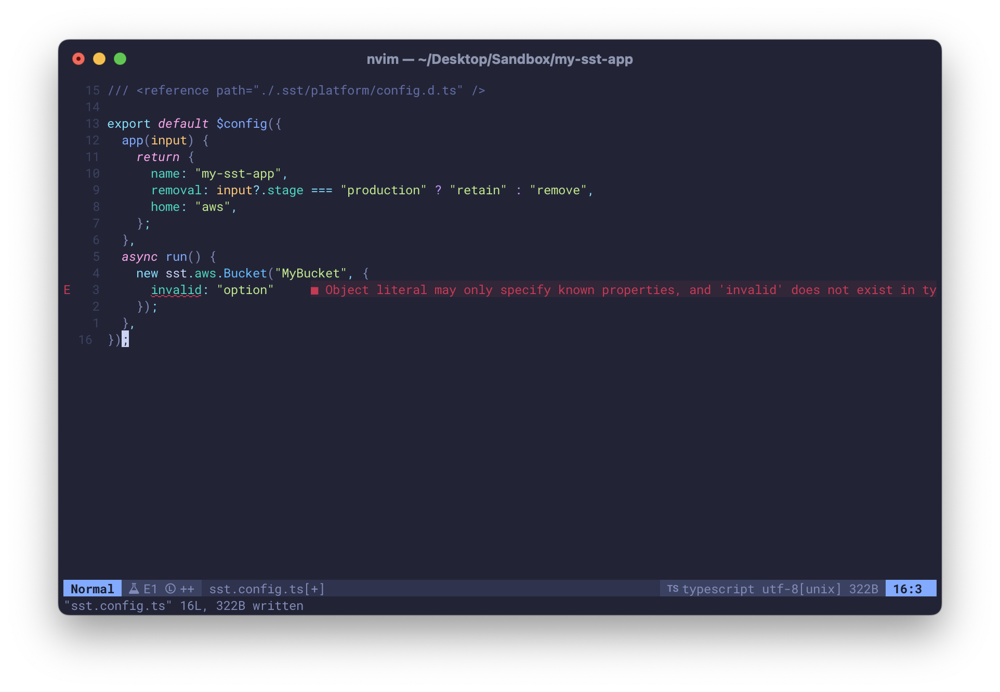
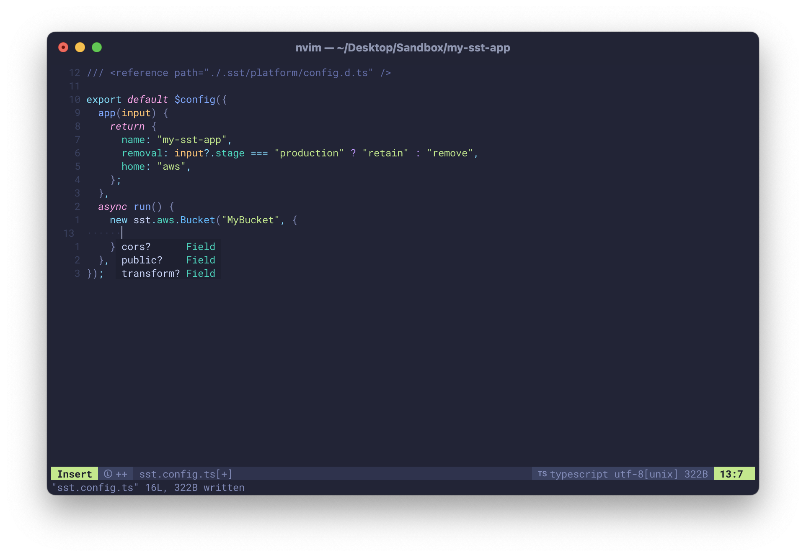
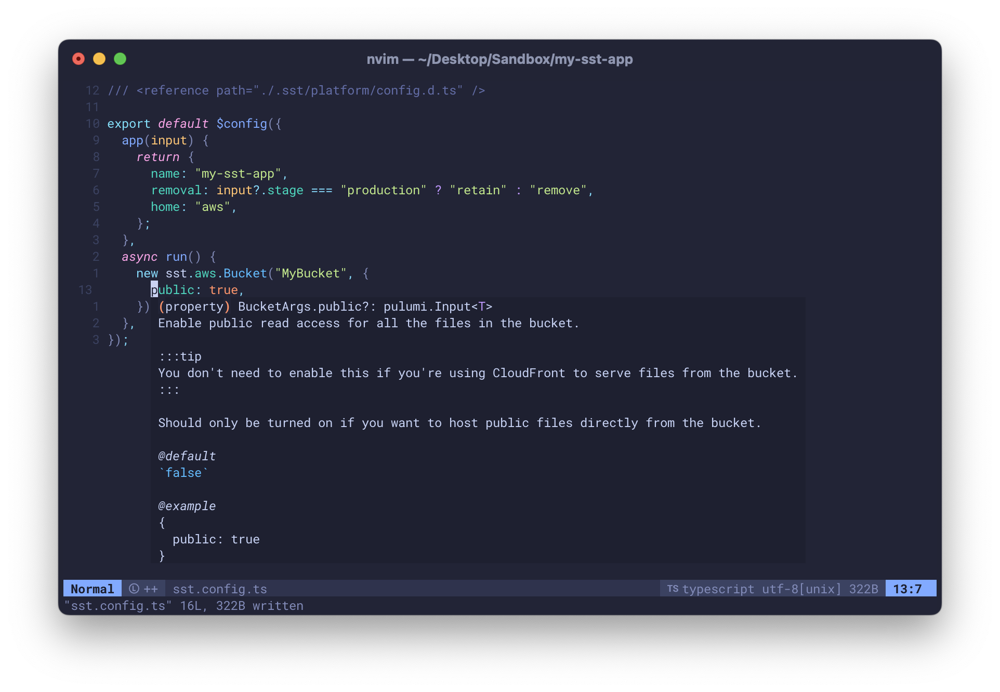

import { Tabs, TabItem } from '@astrojs/starlight/components';

The main difference between working on SST versus any other framework is that everything related to your app is all **defined in code**.

1. SST **automatically manages** the resources in AWS (or any provider) defined in your app.
2. You don't need to **make any manual changes** to them in your cloud provider's console.

This idea of _automating everything_ can feel unfamiliar at first. So let's go through the workflow and look at some basic concepts.

---

## Setup

Before you start working on your app, there are a couple of things we recommend setting up.

Starting with your code editor.

---

### Editor

SST apps are configured through a file called `sst.config.ts`. It's a TypeScript file and it can work with your editor to type check and autocomplete your code. It can also show you inline help.

<Tabs>
  <TabItem label="Type check">
  
  </TabItem>
  <TabItem label="Autocomplete">
  
  </TabItem>
  <TabItem label="Inline help">
  
  </TabItem>
</Tabs>

Most modern editors; VS Code and Neovim included, should do the above automatically. But you should start by making sure that your editor has been set up.

---

### Credentials

SST apps are deployed to your infrastructure. So whether you are deploying to AWS, or Cloudflare, or any other cloud provider, make sure you have their credentials configured locally.

Learn more about how to [configure your AWS credentials](/docs/iam-credentials/).

---

### Console

SST also comes with a [Console](/docs/console/). It shows you all your apps, the resources in them, lets you configure _git push to deploy_, and also send you alerts for when there are any issues.

While it is optional, we recommend creating a free account and linking it to your AWS account. Learn more about the [SST Console](/docs/console/).

---

## sst.config.ts

Now that you are ready to work on your app and your `sst.config.ts`, let's take a look at what it means to _configure everything in code_.


---

### IaC

Infrastructure as Code or _IaC_ is a process of automating the management of infrastructure through code. Rather than doing it manually through a console or user interface.

:::tip
You won't ever need to use the AWS Console to configure your SST app.
:::

Say your app has an API and an S3 bucket, you would define that in your `sst.config.ts`.

```ts title="sst.config.ts"
const bucket = new sst.aws.Bucket("MyBucket");

const api = new sst.aws.ApiGatewayV2("MyApi");
api.route("GET /", {
  handler: "index.handler"
});
```

You won't ever need to go to the API Gateway and S3 parts of the AWS Console. SST will do the work for you.

In the above snippets, `sst.aws.ApiGatewayV2` and `sst.aws.Bucket` are called Components. Learn more about [Components](/docs/components/).

---

### Resources

The reason this works is because when SST deploys the above app, it'll convert it into a set of commands. These then call AWS with your credentials to create the underlying resources. So the above components get transformed into a list of low level resources in AWS.

:::note
You are not directly responsible for the low level resources that SST creates.
:::

If you login to your AWS Console you can see what gets created internally. While these might look a little intimidating, they are all managed by SST and you are not directly responsible for them.

SST will create, track, and remove all the low level resources created by your app.

---

#### Exceptions

There are some exceptions to this. You might have resources that are not created by your SST config. These could include resources that were:

1. **Previously created**

   You might've created some resources by hand in the past that you would like to use in your new SST app. You can import these resources into your app and moving forward, SST can mange them for you. Learn more about [importing resources](/docs/import-resources/).

2. **Externally managed**

   You might have resources that are managed by a different team. In this case, you don't want SST to manage them. You simply want to reference them in your app. Learn more about [referencing resources](/docs/reference-resources/).

3. **Shared across stages**

   If you are creating preview environments, you might not want to make copies of certain components like your database. You might want to share these across stages. Learn more about [sharing across stages](/docs/share-across-stages/).

---

### Linking

Let's say you wanted your API from the above example to upload a file to the S3 bucket, you'd need to hardcode the name of the bucket in your API.

SST avoids this by allowing you to **link resources** together.

```ts title="sst.config.ts" {3}
api.route("GET /", {
  handler: "index.handler",
  link: [bucket]
});
```

Now in your API you can access the bucket using SST's [SDK](/docs/reference/sdk/).

```ts title="index.ts" "Resource.MyBucket.name"
import { Resource } from "sst";

console.log(Resource.MyBucket.name);
```

There's a difference between the two snippets above. One is your **infrastructure code** and the other is your **runtime code**. One is run while creating your app, while the other runs when your users use your app.

:::tip
You can access your infrastructure in your runtime using the SST SDK.
:::

The _link_ allows you to access your **infrastructure** in your **runtime code**. Learn more about [resource linking](/docs/linking/).

---

### State

When you make a change to your `sst.config.ts`, like we did above. SST only deploys the changes.

```diff lang="ts" title="sst.config.ts"
api.route("GET /", {
  handler: "index.handler",
+  link: [bucket]
});
```

It does this by maintaining a _state_ of your app. The state is a tree of all the resources in your app and all their properties.

The state is stored in a file locally and backed up to a bucket in your AWS (or Cloudflare) account.

:::tip
You can view the state of your app and its history in the SST Console. 
:::

A word of caution, if for some reason you delete your state locally and in your provider, SST won't be able to manage the resources anymore. To SST this app doesn't exist anymore.

:::danger
Do not delete the bucket that stores your app's state.
:::

To fix this you'll have to manually re-import all those resources back into your app. Learn more about [how state works](/docs/state/).

---

#### Out of sync

We mentioned above that you are not responsible for the low level resources that SST creates. But this isn't just a point of convenience; it's something you should not do.

:::caution
Do not manually make changes to the low level resources that SST creates.
:::

The reason for this is that, SST only applies the diffs when your `sst.config.ts` changes. So if you manually change the resources, it'll be out of sync with your state.

You can fix some of this by running [`sst refresh`](reference/cli/#refresh) but in general you should avoid doing this.

---

## App

So now that we know how IaC works, a lot of the workflow and concepts will begin to make sense. Starting with the key parts of an app.

---

### Name

Every app has a name. The name is used as a namespace. It allows SST to deploy multiple apps to the same AWS account, while isolating the resources in an app.

If you change the name of your app in your `sst.config.ts`, SST will create a completely new set of resources for it. It **does not** rename the resources.

:::caution
To rename an app, you'll need to remove the resources from the old one and deploy to the new one.
:::

So if you:

1. Create a new app with the name `my-sst-app` in your `sst.config.ts`, deploy it.
2. Rename the app in your `sst.config.ts` to `my-new-sst-app`, deploy again.

You will now have two apps in your AWS account called `my-sst-app` and `my-new-sst-app`.

If you want to rename your app, you'll need to remove the old app first and then deploy a new one with the new name.

---

### Stage

An app can have multiple stages. A stage is like an _environment_, it's a separate version of your app. For example, you might have a dev stage, a production stage, or a personal stage.

It's useful to have multiple versions of your app because it lets you make changes and test in one version while your users continue to use the other.

You create a new stage by deploying to it with the `--stage <name>` CLI option. The stage name is used as a namespace to create a new version of your app. It's similar to how the app name is used as a namespace.

:::caution
To rename a stage, you'll need to remove the resources from the old one and deploy to the new one.
:::

Similar to app names, stages cannot be renamed. So if you wanted to rename a `development` stage to `dev`; you'll need to first remove `development` and then deploy `dev`.

---

#### Personal stages

By default, if no stage is passed in, SST creates a stage using the username in your computer. This called a **personal stage**. Personal stages are typically used in _dev_ mode and every developer on your team should use their own personal stage.

We'll look at this in detail below.

---

### Region

Most resources that are created in AWS (and many other providers) belong to a specific region. So when you deploy your app, it's deployed to a specific region.

:::caution
To switch regions, you'll need to remove the resources from one region and deploy to the new one.
:::

For AWS, the region comes from your AWS credentials but it can be specified in the `sst.config.ts`.

```ts title="sst.config.ts" {5-7}
export default $config({
  app(input) {
    return {
      name: "my-sst-app",
      providers: {
        aws: { region: "us-west-2" }
      }
    };
  }
});
```

Similar to the app and stage, if you want to switch regions; you'll need to remove your app in the old region and deploy it to the new one.

---

## Commands

Now with the above background let's look at what the workflow of building an SST app.

Let's say you've created an app by running.

```bash
sst init
```

---

### Dev

To start with, you'll run your app in dev.

```bash
sst dev
```

This deploys your app to your _personal_ stage in _dev mode_. It brings up a multiplexer that deploys your app, runs your functions, and starts your frontends in dev mode as well.

:::note
The `sst dev` CLI starts your entire app. Including your infrastructure, functions, and frontends.
:::

This deploys your app a little differently and is optimized for local development.

One of the things it does is it runs the functions in your app [_Live_](/docs/live/). This proxies any requests to your local machine and runs the functions locally.

:::tip
Only use `sst dev` in your personal stage.
:::

For this reason we recommend only using your personal stage for local development. And instead deploying to a separate stage when you want to share your app with your users. Learn more about [`sst dev`](/docs/reference/cli/#dev).

---

### Deploy

Once you are ready to go to production run.

```bash
sst deploy --stage production
```

You can use any stage name for production here.

---

### Remove

If you want to remove your app and all the resources in it, you can run.

```bash
sst remove --stage <name>
```

You want to be careful while running this command because it permanently removes all the resources from your AWS (or Cloudflare) account.

:::caution
Be careful while running `sst remove` since it permanently removes all your resources.
:::

To prevent accidental removal, our template `sst.config.ts` comes with the following.

```ts title="sst.config.ts"
removal: input?.stage === "production" ? "retain" : "remove",
```

This is telling SST that if the stage is called `production` then on remove, retain critical resources like buckets and databases. This should avoid any accidental data loss. Learn more about [removal policies](/docs/reference/config/#removal).

---

## With a team

The SST workflow really shines when working with a team. Let's look at what it looks like with a basic git workflow.

1. Every developer on the team uses `sst dev` to work in their own isolated personal stage.
2. You commit your changes to a branch called `dev`.
3. Any changes to the `dev` branch are auto-deployed using `sst deploy --stage dev`.
4. Your team tests changes made to the `dev` stage of your app.
5. If they look good, `dev` is merged into a branch called `production`.
6. And any changes to the `production` branch are auto-deployed to the `production` stage with `sst deploy --stage production`.

In this setup, you have a separate stage per developer, a _dev_ stage for testing, and a _production_ stage.

---

### Autodeploy

To have a branch automatically deploy to a stage when commits are pushed to it, you need to configure GitHub Actions.


Or you can connect your repo to the SST Console and it'll auto-deploy your app for you. Learn more about [Autodeploy](/docs/console/#autodeploy).

---

### PR environments

You can also set it up to create preview environments.

So when a pull request (say PR#12) is created, you auto-deploy a new stage using `sst deploy --stage pr-12`. And once the PR is merged, the preview environment or stage gets removed using `sst remove --stage pr-12`.

Just like above, you can configure this using GitHub Actions or let the SST Console do it for you.

---

And there you have it. You are now ready to build apps the _SST way_.
